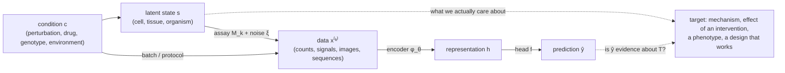

# Chapter 1. The Anatomy of a Research Problem in AI for Biology

!!! abstract "Chapter at a glance"
    **Motivation.** Many impressive-looking results in AI for biology do not survive contact with a new cell type, a new species, or a new experiment, while some modest-looking results turn out to be real. Telling these apart is the central skill of the field.
    **Prerequisites.** None. This chapter is deliberately light on mathematics; its equations are short and are all re-derived later.
    **You will be able to:** (1) describe a biological dataset as a measurement of a latent system; (2) name the **Four Gaps** that separate a model's score from a biological claim; (3) use the twelve-link **Expert Chain** to take a problem to new research directions; (4) place any claim on the **Claim Ladder** and say what evidence it needs; (5) do a first, complete research-reasoning analysis of a published-style result.


!!! note "If this chapter moves too fast"
    Part 0 teaches the prerequisites from scratch: [M1](m01-language-of-mathematics.md) (reading formulas, logic and quantifiers, counting) and [M7](m07-probability.md) (conditional probability and Bayes' rule).

---

## 1.1 Four results, one question

Consider four real episodes from 2025–2026 (details and citations are at the end of the chapter).

1. **A generative genome model designed working viruses.** Researchers used the genome language models Evo 1 and Evo 2 to generate whole bacteriophage genomes using the lytic phage ΦX174 as a design template; about 300 generated genomes were chemically synthesized and tested, and 16 were viable phages, some of which outperformed the natural phage against resistant bacteria (King et al., *Science*, August 2026). A language-model objective, trained on DNA, yielded genomes that *work*. [[S]]
2. **Foundation models failed to beat an additive baseline.** A careful 2025 benchmark compared five single-cell foundation models and two other deep models against deliberately simple baselines for predicting transcriptome changes after CRISPR perturbations. For double perturbations, none beat simply adding the two single-perturbation effects (Ahlmann-Eltze, Huber & Anders, *Nature Methods*, August 2025). [[S]]
3. **Zero-shot embeddings from large single-cell models lost to standard tools.** Without fine-tuning, Geneformer and scGPT embeddings were often outperformed by selecting highly variable genes or by using Harmony and scVI for cell-type clustering and batch integration, and sometimes did worse on datasets they had been pretrained on (Kedzierska et al., *Genome Biology*, 2025). [[S]]
4. **Pretrained DNA models often matched simple one-hot baselines.** Several benchmarks found that representations from genomic language models gave little or no advantage over a standard supervised network on one-hot DNA for human regulatory tasks, even as other work showed strong zero-shot variant-effect performance for models like Evo 2 on coding and some noncoding tasks. [[S]] for the benchmark findings; the *reasons* are [[P]].

These are not contradictory. The first is a case where the objective (predict the next nucleotide across the tree of life) is *aligned* with the target (a genome that is a coherent, fit viral genome) and where success is judged by the world itself (does the phage replicate?). The others are cases where the objective (reconstruct masked expression; predict masked tokens in a human regulatory sequence) is *not* well aligned with the target (predict a causal response to an intervention; predict cell-type-specific regulatory activity), or where the benchmark rewards something other than the intended capability.

The research question that organizes this book is therefore not "how good is this model?" but

> **What, exactly, is this model's score evidence of?**

To answer it, you need a language for what can go wrong between a number on a leaderboard and a statement about biology. That is the purpose of this chapter.

---

## 1.2 Biology as a latent system seen through measurements

### 1.2.1 The measurement view

A cell, a tissue, or an organism has a **state**. We will write $\mathbf{s}$ for the full state at a given instant: every molecule, its position, its modifications, and the dynamics that govern change. Nobody has ever observed $\mathbf{s}$. What we observe are **measurements**, each produced by a physical and chemical procedure we will call an *assay* $k$:

$$
x^{(k)} \;=\; \mathcal{M}_k\big(\mathbf{s},\, c;\; \xi\big).
$$

Here $c$ is the *condition* under which the system was placed (a drug, a CRISPR guide, a growth medium), and $\xi$ collects everything the experimenter did not intend: batch, library preparation, sequencing depth, instrument drift, operator, day. The operator $\mathcal{M}_k$ is typically:

- **Lossy.** Single-cell RNA-seq captures a few percent of the mRNA molecules in a cell; it sees neither protein nor chromatin. Many different states $\mathbf{s}$ map to the same data $x$.
- **Noisy.** Counting molecules is a sampling process, and amplification and capture add variance that is biology-independent.
- **Destructive.** Most single-cell assays kill the cell; we never see the same cell before and after perturbation.
- **Biased.** What is measurable shapes what is studied: abundant genes, well-annotated organisms, culturable microbes, cell lines that grow in dishes.



Everything in this book can be read as a way of filling in this diagram. A *genomic language model* is an encoder $\phi_\theta$ trained on sequences that are themselves outputs of evolution. A *single-cell foundation model* is an encoder trained on the outputs of one lossy assay. *AlphaFold* is a model of the map from sequence to structure that was learned from the outputs of crystallography and cryo-EM. A *virtual cell* is a model that tries to predict $x^{(k)}$ under a new $c$, which means it must implicitly model both $\mathbf{s}$ and $\mathcal{M}_k$.

!!! lens "Research lens: the measurement view"
    **Assumption it makes explicit:** the data are *views* of a latent system, not the system. **Information used:** whatever the assay captures. **Information ignored:** everything it does not capture, including everything that is *systematically* uncapturable (protein modifications in an RNA assay; dynamics in a snapshot). **Failure modes it predicts:** (a) models that learn the assay rather than the biology (batch signatures, sequencing depth); (b) ceilings imposed by noise; (c) apparently contradictory results from different assays of the same biology.

### 1.2.2 Three kinds of tasks

Given the diagram, there are three fundamentally different things we might ask a model to do. They require different information, so their evaluation requires different experiments.

| Task type | Question | Mathematical object | Needs |
|---|---|---|---|
| **Predict** | Given $x$, what is $y$? | $p(y \mid x)$ | Associational data |
| **Generate / design** | Find $x$ such that $y$ is high | $p(x \mid y)$, or $\arg\max_x \E[y\mid x]$ | A model that is accurate *off* the data distribution, i.e., where it will be queried |
| **Explain / intervene** | What happens to $y$ if we *change* $x$ (or $c$)? | $p(y \mid \do(x))$ | Interventional data, or assumptions that license converting association to causation |

These map onto what Judea Pearl calls the rungs of the *ladder of causation*: association, intervention, counterfactual (Pearl, 2009; Pearl & Mackenzie, 2018). Much of the confusion in the field arises from training on rung one and being judged on rung two. "Predict the expression of a gene from its promoter sequence" is a rung-one task; "predict what happens to expression when I edit this base" is a rung-two task whose answer *can* be obtained by perturbing the input to a rung-one model only if the model's learned associations are causal in the relevant region of sequence space (Chapter 44).

### 1.2.3 What is a sample?

The statistician's most valuable habit is to ask: *what is the unit of independent replication?* In biological machine learning the answer is rarely what the table's row count suggests.

- A human genome has $3 \times 10^9$ bases, but the number of *independent* examples of a given regulatory element is the number of loci that behave similarly, not the number of positions.
- A protein-language-model corpus may contain $10^9$ sequences, but they are related by common descent; the number of independent *evolutionary experiments* (families, lineages) is far smaller (Chapters 21, 34, 47).
- A single-cell atlas contains $10^7$ cells, but they came from perhaps $10^2$ donors and $10^1$ labs; many correlations are donor- or batch-level (Chapter 25).
- A Perturb-seq screen has $10^6$ cells but only one measurement per *guide* per *cell line*; the effective sample size for the question "does the model generalize to a new cell line?" is the number of cell lines.

!!! tip "Rule of thumb"
    Before computing any metric, write down the *unit of independence* of your test set and how it differs from the unit of your rows. Statistical power, confidence intervals, and the meaning of "held out" all depend on it.

---

## 1.3 The Four Gaps

A score on a benchmark is a number computed from a model's outputs. A **claim** is a statement about biology, or about a method's usefulness for biology. The distance between them can be decomposed into four gaps. Each gap will recur in every chapter; learning to see them is the single most useful habit this book tries to build.

### 1.3.1 The Measurement Gap (G-M)

> The quantity we measure is not the quantity we care about.

Let $\mathbf{s}$ be the latent state, $x = \mathcal{M}(\mathbf{s}, c; \xi)$ the data, and $h = \phi(x)$ any representation computed from the data. Since $h$ is a function of $x$ and $x$ is a (stochastic) function of $\mathbf{s}$, the chain $\mathbf{s} \to x \to h$ is Markov, and the **data-processing inequality** (Chapter 5) states

$$
\MI(\mathbf{s}; h) \;\le\; \MI(\mathbf{s}; x).
$$

No model, however large, can recover information about the latent state that the measurement did not capture. This sounds obvious but is violated daily in practice: a model trained on bulk RNA-seq is asked about protein activity; a model trained on steady-state snapshots is asked about dynamics; a model trained on reference genomes is asked about personal variation.

A second, more quantitative form of the measurement gap is **label noise**. Suppose the label is $y = f + \varepsilon$, where $f$ is the true quantity and $\varepsilon$ is independent measurement noise with variance $\sigma_\varepsilon^2$. For *any* predictor $\hat y$ that does not see $\varepsilon$,

$$
\E\big[(y - \hat y)^2\big] \;=\; \E\big[(f - \hat y)^2\big] + \sigma_\varepsilon^2 \;\ge\; \sigma_\varepsilon^2,
$$

because the cross-term $2\,\E[(f-\hat y)\varepsilon]$ vanishes by independence. Hence the coefficient of determination obeys

$$
R^2 \;=\; 1 - \frac{\E[(y-\hat y)^2]}{\Var(y)} \;\le\; 1 - \frac{\sigma_\varepsilon^2}{\Var(y)} \;=\; \frac{\Var(f)}{\Var(y)}.
$$

This upper bound is the **noise ceiling**. When two independent replicate measurements $y_1 = f + \varepsilon_1$, $y_2 = f + \varepsilon_2$ have equal noise variance, their Pearson correlation is exactly

$$
\mathrm{Corr}(y_1, y_2) \;=\; \frac{\Cov(f + \varepsilon_1,\, f + \varepsilon_2)}{\Var(f) + \sigma_\varepsilon^2} \;=\; \frac{\Var(f)}{\Var(y)},
$$

so the replicate correlation *is* the ceiling on $R^2$. A model that "explains 40% of the variance" against a label with replicate correlation 0.45 is near-perfect; the same 40% against a label with replicate correlation 0.95 is mediocre. Without the ceiling, the number is uninterpretable.

### 1.3.2 The Objective Gap (G-O)

> What we optimize is not what we want.

Training minimizes a loss $\mathcal{L}_{\text{train}}$ (reconstruct masked tokens, predict the next nucleotide, match a contrastive pair). We want a model that does well on a *target* task with loss $\mathcal{L}_{\text{tgt}}$ (predict the effect of a variant; rank candidate binders; predict the response to a drug). Define

$$
\theta^\star \in \arg\min_\theta \mathcal{L}_{\text{train}}(\theta),
\qquad
\text{objective gap} \;=\; \mathcal{L}_{\text{tgt}}(\theta^\star) \;-\; \min_\theta \mathcal{L}_{\text{tgt}}(\theta)
$$

(where, for a foundation model, $\mathcal{L}_{\text{tgt}}(\theta)$ is evaluated after the allowed adaptation, such as a linear probe or zero-shot scoring). The gap is not a property of the model size. It is a property of the *relationship between two objectives*, and it can be large no matter how well $\mathcal{L}_{\text{train}}$ is minimized.

A clean illustration comes from the law of total variance. Suppose a model is trained to predict a gene's expression $y$ from sequence $x$ only (as a language model does implicitly, as it sees no perturbations). The best such predictor is $\E[y \mid x]$. Now we ask it to predict responses under perturbation $c$. Averaging over perturbations,

$$
\Var(y \mid x) \;=\; \underbrace{\E_c\big[\Var(y \mid x, c)\big]}_{\text{within-condition noise}}
\;+\; \underbrace{\Var_c\big(\E[y \mid x, c]\big)}_{\text{variation caused by } c}.
$$

A model that sees only $x$ is, by construction, blind to the second term. In the extreme case where all cells share the same reference genome $x$, the model's input does not vary, so its output cannot vary: it predicts the *same expression profile for every perturbation*. Any success must come from the model being given a modified input that *represents* the perturbation, and the pretraining objective never rewarded the model for knowing what such an input should mean. That is the objective gap: the pretraining task and the target task have different conditioning variables.

### 1.3.3 The Inference Gap (G-I)

> Association is not intervention.

A model trained on observational data learns $p(y \mid x)$. A scientist or a drug developer wants $p(y \mid \do(x))$, the distribution of $y$ if $x$ were *set* to a value. The two coincide only under assumptions (no unmeasured confounding, correct causal ordering) that biology often violates.

The simplest instructive case: a hidden variable $U$ (say, the local GC content or chromatin accessibility of a region) influences both a feature $X$ (the strength of a candidate motif) and the outcome $Y$ (expression). Let

$$
X = \gamma_X U + \varepsilon_X, \qquad Y = \beta X + \gamma_Y U + \varepsilon_Y,
$$

with all noise terms independent. Then the best linear predictor of $Y$ from $X$ has slope

$$
\frac{\Cov(X, Y)}{\Var(X)} \;=\; \beta + \gamma_Y \frac{\Cov(X, U)}{\Var(X)} \;=\; \beta + \frac{\gamma_X \gamma_Y \Var(U)}{\Var(X)}.
$$

The second term is the **confounding bias**: the model's slope overstates (or reverses) the causal effect $\beta$. A flexible model that is *accurate* at predicting $Y$ from $X$ will, in this world, learn the biased slope. Used for design (choose $X$ to maximize $Y$) it will recommend an intervention that fails, because intervening on $X$ does not move $U$. Chapter 44 develops the theory; the practical lesson is that high predictive accuracy is *compatible* with zero causal validity.

### 1.3.4 The Generalization Gap (G-G)

> The test distribution is not the deployment distribution.

Every metric is computed on a specific test distribution. Claims are made about a different, usually broader one. "Generalization" in biology has many distinct meanings, and a single number cannot cover all of them:

| Claim says the model generalizes to... | Typical test that supports it | Typical leak that fakes it |
|---|---|---|
| held-out positions in the same genome | random split of loci | neighboring loci share sequence, regulatory context, and labels |
| a new gene family or protein fold | split by sequence-identity cluster or fold | remote homologs not captured by identity thresholds |
| a new species | leave-one-clade-out | conserved sequences present in related species |
| a new cell type or tissue | leave-one-cell-type-out | cell types that are developmental or technical neighbors |
| a new individual or ancestry | held-out donors or ancestries | relatedness, population structure |
| a new perturbation | held-out guides or genes | perturbations in the same pathway or module |
| a new *combination* of perturbations | held-out pairs | single-perturbation marginals do most of the work |
| a new lab or protocol | held-out batch/study | assay-specific signatures |
| a new chemotype | scaffold or time split | analog series; assay artifacts |

!!! example "Worked Research Example 1.1: What does \"R² = 0.72\" mean?"
    **Situation.** A paper reports that a neural network predicts the log-expression of genes from their promoter and gene-body sequence with test $R^2 = 0.72$ on 20% of genes held out at random. The authors write that the model "has learned the regulatory code."

    **Question.** What is this number evidence of? What would you need to know before believing the claim?

    **Walk through the reasoning (try writing your own answer first).**

    1. *What is the ceiling?* If the label has replicate correlation $r$, no model can have $R^2$ above about $r$ (derived above). $R^2 = 0.72$ is excellent if $r = 0.75$ and unremarkable if $r = 0.99$.
    2. *What is the baseline?* What does a model that has learned nothing biological achieve? The training mean gives $R^2 \approx 0$. A better baseline: GC content, gene length, or the expression of the nearest annotated gene. Cheap baselines often explain surprisingly large fractions of variance.
    3. *What is the unit of independence?* Genes sit in neighborhoods sharing chromatin domains, copy-number state, and sequence composition. Held-out genes at random are *not* independent of training genes.
    4. *What information is available to the model?* It sees sequence. Neighboring genes share a "sequence signature." A flexible model can learn *which neighborhood* a sequence is from and output that neighborhood's average expression, with no knowledge of any regulatory grammar.
    5. *What alternative explanations produce the same number?* (a) A real, transferable regulatory feature; (b) neighborhood memorization; (c) a confounder such as GC content; (d) leakage through homologous or duplicated genes.
    6. *What experiment discriminates?* Evaluate under a split that removes the shortcut: hold out whole chromosomes or whole chromatin domains; compare to a model restricted to local promoter features; compare with the ceiling.
    7. *What would each hypothesis predict?* (a) $R^2$ similar under both splits; (b) large drop under the chromosome split; (c) similar to a GC-only baseline; (d) the model's top-scoring "errors" are duplicated genes.

    **Simulation.** The following code builds exactly this situation. Genes are grouped into blocks that share a regional expression factor *and* a sequence signature; a real motif feature affects every gene regardless of block.

    ```python
    --8<-- "code/ch01_noise_ceiling.py"
    ```

    Output (seed 0):

    ```text
    replicate correlation = 0.824  (Var(signal)/Var(label) = 0.818)  -> no model can exceed R^2 of about 0.82 on this label
    random genes           mean-baseline R^2 = -0.001 | motif-only R^2 = 0.361 | motif + sequence-similarity memorisation R^2 = 0.717
    held-out chromosomes   mean-baseline R^2 = -0.016 | motif-only R^2 = 0.371 | motif + sequence-similarity memorisation R^2 = 0.167
    ```

    **Expert analysis.** The memorizing model achieves $R^2 = 0.72$ on a random split, which is $\approx 87\%$ of the noise ceiling (0.82), and would be reported as a triumph. Under a chromosome split it falls to 0.17, *worse than a one-feature model* (0.37), because borrowing the neighborhood average now injects noise from unrelated neighborhoods. The simple motif-only model scores 0.36–0.37 under both splits, and *that* number is the transferable part. The headline number was therefore mostly measuring neighborhood recognition. Three general lessons:

    - A score is interpretable only relative to a **ceiling**, a **trivial baseline**, and a **split designed to remove the shortcut**.
    - The *gap between random and structured splits* is itself a measurement: here it estimates how much of the model's skill is shortcut.
    - A real model is not this clean. But the same logic (a flexible model + a leaky split + a latent regional factor) underlies the most common failure in genomic benchmarking, and Chapters 31 and 43 return to it with real data.

    **What the example does *not* show.** It does not show that all models trained with random splits are leaky; it shows how to *test* whether a particular one is.

---

## 1.4 The Expert Chain

Experts do not move from "a model" to "a paper" in one step. They move along a chain of questions, and they can tell you which link they are on. The chain has twelve links. Every worked example, notebook, and open-problem analysis in this book is an instance of it.

| Link | Name | The question an expert asks | A typical novice failure |
|---|---|---|---|
| **L1** | Problem | What is the biological or practical question? What is the unit of analysis, the target, and the decision the answer would inform? | Starting from a method (a transformer) instead of a question |
| **L2** | Existing approaches | What has been tried, in what order, and what did each fix? | Treating the newest method as the state of the art without tracing why it displaced predecessors |
| **L3** | Assumptions | What must be true for each approach to work (about data, noise, independence, causal structure, representation)? | Not seeing assumptions that "everyone" makes |
| **L4** | Why they might work | What is the mechanism by which the approach captures signal? What information does it exploit? | Mistaking "works on the benchmark" for an explanation |
| **L5** | Failure modes | Under which realistic conditions does it break (shift, confounding, ceiling, shortcut, scale)? | Listing generic limitations instead of predicting specific ones |
| **L6** | Bottlenecks | Is progress limited by data, representation, objective, compute, evaluation, or biology itself? | Assuming the bottleneck is always more data or more parameters |
| **L7** | Open questions | What precisely is unknown? State each as a falsifiable question. | Vague questions ("understand the genome") |
| **L8** | Hypotheses | What are the competing explanations of the failure or the phenomenon? Do they make *different* predictions? | One hypothesis, the favorite |
| **L9** | Candidate solutions | What change (objective, data, architecture, formulation) addresses each hypothesis? | Proposing a modification not tied to a diagnosed cause |
| **L10** | Experiments | What measurement would distinguish the hypotheses? What are the controls and baselines? | Running the experiment that can only confirm |
| **L11** | Interpretation | What does each possible outcome mean? What result would change your mind? | Interpreting after the fact |
| **L12** | New directions | What question does the answer open up? What is now possible or testable? | Ending at "future work: scale up" |

!!! rhyme "Structural rhyme: the Expert Chain ↔ Bayesian inference"
    The chain is a qualitative version of Bayesian updating (Chapter 4). L3–L5 build a *prior* over how things can fail; L8 enumerates *hypotheses* $H_i$; L10 chooses the experiment that maximizes expected information about which $H_i$ is true; L11 computes the *posterior* $P(H_i \mid \text{data}) \propto P(\text{data}\mid H_i)P(H_i)$ and, importantly, specifies the likelihoods *before* running the experiment. "What would change my mind?" is the statement that some outcome has likelihood ratio far from 1. Chapter 56 makes this formal.

### Working the chain once: expression from sequence

To make the chain concrete, here is a compressed pass on the problem *"predict a gene's expression in a cell type from its DNA sequence."* Later chapters expand each link.

- **L1 Problem.** Given reference DNA around a gene (say 200 kb), predict RNA output per cell type. Decision: prioritize noncoding variants for disease follow-up.
- **L2 Existing approaches.** Motif scanning with position weight matrices; k-mer SVMs; convolutional networks trained on chromatin assays (DeepSEA, Basset); long-range CNN–transformers (Enformer, Borzoi); multi-modal long-context models (AlphaGenome); and unsupervised genomic language models (Chapters 29, 31, 32).
- **L3 Assumptions.** Sequence is sufficient given cell type; one reference genome is a representative input; training loci are representative of test loci; correlation between predicted and measured tracks reflects cis-regulatory effect.
- **L4 Why they work.** Regulatory sequence has motifs and grammar; nearby sequence is informative; enormous numbers of genomic positions provide dense supervision; chromatin and expression are largely determined in cis by local sequence plus trans factors that vary by cell type.
- **L5 Failure modes.** Variation *between individuals* is tiny relative to variation between genes, so models trained on reference genes can predict between-gene expression well yet fail at within-gene, between-individual effects; distal enhancers beyond the context window; trans effects; cell-state heterogeneity; confounding by neighboring-gene context.
- **L6 Bottlenecks.** Possibly: too few independent loci; label noise; lack of interventional data for regulatory variants; objective rewarding between-gene variance.
- **L7 Open questions.** Does the model capture within-gene allelic effects? Which long-range contacts are used? Does it generalize to unseen cell types?
- **L8–L12.** Developed in Chapters 31, 41, and 50; the machinery for doing them rigorously is built in Parts VII–VIII.

---

## 1.5 The Claim Ladder

The Four Gaps tell you *where* a claim can fail. The **Claim Ladder** tells you *what evidence a given claim requires*. Almost all confusion about whether a model "works" comes from silently climbing a rung without the corresponding evidence.

| Rung | Claim | What evidence is required | Typical evidence offered | Typical shortfall |
|---|---|---|---|---|
| **C0** | The model fits the training data | A training metric | A loss curve | Treated as a result |
| **C1** | The model predicts held-out data from the same distribution | Properly randomized split, baselines, noise ceiling | A test score | Leaky splits; no ceiling or baseline |
| **C2** | The model predicts under distribution shift (new family, cell type, species, lab, perturbation) | Structured splits that remove shortcuts; prospective data | A cross-validation variant | Shifts that are not actually shifts (nearby cell type, homologs) |
| **C3** | The model's internal computation reflects the real mechanism | Interventions on the model *and* on biology that agree; mechanistic predictions confirmed experimentally | Attribution maps, motif logos | Visual plausibility; attributions are not causal |
| **C4** | The model supports *intervention or design* (edit, drug, sequence) with predictable outcomes | Prospective experiments on model-chosen interventions, with controls | Retrospective enrichment | Retrospective success; selection bias in what was tested |

A useful discipline is to write on the first line of any evaluation: **"This experiment supports a claim at rung C__."** It is rare for a paper's abstract to match the rung its evidence supports.

!!! example "Worked Research Example 1.2: A genomic foundation model performs extremely well at held-out sequence prediction but poorly at predicting perturbation effects"
    **Situation.** A large genomic language model, pretrained by predicting held-out nucleotides in genomes, achieves very low perplexity on held-out sequences. Its embeddings are then used to predict transcriptome changes after CRISPR perturbations. Performance is poor and sometimes no better than predicting the average perturbation effect.

    **Question.** Why might this happen? What would you do about it?

    **The reasoning, link by link.**

    1. **What does the pretraining objective actually teach?** Minimizing next- or masked-nucleotide cross-entropy rewards predicting *sequence*. Its optimal solution is $p_\theta(x) \approx p_{\text{data}}(x)$, where $p_{\text{data}}$ is the distribution of sequences that survived evolution and were sequenced. The model learns what is *conserved, repeated, and compositionally constrained*. Much of the achievable loss reduction comes from repeats, codon structure, GC content, and conserved coding regions; these dominate the loss simply because they are most of the genome and the easiest to predict (Chapter 32).
    2. **What information is available to the model?** Sequence in a window. Not cell type, not chromatin state, not the abundance of transcription factors, not the identity of a perturbation, not time.
    3. **What information is missing?** The *conditioning variable* of the target task: a perturbation $c$ and the cell state it acts on. By §1.3.2, a model whose input does not include $c$ cannot capture the $\Var_c(\E[y\mid x,c])$ term. Also missing: trans-regulatory effects (the perturbed gene is often far from the genes whose expression changes).
    4. **What assumptions connect sequence prediction to perturbation prediction?** (i) That compressing sequences yields features that encode regulatory function; (ii) that those features are *linearly or simply readable* for the target; (iii) that a perturbation can be represented as a change to the input; (iv) that downstream responses are determined by local sequence context.
    5. **Where might the connection fail?** (i) The easiest-to-learn sequence regularities are not regulatory. (ii) Regulation is cell-type dependent and the model has no cell-type input. (iii) A knockout or CRISPRi perturbation changes the *trans* environment, not the cis sequence of target genes. (iv) Responses depend on network topology and cell state, which are not in the DNA window.
    6. **What alternative explanations exist?** (H1) *Objective gap:* the representation never needed regulatory features. (H2) *Missing conditioning:* the information needed (perturbation, cell state) is not an input. (H3) *Readout failure:* the features exist but the probe or head cannot access them with the data available. (H4) *Evaluation artifact:* the perturbation benchmark has a large shared "average response" and small perturbation-specific variance, so everything scores near baseline on the chosen metric (Chapter 39). (H5) *Data/noise ceiling:* perturbation effects are weak and noisy; the ceiling is low. (H6) *Distribution shift:* perturbation data come from cell lines with aneuploid genomes and a regulatory state absent from pretraining genomes.
    7. **What experiments distinguish them?**

        | Hypothesis | Experiment | Predicted result if true |
        |---|---|---|
        | H1 Objective gap | Compare probes on embeddings from (a) the pretrained model and (b) a randomly initialized model of the same architecture; also compare to a supervised regulatory model | Pretrained ≈ random initialization on regulatory targets; supervised model far better |
        | H2 Missing conditioning | Provide the perturbed gene's identity or a learned gene embedding as input and retrain the head; or check the information content of $x$ for $c$ | Large gain from adding the conditioning variable; no gain from more sequence-model capacity |
        | H3 Readout failure | Increase the head's capacity and data (fine-tune) and compare to linear probe; probe for *known* regulatory features (motif presence, accessibility) | Probe fails for regulatory features but succeeds for sequence features; fine-tuning helps |
        | H4 Evaluation artifact | Evaluate with the *mean-perturbation baseline* and with metrics that remove the shared response (differential expression of top genes; rank-based discrimination) | Baseline scores close to the model on the aggregate metric; separation appears on perturbation-specific metrics |
        | H5 Ceiling | Estimate replicate correlation of perturbation effects and compute the ceiling | Replicate-level ceiling is low; the model is near it |
        | H6 Shift | Evaluate the pretrained model's likelihood of the cell line's genome (aneuploid, edited) vs. reference; test on a perturbation in a diploid line | Degradation correlates with distance from pretraining genomes |

    8. **What model modifications might address each?** (H1) Change the objective: add supervised functional-genomics targets, or fine-tune on multi-task chromatin and expression; (H2) make the perturbation and cell state explicit inputs (conditioning), e.g., a model of $p(x^{(\text{expr})} \mid \text{cell state}, c)$ with gene embeddings from the language model as *priors* (Chapter 39); (H3) bigger heads, fine-tuning, or in-context examples; (H4) adopt metrics and baselines that cannot be gamed by predicting the mean; (H5) lower expectations or collect more replicates; (H6) include diverse genomes or fine-tune on the relevant cell line.
    9. **What predictions would each modification make?** If H2 is the main cause, adding conditioning with *any* reasonable gene embedding should help substantially, even a random one for genes seen in training; if H1, only embeddings carrying functional information (not random) would help and they should rank by how functional their pretraining was.
    10. **What research directions follow?** Models that combine sequence priors with explicit perturbation conditioning; objectives that make sequence representations *regulatory-relevant* (e.g., pretraining on sequence → multi-assay chromatin and expression); evaluation suites that separate the above explanations; and, importantly, *interventional* training data at scale (Chapters 39, 44, 51).

    **Expert analysis.** The most likely story is a mixture of H1 and H2 amplified by H4: the language-model objective is only weakly aligned with regulatory function, the target needs a conditioning variable the model never saw, and the standard aggregate metrics reward predicting a shared average response. The *diagnostic move* is to refuse to say "the model failed" and instead to ask which of the Four Gaps is responsible: here, G-O (objective), G-M (what the data can contain), and G-I (observational pretraining vs. interventional target) all contribute, and the evaluation (G-G, plus metric choice) can hide or magnify them. We return to this example in Chapters 17 (objective gap), 32 (genomic LMs), 39 (perturbation prediction), 45 (representation failures), and 58 (reasoning without answers), each time with more tools.

---

## 1.6 Researcher's Notebook: decomposing a vague problem

!!! notebook "Researcher's Notebook: \"Predict how a mutation affects a cell\""
    **The raw problem.** A collaborator says: *"We want a model that predicts how a mutation affects a cell."* This is a perfectly good *start* and an unusable *problem*. The notebook move is to decompose.

    **Step 1: Pin down each noun.**

    - *Mutation:* a single-nucleotide change? An indel? A structural variant? A coding change? Where (coding, splice site, promoter, enhancer, intergenic)? Germline or somatic? Homozygous or heterozygous?
    - *Affects:* which molecular readout (mRNA level, splicing, protein stability, chromatin accessibility, binding), which cellular phenotype (growth, differentiation, drug response), which organism-level phenotype (disease)?
    - *Cell:* which cell type, which state, which genetic background, which environment, at which time?

    **Step 2: Fill in the measurement chain.** For each combination, what *assay* observes the effect ($\mathcal{M}_k$)? Single-nucleotide effects on gene expression in a given cell type are typically observed through MPRA (massively parallel reporter assays, which test the sequence out of genomic context), CRISPR base editing plus RNA-seq (in genomic context, but few variants), or eQTL statistics (natural variants, confounded by linkage). Each has a different gap to "affects a cell."

    **Step 3: Identify hidden assumptions.**

    1. *The effect is additive across alleles and sites.* Often false (epistasis, dominance).
    2. *The effect in the assay equals the effect in the organism.* MPRA ignores chromatin context.
    3. *The training variants are representative of the test variants.* Pathogenic noncoding variants are rarer, more extreme, and differently located than common eQTLs.
    4. *The genome background is the reference.* Personal genomes carry linked variants that modify effects.
    5. *The effect is a property of the variant, not of the cell.* It is a property of variant × cell state.

    **Step 4: Distinguish limitation types.**

    | Limitation | Type | Could more data/scale fix it? |
    |---|---|---|
    | MPRA ignores genomic context | *Assay* (G-M) | Only by different assays |
    | eQTL effects confounded by LD | *Inference* (G-I) | Fine-mapping and experiments; not model size |
    | Few causal noncoding variants known | *Data* | New variant screens |
    | Model trained on reference only | *Representation/objective* (G-O) | Retraining with variation |
    | Cell-type-specific effect unseen at training | *Generalization* (G-G) | More cell-type diversity, or better inductive bias |

    **Step 5: Produce sub-problems.** (a) Variant → local molecular effect (accessibility, binding, splicing): well-posed, with reasonable data. (b) Local effect → gene expression in cell type: needs long-range models and perturbation data. (c) Gene expression → cell phenotype: a network and dynamics problem, far less constrained. (d) Cell phenotype → organismal phenotype: statistical genetics and physiology.

    **Step 6: Decide which sub-problem is a *researchable* question now.** (a) is mature; (b) is the open frontier for noncoding variants (Chapters 31, 41, 50); (c) is the "virtual cell" problem (Chapters 39, 51); (d) is genotype-to-phenotype (Chapters 26, 41).

    **What to notice.** The vague problem has become four problems with different data, different gaps, and different amounts of existing evidence. Choosing among them is already a research decision, and it was made *before* any model was selected.

---

## 1.7 The Ten Attacks: a preview

Chapter 55 teaches idea generation systematically. Here is the list, so that you can start noticing instances as you read.

| # | Attack | The question it asks |
|---|---|---|
| **A1** | **Assumption** | Which assumption does everyone make? Is it necessary? |
| **A2** | **Representation** | Does the input representation discard information the task needs? |
| **A3** | **Objective** | Does the loss reward the capability we want? |
| **A4** | **Data** | Could better, differently structured, or interventional data dissolve the problem? |
| **A5** | **Evaluation** | Does the benchmark measure what it is believed to measure? |
| **A6** | **Scale** | What changes with more data, parameters, context, modalities, compute? |
| **A7** | **Cross-domain transfer** | Which idea from another field has the same mathematical structure? |
| **A8** | **Problem reformulation** | Can the problem be restated so that a different class of methods applies? |
| **A9** | **Biological constraint** | Can known biology serve as an inductive bias? |
| **A10** | **Biological discovery** | What unknown biological mechanism could explain a persistent modeling failure? |

Notice that Worked Research Example 1.2 already used several: H1 is an *objective* attack (A3), H2 is a *representation/data* attack (A2, A4), and H4 is an *evaluation* attack (A5).

---

## 1.8 How to read a claim: the evidence grade

Throughout the book, claims carry grades:

- [[E]] **Established.** Mathematically proven, or replicated across labs, methods, and datasets so that disagreement would be surprising. *Example:* the data-processing inequality; the fact that AlphaFold 2 predicted most CASP14 targets at near-experimental accuracy.
- [[S]] **Strong evidence.** Multiple independent sources agree; some alternative explanations remain. *Example:* simple baselines are competitive with deep models for combinatorial perturbation prediction under current benchmarks.
- [[P]] **Plausible.** Consistent with evidence; not yet discriminated from rival explanations. *Example:* the reason pretrained DNA models underperform supervised models on human regulatory tasks is that the pretraining objective over-weights non-regulatory sequence.
- [[H]] **Open hypothesis.** A specific claim an experiment could test. *Example:* sequence models trained on diverse species learn syntax of transcription-factor binding that transfers across species.
- [[X]] **Speculative.** Motivated but unsupported; may be wrong. *Example:* a single model will predict the molecular behavior of an entire human cell from DNA alone.

Practice assigning these grades yourself when you read abstracts. The commonest error in reading the literature is to treat a [[P]] claim in the discussion section as if it were an [[S]] claim in the results.

---

## 1.9 Connections and how the rest of the book proceeds

The rest of the book fills in the machinery behind each term introduced here.

| In this chapter | Developed in |
|---|---|
| Measurement operator, noise, ceilings | Ch 4 (statistics), 5 (information), 25 (single-cell measurement), 43 (evaluation) |
| Objective gap | Ch 13 (self-supervision), 17 (foundation models), 32/34/38 (domain models) |
| Inference gap | Ch 26 (statistical genetics), 39 (perturbation), 44 (causality) |
| Generalization gap | Ch 7 (learning theory), 43 (benchmarks), 45 (shift) |
| Expert Chain | Every chapter; formalized as Bayesian experimental design in Ch 46 and 56 |
| Ten Attacks | Examples in every Part; systematized in Ch 55 |
| Claim Ladder | Ch 43 (C1–C2), 48 (C3), 46 (C4) |

**A reading guide for the next chapters.** Part II teaches only the mathematics that later chapters *use*: the vector spaces in which representations live (Chapter 2), the calculus of learning (Chapter 3), the probability that makes noise and uncertainty precise (Chapter 4), and the information theory that makes "what a representation retains" a mathematical statement (Chapter 5). Read Chapter 4's treatment of multiple testing and Bayesian reasoning even if you know statistics: the biology-specific pitfalls are in the details.

!!! takeaways "Key takeaways"
    1. Biological data are **measurements** $x = \mathcal{M}_k(\mathbf{s}, c; \xi)$ of a latent system: lossy, noisy, biased. No model can exceed the information in $x$ about $\mathbf{s}$.
    2. Distinguish three kinds of task: **predict**, **generate/design**, **explain/intervene**. They need different information and different evidence.
    3. A score is evidence about a claim only after accounting for the **Four Gaps**: measurement (G-M), objective (G-O), inference (G-I), generalization (G-G).
    4. For a noisy label, replicate correlation is the **ceiling on $R^2$**; always report ceilings and baselines. A gap between random and structured splits estimates how much skill is shortcut.
    5. The **Expert Chain** (L1–L12) is the process; the **Claim Ladder** (C0–C4) tells you what evidence a claim needs; the **Ten Attacks** are strategies for generating new directions.
    6. The most productive question about any result is: **"What is this score evidence of?"**

---

## Further reading and sources

**Conceptual foundations**

- Chamberlin, T. C. (1890; reprinted *Science*, 1965). The method of multiple working hypotheses. The classic argument for entertaining several explanations at once.
- Platt, J. R. (1964). Strong inference. *Science* 146, 347–353. The case for designing experiments that eliminate hypotheses.
- Pearl, J. (2009). *Causality* (2nd ed.), Cambridge University Press; Pearl, J. & Mackenzie, D. (2018). *The Book of Why*. The ladder of causation.
- Geirhos, R. et al. (2020). Shortcut learning in deep neural networks. *Nature Machine Intelligence* 2, 665–673.
- Kapoor, S. & Narayanan, A. (2023). Leakage and the reproducibility crisis in machine-learning-based science. *Patterns* 4, 100804.
- Leek, J. T. et al. (2010). Tackling the widespread and critical impact of batch effects in high-throughput data. *Nature Reviews Genetics* 11, 733–739.

**Episodes cited in §1.1** (each is revisited with a full dissection later)

- King, S. H. et al. (2026). Generative design of bacteriophages with genome language models. *Science*, 6 August 2026 (preprint: bioRxiv, September 2025). Nearly 300 generated genomes were synthesized and tested; 16 were viable phages.
- Brixi, G. et al. (2026). Genome modelling and design across all domains of life with Evo 2. *Nature* 652, 1349–1361 (published 4 March 2026; preprint February 2025). [Chapter 32]
- Ahlmann-Eltze, C., Huber, W. & Anders, S. (2025). Deep-learning-based gene perturbation effect prediction does not yet outperform simple linear baselines. *Nature Methods* 22, 1657–1661. [Chapter 39]
- Kedzierska, K. Z., Crawford, L., Amini, A. P. & Lu, A. X. (2025). Zero-shot evaluation reveals limitations of single-cell foundation models. *Genome Biology*. [Chapter 38]
- Avsec, Ž. et al. (2026). Advancing regulatory variant effect prediction with AlphaGenome. *Nature*, 28 January 2026. [Chapter 31]
- Benchmarks of DNA language models against one-hot supervised baselines: e.g., Tang & Koo and the DART-Eval benchmark (2024–2025). [Chapter 32]

!!! note "On the sources"
    Details about recent papers (venue, date, headline numbers) were checked against publisher and preprint pages in October 2026. Where a number is quoted, it is the authors' own headline claim, not an independent verification.
