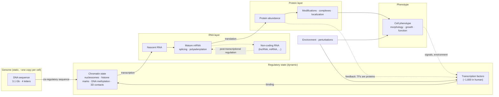

# Chapter 19. The Cell as an Information-Processing System

!!! abstract "Chapter at a glance"
    **Motivation.** Part V teaches biology *as a modeler needs it*. This opening chapter builds the frame: the cell as a noisy, multi-layer, dynamic information-processing system observed through narrow measurement windows. It sets up the observable/latent distinction used for every biological dataset in the rest of the book.
    **Prerequisites.** Chapters 1, 4, 5 (measurement view; negative binomial; information).
    **You will be able to:** (1) describe the central dogma as an information flow with specific observable and latent layers; (2) give order-of-magnitude numbers for molecules, timescales, and sizes that constrain any model; (3) derive the negative binomial distribution of bursty gene expression and relate it to single-cell counts; (4) explain cell types and states as attractors of a regulatory network and verify bistability in a toggle switch; (5) state what each major assay observes and what it cannot; (6) apply the seven-question "biology for modeling" ladder to a new biological object.

---

## 19.1 The seven questions

For every biological object in the next chapters, we ask the same seven questions. Learn them now.

!!! bio "The modeling ladder: seven questions for any biological object"
    1. **What is it?** (the object and its role)
    2. **What information does it contain?** (what is encoded, and in what degrees of freedom)
    3. **How is it generated?** (the physical and evolutionary process that produces it)
    4. **How is it measured?** (the assay, its resolution, noise, and biases)
    5. **How is it represented computationally?** (tokens, matrices, graphs, coordinates)
    6. **What variation exists?** (between genes, cells, individuals, species, conditions)
    7. **What can ML learn from it, and what can ML not observe?** (information available vs. missing)

Question 7 is the one that determines which problems are solvable *in principle*; questions 3 and 4 determine which are solvable *with this data*.

---

## 19.2 The cell, in numbers

Models must respect physical scales. The numbers below are **orders of magnitude** that vary between cell types and conditions (consult Milo & Phillips, *Cell Biology by the Numbers*, and the BioNumbers database).

| Quantity | *E. coli* | Typical cultured human cell |
|---|---|---|
| Genome | 4.6 Mb; ~4,300 genes | 3.1 Gb (diploid: two copies); ~20,000 protein-coding genes |
| Cell volume | ~1 fL ($1\,\mu\text{m}^3$) | ~$10^3$–$10^4\,\mu\text{m}^3$ (1–4 pL) |
| Protein molecules | ~$3\times10^6$ | ~$10^9$ |
| mRNA molecules | ~$10^3$–$10^4$ | ~$10^5$–$10^6$ |
| Number of distinct cell types in the organism | 1 | hundreds (order $10^2$–$10^3$, depending on resolution) |
| Cells in the organism | $10^0$ | ~$3\times10^{13}$ (the human body also hosts a comparable number of bacteria) |

Three observations constrain modeling.

1. **Low copy numbers.** A typical mammalian gene has *tens* of mRNA copies per cell; many regulatory proteins have *hundreds* to *thousands*. At such numbers, molecular noise is not a small correction: it is a leading-order effect (§19.5).
2. **One genome, many cell types.** The same 3.1-Gb sequence specifies hundreds of stable cell phenotypes. A model of "the genome" that does not take a *cell state* as input can at most predict state-independent features (§1.3, Chapter 22).
3. **Sparse sampling.** Measurements sample a small fraction of the molecules (single-cell RNA-seq typically captures a minority of a cell's transcripts). The measurement gap is built into the physics of the assay (Chapter 25).

---

## 19.3 The central dogma as an information flow

The **central dogma** states that sequence information flows from DNA to RNA to protein, and not back from protein to sequence. For a modeler it is better viewed as a **layered information-processing pipeline with regulatory feedback at every level**:



**Which layers are measured?**

| Layer | What is measured | Main assays | Typical dimension per cell | What is lost |
|---|---|---|---|---|
| Genome | Sequence and variants | DNA sequencing | $3\times10^9$ bases | Cell-to-cell somatic variation unless sequenced per cell |
| Chromatin accessibility | Regions open to enzymes | ATAC-seq, DNase-seq | ~$10^5$ regions; very sparse per cell | Which TF is bound; causal state |
| TF binding / histone marks | Occupancy at loci | ChIP-seq, CUT&RUN | $10^4$–$10^5$ peaks | Per-cell resolution; dynamics |
| 3D genome | Contacts between loci | Hi-C, Micro-C | $10^6$–$10^9$ contact pairs | Single-cell, time |
| RNA | Transcript counts | RNA-seq, scRNA-seq | $2\times10^4$ genes | Most molecules; isoform detail; localization |
| Protein | Abundance, modifications | Mass spectrometry, CITE-seq, flow/CyTOF | $10^2$–$10^4$ proteins | Dynamic range, single-cell coverage |
| Phenotype | Morphology, function | Imaging, growth assays, electrophysiology | variable | Molecular cause |

**Latent versus observed.** Each assay provides a *noisy, partial view* of one layer. The causal chain from DNA to phenotype passes through layers (TF concentrations, chromatin state, translation rates, post-translational states) that are only partially observed, in a destructive snapshot, per cell. Models that bridge layers (sequence → expression; expression → phenotype) must therefore infer latent states and cannot, by construction, use information the assays discard (Chapter 1, G-M).

!!! bio "Biology for modeling: gene expression"
    **What is it?** The process by which a gene's information is used to make RNA and protein.
    **Information it contains.** A *quantity* (how much) and a *timing/isoform pattern* (when, which variant). Sequence determines the potential; the cell state decides what is realized.
    **How is it generated?** Transcription factors and chromatin (the *trans* environment) read the *cis*-regulatory sequence and allow RNA polymerase to initiate in stochastic bursts; RNA is processed, exported, translated, and degraded.
    **How is it measured?** Counting RNA fragments (RNA-seq): a sampled, noisy proxy; protein by mass spectrometry or antibodies.
    **Computational representation.** A non-negative integer vector over genes per cell (or per sample); an expression *program* is a latent factor over genes.
    **What varies.** Between genes (orders of magnitude), cell types (hundreds), individuals (small, heritable cis effects), time (minutes–hours), and by chance (bursting).
    **What can ML learn?** Co-expression structure, cell-type signatures, cis-regulatory sequence determinants (partially), responses to perturbations in the training distribution.
    **What can ML not observe?** True molecule counts; protein levels from RNA alone; kinetic rates from snapshots; causal effects from observation alone; any cell state not covered by the data.

---

## 19.4 Timescales

Biological processes span more than twenty orders of magnitude in time. A model trained on data at one timescale can say little about processes at a very different one.

| Process | Timescale |
|---|---|
| Bond vibration | $\sim10^{-14}$ s |
| Side-chain and loop motions | ps–µs |
| Protein folding | µs–s |
| Binding and unbinding (ligand, TF) | ms–min (residence times from ms to hours for tight binders) |
| Enzyme turnover | median $\sim10\ \text{s}^{-1}$ (range 0.01–$10^6\ \text{s}^{-1}$) |
| Transcriptional burst | minutes |
| mRNA half-life | minutes (bacteria); hours (mammalian cells, median several hours) |
| Protein half-life | hours–days (median longer than mRNA) |
| Cell-cycle duration | ~20–30 min (*E. coli*); ~24 h (mammalian cells) |
| Differentiation, development | days–weeks |
| Organismal life; physiological aging | years |
| Evolution | $10^3$–$10^9$ years |

**Implications.** (i) **Snapshot data** (most single-cell and population data) reflect a mixture of states at different phases of slow processes; inferring dynamics requires assumptions (Chapter 30: RNA velocity). (ii) **Timescale separation** makes some variables quasi-static (genotype), some quasi-equilibrium (TF binding relative to transcription), and some slow (cell identity); models may treat fast variables as equilibrated if the assumption holds. (iii) A perturbation measured at 48 h reflects *primary and secondary effects* (cascades), while one measured at 6 h reflects mostly primary effects; **the readout time is part of the experiment** (Chapter 25).

---

## 19.5 Noise in gene expression: bursting and the negative binomial

Genes are not switched on and off like a light; they fire in **bursts**: the promoter transiently becomes active, produces several mRNAs, and returns to silence (Raj et al., 2006). At low copy numbers this produces large cell-to-cell variation even in identical cells and environments (intrinsic noise; Elowitz et al., 2002). **Extrinsic noise** (cell size, cell-cycle phase, concentrations of shared factors) adds variation that is correlated across genes.

### 19.5.1 Derivation: bursting gives the negative binomial

Model: bursts arrive as a Poisson process at rate $k_b$; each burst produces a geometrically distributed number of mRNAs $B$ on $\{0,1,2,\dots\}$ with mean $b$ (probability generating function $H(z)=\E[z^B]=\dfrac1{1+b(1-z)}$); each mRNA degrades independently at rate $\gamma$. At steady state, the mRNA count is the number of molecules that survive from all past bursts. A burst at age $a$ contributes each of its molecules independently with probability $p(a)=e^{-\gamma a}$, so the *thinned* burst has pgf $H(1-p+pz)=\dfrac1{1+bp(1-z)}$. Because bursts are Poisson in time, the pgf of the total count is

$$
G(z)=\exp\Big(k_b\int_0^\infty\big[H(1-p(a)+p(a)z)-1\big]\,da\Big)=\exp\Big(k_b\int_0^\infty\frac{-q\,e^{-\gamma a}}{1+q\,e^{-\gamma a}}\,da\Big),\quad q=b(1-z).
$$

The integral equals $-\frac1\gamma\ln(1+q)$, so

$$
G(z)=\big(1+b(1-z)\big)^{-k_b/\gamma}.
$$

This is the pgf of a **negative binomial** with shape $r=k_b/\gamma$ and mean $\mu=rb$, with variance

$$
\mathrm{Var}=\mu(1+b)=\mu+\frac{\mu^2}{r}.
$$

(compare Chapter 4, §4.2.3: the Gamma–Poisson form with the same variance). The **Fano factor** (variance/mean) is $1+b$: *burst size* sets the overdispersion, *burst frequency relative to decay* sets $r$ (the inverse dispersion). A constitutively expressed gene (no bursting, $b\to0$) is Poisson with Fano factor 1.

**Simulation** (`code/ch19_cell_dynamics.py`): $k_b=0.2\ \text{min}^{-1}$, $b=8$, $\gamma=0.1\ \text{min}^{-1}$, so $r=2$ and $\mu=16$. From 4,000 simulated cells: mean $15.85$ (theory $16.0$), variance $141.8$ (theory $144.0$), Fano factor $8.95$ (theory 9.0), and a moment-matched NB fit gives $r=1.99$ (theory 2.00). A Poisson gene with the same mean has Fano factor $0.99$. **The overdispersion in single-cell count data is therefore partly *biological* (bursting) and partly technical (capture heterogeneity), and the NB likelihood is the natural model for both** (Chapters 4, 25, 30).

!!! rhyme "Structural rhyme: mechanistic bursting ↔ the Gamma–Poisson mixture ↔ the single-cell likelihood"
    Chapter 4 derived the NB as a Gamma–Poisson mixture (the true rate varies from cell to cell). Here the same distribution arises from a *mechanistic* model of bursts. The two derivations describe the same data with different latent structures: *continuous rate heterogeneity* versus *discrete burst events*. They are statistically indistinguishable from a single snapshot of counts. This is an example of **non-identifiability of mechanism from marginal distributions**: to distinguish mechanisms you need dynamics (live imaging, time series) or perturbations. The choice of likelihood in a model (Gaussian, Poisson, NB, zero-inflated) is thus a statement about *unobserved biology*, and different choices can fit equally well.

---

## 19.6 Cell types and states as attractors

### 19.6.1 The regulatory network as a dynamical system

Genes regulate each other: transcription factors (proteins) activate or repress targets, including other TFs. Writing $x_g$ for the concentration of gene product $g$, a minimal ODE model is

$$
\frac{dx_g}{dt}=f_g(\mathbf{x})-\gamma_gx_g,
$$

where the production function $f_g$ encodes regulatory logic (Hill functions of TF concentrations; Chapter 22) and $\gamma_g$ is the degradation/dilution rate. A **cell state** is then a point $\mathbf{x}$ in this space; a **stable cell type** is an **attractor**: a state that the dynamics return to after small perturbations (Kauffman, 1969; Huang et al., 2005). **Differentiation** is a trajectory from one attractor basin to another; **Waddington's landscape** is the metaphor, with valleys as attractors and ridges as barriers.

### 19.6.2 A minimal example: the genetic toggle switch

Two genes that repress each other (Gardner, Cantor & Collins, 2000):

$$
\frac{du}{dt}=\frac{a}{1+v^n}-u,\qquad\frac{dv}{dt}=\frac{a}{1+u^n}-v .
$$

For $n=2$: if the maximal production rate $a$ is small, there is one stable state with $u=v$ (both moderately expressed); if $a$ is large enough, mutual repression produces **bistability**. The code finds fixed points by Newton iteration and classifies them by the Jacobian: for $a=1.5$, a single stable state $(0.86,0.86)$; for $a=3$, two stable states $(u=0.38,v=2.62)$ and $(2.62,0.38)$ plus an unstable saddle $(1.21,1.21)$ between them. *Two cell types from one regulatory architecture*, with the unstable symmetric state as the "ridge."

**Noise-driven switching.** With additive noise of standard deviation $\sigma$ the system occasionally crosses the barrier. The number of *committed* switches (clear transitions to the other state) in 4,000 time units rises steeply with noise: 23 at $\sigma=0.3$, 158 at $0.6$, and 471 at $0.9$. Therefore **cell states are robust but not permanent**: stochastic fluctuations (Section 19.5) can cause spontaneous transitions, which is thought to underlie phenomena such as heterogeneity in drug response and stem-cell state interconversion.

### 19.6.3 Consequences for modeling cell states

- **Discrete versus continuous.** Attractor basins imply discrete-looking clusters; transitions imply continuous bridges; the same tissue can display both (Chapter 8's Worked Example 8.1).
- **Hysteresis and history dependence.** In a bistable system the state depends on *history*, not only the current environment; a snapshot may not determine a cell's *potential*.
- **Identifiability.** Observing the steady-state *marginal distribution* of expression across cells does not identify the regulatory network; many networks give similar distributions (Chapter 44).
- **Perturbation response depends on state.** A perturbation that is small relative to the barrier does nothing; a perturbation that crosses it changes cell fate. *The response to a perturbation is a function of cell state*, and a model without state as an input cannot capture it (Chapter 39).

```python
--8<-- "code/ch19_cell_dynamics.py"
```

Output:

```text
bursting gene: mean = 15.85 (theory r*b = 16.00), variance = 141.82 (theory mu(1+b) = 144.00), Fano factor = 8.95 (theory 9.0)
  Poisson gene with the same mean: Fano factor = 0.99;  fraction of cells with zero mRNA: bursting 0.013 vs Poisson 0.000
  NB moment fit: r = 1.99 (theory 2.00), i.e. dispersion 1/r = 0.50
toggle switch, a = 1.5: (u=0.86, v=0.86) stable
toggle switch, a = 3.0: (u=0.38, v=2.62) stable; (u=1.21, v=1.21) UNSTABLE (saddle); (u=2.62, v=0.38) stable
  noise sd 0.3: number of committed state switches in 4,000 time units = 23
  noise sd 0.6: number of committed state switches in 4,000 time units = 158
  noise sd 0.9: number of committed state switches in 4,000 time units = 471
```

---

## 19.7 What a measurement of a cell is, formally

Chapter 1 wrote $x^{(k)}=\mathcal{M}_k(\mathbf{s},c;\xi)$. We can now be concrete about each part.

- The **state** $\mathbf{s}$ includes copy numbers of every molecular species, their locations and modifications, chromatin configuration, and the history that determines future behavior. Dimensionality: effectively unbounded.
- The **assay operator** $\mathcal{M}_k$ for scRNA-seq is a *sampling process*: each mRNA molecule is captured with probability $\pi_n$ (cell-specific capture efficiency), reverse-transcribed, amplified, and sequenced: $x_{ng}\mid s\sim\mathrm{Binomial}(m_{ng},\pi_n)$, where $m_{ng}$ is the true copy number. This loses information about absolute abundance (only *relative* abundance survives, scaled by $\pi_n$), and adds sampling noise on top of biological bursting noise.
- The **nuisance** $\xi$ includes batch, reagent lot, instrument, and operator.
- The **destructive** nature of the measurement means each cell is observed once; the *same* cell is never measured under two conditions (§19.8).

**Counterfactual impossibility.** We would like to know how *this* cell would have responded to a different perturbation. We cannot observe it: the cell was destroyed by the first measurement, and no two cells are identical. This is the *fundamental problem of causal inference* (Holland, 1986), manifested in biology as the impossibility of paired before/after single-cell measurements; treatments of perturbation prediction (Chapters 39, 44) must work with *distributions* of cells under each condition, not paired outcomes.

---

## 19.8 Worked research examples

!!! example "Worked Research Example 19.1: A gene is \"expressed 3-fold higher in disease.\" Bulk and single-cell data disagree on what that means"
    **Situation.** Bulk RNA-seq shows gene $G$ 3× higher in diseased tissue. Single-cell data from the same tissue show that the *fraction of cells expressing $G$* is 3× higher in disease, with the same per-cell expression among expressing cells.

    **Question.** What does each result say, and what could each hide?

    **Reasoning.**

    1. *Bulk measures a mixture.* A bulk value is $\sum_t w_t\mu_t$: cell-type proportions times per-type expression. A 3× change can come from (i) 3× higher expression in every cell, (ii) 3× more of a cell type that expresses $G$, or (iii) a rare cell type with a huge increase.
    2. *Single-cell resolves composition but has its own gaps.* Dropout/sampling limits detection of low-expression genes; dissociation biases composition (fragile cell types are lost); the "fraction expressing" depends on detection threshold and depth.
    3. *Alternative explanations for the single-cell finding.* (H1) A real change in the fraction of a cell type or state. (H2) A change in *bursting frequency* (more cells ON at a time, same burst size): a within-cell-type effect. (H3) Technical: higher sequencing depth or capture in the disease samples. (H4) Infiltration of a new cell type.
    4. *Experiments.* Compare at matched depth (downsample); examine the *distribution* of $G$ counts (NB parameters $r$ and $\mu$ separately: burst frequency vs. size); test within annotated cell types; use an orthogonal measurement of fraction positive (RNA FISH or immunostaining).
    5. *Predictions.* Under H2, NB analysis shows $r$ (frequency) changes while $b$ (size) does not; under H1, cell-type proportions change while per-type distributions do not.

    **Expert analysis.** "Expression level" is not one quantity. The distribution of counts across cells decomposes into *composition*, *burst frequency*, *burst size*, and *technical sampling*. Models that predict a single expected value per gene per condition discard this structure; models that capture distributions (Chapter 39's generative perturbation models) can represent it, but only if evaluated on distributional metrics.

!!! example "Worked Research Example 19.2: A model of steady-state expression is asked to predict the response 30 minutes after a drug"
    **Situation.** A model is trained on thousands of steady-state expression profiles and then applied to predict the transcriptional response 30 minutes after adding a drug. It performs poorly.

    **Reasoning.**

    1. *Timescale mismatch.* Steady-state data reflect equilibrium between production and decay. A 30-minute response reflects *primary* effects on transcription of *fast-turnover* mRNAs, and is largely invisible in stable transcripts whose half-lives are many hours.
    2. *Which genes can show a 30-minute change?* Those with short mRNA half-lives (immediate-early genes, many TFs) can rise or fall within minutes; stable housekeeping transcripts barely move even if their transcription changes completely (the change in level scales with $1-e^{-\gamma t}$).
    3. *Alternative explanations for the failure.* (H1) The model lacks dynamics (no time input). (H2) The drug acts on post-transcriptional or signaling processes absent from steady-state data. (H3) The metric treats all genes equally although only a small fast subset responds. (H4) The 30-minute data are noisier (smaller effect sizes), lowering the ceiling.
    4. *Experiments.* Stratify performance by mRNA half-life; compare to a baseline that predicts response = 0 for stable transcripts and a mean response for unstable ones; evaluate against the replicate noise ceiling; test a model that includes a *time* variable and half-life features.
    5. *Predictions.* The model's performance should be concentrated in short-half-life genes; a kinetic-feature-aware baseline should outperform a generic network.

    **Expert analysis.** The distinction between *where the system sits* (steady state) and *how it moves* (dynamics) is a modeling limitation, not a data-size limitation: no amount of steady-state data contains the kinetic information needed (G-M and G-O). The fix is *data* (time courses, metabolic labeling such as 4sU-seq that measures new RNA) or an *explicit mechanistic prior* (Chapter 55, A9).

---

## 19.9 Researcher's Notebook

!!! notebook "Researcher's Notebook: draw the measurement chain before choosing a model"
    **Procedure.** For any new problem, draw the diagram of §19.3 and annotate it:

    1. Circle the layer that is **observed** and the layer that is the **target**. If they differ (observe RNA, target protein activity), mark the missing arrows as *assumptions* ("RNA ∝ protein").
    2. Label each arrow with its **timescale** (is the observation downstream of the target by minutes or days?).
    3. List the **noise sources** along each arrow: bursting, capture, batch, cell-cycle phase.
    4. List the **variables that act on the target but are not measured** (cell state, TF concentration, metabolic state): they will appear as unexplained variance (the Bayes error of Chapter 7).
    5. State the **counterfactual** you would need and say whether it is observable (it usually is not; see §19.7).

    **Example: "predict protein level from mRNA level."** Observed: mRNA (steady state). Target: protein. Missing: translation rate, protein degradation. Typical result across genes: mRNA explains a modest fraction (on the order of 40%) of protein variance in many datasets; the remainder reflects translation and degradation rates, which depend on sequence features (UTRs, codons, degrons) and cell state. A model should therefore include *sequence features of the mRNA and protein* in addition to the mRNA level (Chapter 33).

    **What this teaches.** The diagram turns "the model fails" into "which arrow is missing information." It is the quickest way to decide whether more data, new data types, or a new objective is needed.

---

## 19.10 Connections

- **Backward:** the measurement view and noise ceiling (Chapter 1); NB and Gamma–Poisson (Chapter 4); information content and channels (Chapter 5); latent-variable models and mixtures vs. continua (Chapter 8).
- **Forward:** genomes and variation (Chapter 20); evolution (Chapter 21); regulation, the cis/trans decomposition (Chapter 22); proteins (Chapter 23); single-cell and perturbation measurement in detail (Chapter 25); single-cell methods and RNA velocity (Chapter 30); perturbation prediction and state-dependent responses (Chapter 39); causal identifiability of networks (Chapter 44).

!!! takeaways "Key takeaways"
    1. Use the **seven-question ladder** (what, information, generated, measured, represented, varies, learnable/unobservable) for every biological object.
    2. Cells have **low copy numbers** (tens of mRNAs per gene, $10^9$ proteins), so noise is first-order; one genome supports **hundreds of cell types**.
    3. The central dogma is a **layered pipeline with feedback**; each assay is a noisy partial view of one layer; destructive per-cell measurements preclude paired counterfactuals.
    4. **Bursting** gives $G(z)=(1+b(1-z))^{-k_b/\gamma}$: a negative binomial with Fano factor $1+b$ (simulated: 8.95 vs. 9.0; Poisson 0.99).
    5. **Cell types are attractors** of regulatory dynamics: a toggle switch has two stable states and an unstable saddle for large $a$; noise causes switching (23 → 158 → 471 switches as $\sigma$ rises).
    6. **Timescales** span 20+ orders of magnitude; snapshot, steady-state, and dynamic data answer different questions.
    7. The response to a perturbation is **state-dependent**; a model without state as input cannot capture it.

---

## Further reading

- Alberts, B. et al. *Molecular Biology of the Cell* (7th ed.). The standard textbook; use as a reference.
- Milo, R. & Phillips, R. (2015). *Cell Biology by the Numbers*. Garland Science. BioNumbers database (bionumbers.hms.harvard.edu).
- Sender, R., Fuchs, S. & Milo, R. (2016). Revised estimates for the number of human and bacteria cells in the body. *PLoS Biology* 14, e1002533.
- Elowitz, M. B., Levine, A. J., Siggia, E. D. & Swain, P. S. (2002). Stochastic gene expression in a single cell. *Science* 297, 1183–1186. Raj, A., Peskin, C. S., Tranchina, D., Vargas, D. Y. & Tyagi, S. (2006). Stochastic mRNA synthesis in mammalian cells. *PLoS Biology* 4, e309. Peccoud, J. & Ycart, B. (1995). Markovian modeling of gene-product synthesis. *Theoretical Population Biology* 48, 222–234.
- Gardner, T. S., Cantor, C. R. & Collins, J. J. (2000). Construction of a genetic toggle switch in *Escherichia coli*. *Nature* 403, 339–342. Kauffman, S. (1969). Metabolic stability and epigenesis in randomly constructed genetic nets. *J. Theor. Biol.* 22, 437–467. Huang, S., Eichler, G., Bar-Yam, Y. & Ingber, D. E. (2005). Cell fates as high-dimensional attractor states of a complex gene regulatory network. *Physical Review Letters* 94, 128701.
- Schwanhäusser, B. et al. (2011). Global quantification of mammalian gene expression control. *Nature* 473, 337–342. Vogel, C. & Marcotte, E. M. (2012). Insights into the regulation of protein abundance from proteomic and transcriptomic analyses. *Nature Reviews Genetics* 13, 227–232.
- Holland, P. W. (1986). Statistics and causal inference. *J. Am. Stat. Assoc.* 81, 945–960.
- Bar-Even, A. et al. (2011). The moderately efficient enzyme: evolutionary and physicochemical trends shaping enzyme parameters. *Biochemistry* 50, 4402–4410.
