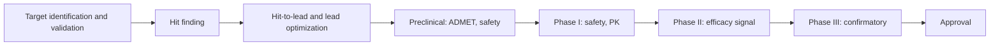

# Chapter 37. Molecular Machine Learning and Drug Discovery

!!! abstract "Chapter at a glance"
    **Motivation.** Drug discovery is where AI for biology meets the economics of medicine: a candidate molecule costs years and hundreds of millions of dollars to test in humans, about nine in ten that enter clinical trials fail, and a modest improvement in the probability of success or the time to the clinic is worth billions. Machine learning enters at every stage, from nominating targets, to finding and optimizing molecules, to designing trials. The evidence for what it contributes is mixed in a specific way: for *molecular property prediction* the best simple models are hard to beat and all models degrade when chemistry is new; for *generative design* the benchmarks are easily gamed and prospective tests are rare; for *clinical success* the first AI-nominated molecules have reached Phase II and Phase III, with a small-sample record that is consistent with better early properties and unchanged efficacy attrition. This chapter lays out the pipeline and its attrition, runs a controlled comparison on a real data set (a random forest on fingerprints, a nearest-neighbor model, and a graph network on 1,513 BACE-1 inhibitors) with the metrics that matter in a campaign (enrichment, hits for a fixed budget, calibrated uncertainty), reviews generative and structure-based methods and the clinical record, and states what a credible claim of AI-enabled discovery must show.
    **Prerequisites.** Chapters 16, 22–24, 35, 36, 43–47.
    **You will be able to:** (1) map ML methods onto the stages of the drug-discovery pipeline and the attrition at each stage; (2) compare molecular models with decision-relevant metrics and a noise ceiling; (3) read generative-chemistry benchmarks critically; (4) state what the clinical record of AI-discovered molecules does and does not show; (5) design a prospective comparison of discovery strategies; (6) judge uncertainty estimates by coverage, not by their existence.

---

## 37.0 The pipeline, the attrition, and where the leverage is



Three quantitative facts organize the field.

1. **Attrition.** Roughly nine of ten candidates that enter Phase I do not reach approval; the largest causes are lack of clinical efficacy (about half) and toxicity (about a quarter to a third), with pharmacokinetics and commercial reasons making up the remainder (analyses of 2010–2017 programs, Sun et al., *Acta Pharm. Sin. B* 2022) [[S]]. Efficacy failures are failures of *target biology* (modulating this target does not treat this disease); toxicity and pharmacokinetic failures are failures of *molecule quality*.
2. **Genetic evidence for the target doubles-plus the odds.** Drug mechanisms supported by human genetic evidence are about 2.6 times as likely to succeed in the clinic as those without (Minikel et al., *Nature* 2024) [[S]], which is why target selection from genetic data (Chapters 26, 41) is among the highest-value uses of computation.
3. **Which problem machine learning addresses determines what it can change.** A model that improves molecule quality (potency, selectivity, ADMET, synthesizability) can raise Phase I success; only better target biology raises Phase II and III success. The clinical record below fits this decomposition.

!!! lens "Research lens: what information a molecular model uses and ignores"
    *Uses*: the molecule's structure (as a fingerprint, graph, or 3-D conformer) and, for structure-based models, the target's pocket. *Ignores*: the assay (conditions, format, noise), the protein's conformational ensemble and water (Chapter 35), the cellular context (permeability, efflux, metabolism), and the disease biology. A model trained on one target's potency data predicts that target's *assay readout*, not the molecule's clinical value.

---

## 37.1 Representations, models, and what each assumes

| Model class | Input | Inductive bias | Strengths | Typical failure |
|---|---|---|---|---|
| **Fingerprint + RF/GBM/linear** | Count or bit fingerprint of substructures (Morgan, radius 2) | Local substructures are additive-ish features | Fast, hard to beat on small data (Chapter 24); calibrated spread for trees | No 3-D, no stereochemistry unless added, unseen substructures |
| **Similarity (kNN, kernel)** | Tanimoto similarity | Similar molecules have similar activity (Chapter 24: the similarity–activity relation) | Strong when the test set is near training | Activity cliffs; fails far from training |
| **Graph networks (MPNN, GCN, GIN)** | Atom and bond graph | Local message passing (Chapter 16) | Learn features; scale with data | Limited expressiveness (1-WL, Chapter 16); no 3-D; overfits small sets |
| **Equivariant 3-D networks** | Coordinates and atom types (SchNet, EGNN, PaiNN) | E(3) symmetry | Quantum properties, forces, conformer-dependent quantities | Need conformers; cost |
| **SMILES/graph LMs and molecular FMs** | Token sequences or graphs pretrained on 10⁸–10⁹ molecules | Pretraining on unlabeled chemistry | Transfer to small tasks (inconsistently) | Gains over fingerprints are modest on many benchmarks (§37.2) |
| **Structure-based** | Protein–ligand complex (docking, co-folding, FEP) | Physical interactions | Novel chemotypes, selectivity | Pose and scoring errors; cost; training-set memorization (Chapter 35) |
| **Generative** | Property targets or pockets | Learn the chemical space | Propose new molecules | Metrics gamed; synthesizability; oracle exploitation (Chapter 36) |

---

## 37.2 A controlled comparison on real data (BACE-1)

The data are the 1,513 BACE-1 inhibitors of Chapter 24 (pIC$_{50}$, mean 6.5, SD 1.34; 12.4% have pIC$_{50}\ge8$, the "potent" class). Four models are compared: a random forest on Morgan count fingerprints (300 trees); a Tanimoto-weighted nearest-neighbor model ($k=5$); a graph convolutional network (three residual graph-convolution layers of width 96, mean and max pooling, trained from scratch for 80 epochs with the number of epochs fixed in advance, single network and an ensemble of 3); and the average of the random forest and the GCN ensemble. Two five-fold cross-validations are run: a **random split**, and a **cluster split** (Butina clusters at Tanimoto distance 0.6, whole clusters held out: "a new chemical series"). Besides Pearson $r$ and RMSE, two metrics reflect a campaign's decisions: the **enrichment factor at 10%** (EF@10%: the fraction of potent compounds among the 10% ranked highest, divided by the base rate; the maximum is 8.0) and the **hit multiple at a 5% budget** (potent compounds found among the 5% of the test set chosen by prediction, as a multiple of random choice). Uncertainty estimates (the ensemble spread for the GCN, the spread across trees for the forest) are tested by coverage of nominal 90% intervals and by their rank correlation with the absolute error.

```python
--8<-- "code/ch37_molecular_ml.py"
```

```text
1513 molecules, 106 Butina clusters; 'potent' = pIC50 >= 8.0 (12.4% of the data); atoms padded to 97; GCN: 3 residual graph-convolution layers, width 96, ensemble of 3, 80 epochs (fixed in advance)
metrics per model: Pearson r | RMSE | enrichment factor (EF@10%) of potent compounds in the top 10% by prediction (1 = random; maximum 8.0) | potent hits among the 5% of the test set chosen by prediction, as a multiple of random choice

-- random split --
model                       Pearson r    RMSE     EF@10%    hits in top 5% (x random)
RF                            0.856    0.697     4.99        6.52
kNN (Tanimoto, k=5)           0.833    0.742     5.07        5.49
GCN (1 net)                   0.821    0.775     4.59        4.76
GCN ensemble (3)              0.837    0.734     4.60        5.39
RF + GCN ensemble             0.861    0.685     4.92        6.18

-- cluster split --
model                       Pearson r    RMSE     EF@10%    hits in top 5% (x random)
RF                            0.632    1.096     3.03        3.98
kNN (Tanimoto, k=5)           0.560    1.181     2.70        2.75
GCN (1 net)                   0.581    1.184     2.06        2.16
GCN ensemble (3)              0.597    1.156     2.62        2.83
RF + GCN ensemble             0.638    1.091     2.73        3.43

-- does predictive uncertainty tell you when to distrust a prediction? (Spearman correlation between predicted SD and |error|; coverage of mean +/- 1.645 SD intervals, nominal 0.90) --
split     model                  rho(SD, |error|)   coverage of the 90% interval   rho(1 - max Tanimoto to training, |error|)
random    GCN ensemble (3)          0.154                     0.361                          0.074
random    RF (tree spread)          0.298                     0.900                          0.078
cluster   GCN ensemble (3)          0.170                     0.309                          0.248
cluster   RF (tree spread)          0.203                     0.883                          0.196
```

**Reading the results.**

1. **The fingerprint forest is a hard baseline.** Under the random split the forest has $r=0.856$ and RMSE 0.697; the GCN ensemble is slightly behind ($r=0.837$, RMSE 0.734), a single GCN further ($r=0.821$); kNN is at 0.833. Against the noise ceiling of Chapter 24 (a single-measurement SD of 0.54 pIC$_{50}$ gives $r\le0.92$) the forest reaches 93% of the achievable correlation. Under the cluster split the order is the same, $r=0.632$ (forest), 0.597 (GCN ensemble), 0.581 (single GCN), 0.560 (kNN). **A graph network trained from scratch on 1,500 molecules did not beat a forest on fingerprints**, in agreement with benchmark studies on small data sets [[S]]. The **average of the forest and the GCN ensemble was the best by correlation in both splits** (0.861 and 0.638): different inductive biases make partly independent errors.
2. **Novelty costs everyone.** Moving from random to cluster split reduces the forest's correlation from 0.86 to 0.63 (69% of the ceiling), its EF@10% from 4.99 to 3.03 and its hit multiple at a 5% budget from 6.5 to 4.0. For a team that will test only the top 5% of a new series, a model that looks excellent in random cross-validation finds potent compounds 4 times as often as random choice, not 6.5 times.
3. **Ensembling a graph network does not make it a good uncertainty estimator.** The GCN ensemble's intervals contain the truth for only 31–36% of compounds at a nominal 90% (they are far too narrow); the rank correlation between its predicted SD and the absolute error is 0.15–0.17. The forest's tree spread contains the truth for 88–90% of compounds, but this is largely because the spread across trees is wide; its rank correlation with the error is 0.20–0.30. In the cluster split a simple distance measure (one minus the maximum Tanimoto similarity to the training set) correlates with the GCN's error ($\rho=0.25$) better than its ensemble spread does (0.17). **Ensembles estimate model variance, not the bias that comes from being far from the training data** (Chapter 45), and an uncertainty estimate is useful only when it is calibrated on data that resemble deployment.
4. **Decision metrics rank models differently than correlation.** The kNN model has the highest EF@10% under the random split (5.07, against 4.99 for the forest) while having a lower correlation; the single GCN has a lower EF@10% under the cluster split (2.06) than its correlation would suggest. If the decision is "which 5% to make," optimize and report the enrichment at that budget, with an interval.

!!! lens "Research lens: assumptions of the comparison"
    One target, one assay type, 1,513 molecules (a few chemical series), a GCN without 3-D or pretraining, hyperparameters not tuned (a tuned GCN or a larger pretrained model might change the ranking by a few points; the preregistered fixed epochs avoid tuning on the test fold), and a three-member ensemble. The conclusion is not "graph networks are worse" but "do not assume a more expressive model beats a strong baseline, and compare with decision metrics under a split that matches deployment."

---

## 37.3 Generative chemistry: what the benchmarks measure

Generative models (VAEs and RNNs on SMILES, graph generators, reinforcement-learning optimizers such as REINVENT, diffusion models over 3-D molecules and pockets) are evaluated on *distribution-learning* metrics (validity, uniqueness, novelty, diversity, closeness to the training distribution; MOSES, GuacaMol) and on *goal-directed* optimization of an oracle (a computed property or a docking score). Four problems recur.

1. **Distribution metrics are easily saturated** and say little about utility: a model can have 100% validity and uniqueness and propose molecules no chemist would make.
2. **Goal-directed benchmarks reward oracle calls.** With a fixed budget of oracle evaluations (a realistic assumption: each is an experiment or a costly simulation), *sample efficiency* decides the ranking, and in a large comparison (Gao et al., *NeurIPS* 2022) simple methods (REINVENT-style reinforcement learning, genetic algorithms) were highly competitive against more elaborate generators [[S]].
3. **Oracles are exploitable** (Chapter 36): optimized molecules maximize a docking score or a learned property with no guarantee of real activity; the gap between oracle and truth grows with optimization strength.
4. **Synthesizability and cost** are constraints, not afterthoughts: retrosynthesis planners (Segler et al., *Nature* 2018; AiZynthFinder) and synthesis-aware generation address them [[P]]; in a prospective campaign the fraction of proposed molecules a chemist would make in at most five steps is a primary metric.

**Structure-based generation and scoring.** Pocket-conditioned diffusion models (DiffSBDD, TargetDiff) generate ligands for a given pocket; docking networks (DiffDock, Corso et al. 2023) predict poses; both are subject to the evidence of Chapter 35 (pose accuracy falls for novel pockets; physical validity must be checked: Buttenschoen et al. 2024). **Affinity prediction** aims at the accuracy of free-energy perturbation (about 1 kcal/mol for congeneric series, at substantial cost) at lower cost; the Boltz-2 affinity module reports approaching FEP accuracy at about a thousand-fold lower cost (developer-reported [[P]]), while published ML scoring functions have suffered from leakage between training and benchmark sets that inflated reported accuracy [[S]].

---

## 37.4 The clinical record and what it can show

!!! paper "Paper dissection: 'How successful are AI-discovered drugs in clinical trials?' (Jayatunga, Ayers, Bruens, Jayanth & Meier; *Drug Discovery Today* 2024)"
    **Problem.** Do molecules discovered with AI-enabled methods have higher clinical success rates than conventional ones?
    **Design.** A descriptive analysis of AI-discovered molecules (as classified by the authors from company disclosures) that had entered or completed clinical trials by the end of 2023, compared with historical success rates.
    **Result (as reported).** Phase I success was 80–90% (21 completed Phase I trials), higher than the historical rate of about 40–65%; Phase II success was about 40% (10 completed trials), in line with historical averages. The authors read this as better early-stage properties without evidence of improved efficacy.
    **Limitations.** Small numbers (a Phase II rate of 4/10 has a 95% confidence interval of roughly 12% to 74%); classification of "AI-discovered" by the sponsors; survivorship (successes are announced); different targets and periods; no matched controls.
    **Unresolved.** Whether the pattern persists with larger numbers, and whether it reflects the effect of AI or the choice of easier targets.

**Rentosertib.** The most advanced case at the time of writing is a small-molecule TNIK inhibitor for idiopathic pulmonary fibrosis (Insilico Medicine), for which both the target and the molecule were nominated with AI-enabled methods. A randomized, double-blind, placebo-controlled Phase IIa trial (71 patients, 22 sites in China, 12 weeks) reported a mean change in forced vital capacity of +98.4 mL at the highest dose against −20.3 mL for placebo, with acceptable tolerability, as published in *Nature Medicine* in 2025; a Phase III trial in China was announced in July 2026 [[S]] for the trial result as reported, [[P]] for clinical benefit (a small, short, early-phase study). As of this writing no AI-discovered drug has received regulatory approval to the best of the author's knowledge. Chapter 58 (Case 4) works through what this evidence can and cannot show about AI itself.

**What ML can plausibly change, ranked by confidence.** [[S]]: speed of molecule optimization within a series (design–make–test cycles), prioritization of compounds within chemical series, early property prediction; [[P]]: Phase I success via better properties, target nomination from multi-omic and genetic data; [[H]]: Phase II/III success via better target biology; [[X]]: de novo discovery of drugs for undruggable targets at scale.

---

## 37.5 Worked research examples

!!! example "Worked Research Example 37.1: A generative model proposes 50 molecules with predicted pIC₅₀ above 9"
    **Situation.** A group's generator, trained on the target's known inhibitors and guided by a potency predictor, outputs 50 molecules predicted at pIC$_{50}\ge9$. The best known compound is at 8.4. Synthesis of the 50 would cost about $400,000.

    **Question.** What should be done before synthesis?

    **Reasoning (Expert Chain).**

    1. **L1 What does "predicted 9" mean?** The predictor was trained on a data set whose potent compounds reach 8–9; predictions at 9+ are at or beyond the edge of the training labels. By §36.2 the expected overstatement of the gain is large; for a model with the cluster-split correlation of §37.2 ($r\approx0.6$, $R^2\approx0.4$) the true expected value of the top predictions is much lower than predicted.
    2. **L3–L5 Failure modes.** (a) *Extrapolation*: how far are the molecules from the training set (nearest-neighbor Tanimoto)? (b) *Oracle exploitation*: do they share a motif that the predictor overweights? (c) *Synthesizability*: what is the predicted number of steps? (d) *Redundancy*: how many distinct chemotypes?
    3. **L6 Bottleneck.** The predictor's error at the distance of the proposed molecules.
    4. **L10 Experiments.** (i) Compute applicability-domain statistics; (ii) re-score with an *independent* model class (forest on fingerprints; a physics-based or structure-based score) and require agreement (Chapter 36's second-filter test); (iii) cluster the 50 into chemotypes and choose 12 spanning the clusters plus 3 *controls* (known actives of the best series; random compounds of matched properties); (iv) synthesize and test those 15 first; use the measured values to calibrate the predicted-versus-measured gap as a function of distance.
    5. **L11 Interpretation.** If the 12 show a mean potency gain over the known series at lower distances but none at greater distances, set a trust region accordingly and plan the next 50 inside it; if none is active, the generator has exploited the predictor, and the next step is retraining with the new negatives.

    **Expert analysis.** A 15-compound test costs about 30% of the synthesis of all 50 and tells whether the other 35 are worth making; the experiment's value is the calibration, not only the hits.

!!! example "Worked Research Example 37.2: Do molecular foundation models reduce the number of compounds needed to find a lead? No known answer"
    **Situation.** A company has a pretrained molecular foundation model and a conventional fingerprint-forest workflow. It runs active-learning campaigns (select a batch, measure, retrain, repeat). No one knows whether the pretrained model reduces the number of measured compounds needed to find a lead (a compound with pIC$_{50}\ge8$) on new targets.

    **Question.** How would you answer this for the company's targets?

    **Reasoning.**

    1. **Outcome.** The *cumulative number of leads found as a function of compounds measured*, per target (a learning curve of discovery), summarized by compounds-to-first-lead and the area under the cumulative-hit curve.
    2. **Arms.** (A) forest on fingerprints with Thompson/greedy selection; (B) the foundation model's embeddings plus a ridge or GP head with the same selection rule; (C) random selection; (D) a medicinal chemist's selection (if affordable). Same pool, same batches (e.g., 5 rounds of 96), same assay.
    3. **Design.** At least 10 targets with *already measured* large libraries (so campaigns can be *simulated retrospectively* by revealing labels batch by batch: cheap), with a held-out cluster structure to emulate novelty; later confirm on 2–3 targets prospectively.
    4. **Analysis.** A paired comparison of the area under the discovery curve across targets (mixed-effects model with target as a random effect); report the *distribution* of effects, not only the mean; account for hyperparameter tuning effort (equal budget).
    5. **Power.** With 10 targets and an area-under-curve difference SD of 0.1 across targets, a true mean difference of 0.08 would be detected with about 80% power at $\alpha=0.05$; a smaller difference would not, which should be stated before the study.
    6. **Decision rule.** Adopt the foundation model if its area under the discovery curve exceeds the forest's by at least 0.05 with the lower 95% bound above 0 on the retrospective campaigns and the prospective targets agree in direction; otherwise keep the forest (cheaper) and use the model only as an additional feature.

    **What is not known.** The size of the effect; §37.2 suggests a small or null one for a plain graph network on a single target, with the largest potential gain from hybrid combinations (the forest-plus-GCN average was the best correlation in both splits).

---

## 37.6 Researcher's Notebook

!!! notebook "Researcher's Notebook: evaluating a molecular model or a discovery claim"
    1. **Use a cluster or scaffold split** that matches the novelty you expect and report the gap to a random split.
    2. **Report decision metrics**: enrichment at the budget, hits per compound synthesized, with intervals.
    3. **Compare against fingerprints + forest** with equal tuning effort, and against an average of models.
    4. **Report the noise ceiling** of the assay and normalize.
    5. **Check calibration of uncertainty** (coverage of nominal intervals) on the deployment-like split; use a distance-to-training measure as a baseline.
    6. **For generative claims**, report oracle-call efficiency, synthesizability, novelty by chemotype, and an independent second oracle.
    7. **For clinical claims**, separate molecule quality from target biology, and report denominators and matched comparisons.

    **What it teaches.** The best model is often the average of different simple ones, and the right metric is the decision the model informs.

    **An open question to carry forward.** Phase I success is plausibly raised by better molecule properties, while Phase II success depends on target biology. Is there a measurable *molecule-quality score* (a combination of selectivity, off-target liability, and exposure at efficacious dose, computed before the clinic) that predicts Phase I and II attrition independently of target, and could it be calibrated by regressing historical program outcomes on preclinical profiles? Such a score would let AI-enabled discovery be *evaluated in advance*, by comparing its predicted attrition with the realized one.

---

## 37.7 Connections

- **Backward:** equivariance and graph networks (Chapter 16); molecular representation, binding free energy, and BACE/ESOL (Chapter 24); structure prediction and co-folding (Chapter 35); design and oracle exploitation (Chapter 36); benchmark design, shift, and experimental design (Chapters 43, 45, 46); learning curves (Chapter 47).
- **Forward:** AI scientists in drug discovery (Chapter 54); open problems in molecules (Chapter 52); AI-discovery evaluation (Chapter 58, Case 4).

!!! takeaways "Key takeaways"
    1. About nine in ten clinical candidates fail, about half for lack of efficacy (target biology) and a quarter to a third for toxicity (molecule quality); human genetic support for a target raises the odds about 2.6-fold. ML's leverage depends on which of these it addresses.
    2. On BACE-1, a random forest on fingerprints ($r=0.856$ random, 0.632 cluster) was not beaten by a graph network trained from scratch (0.837, 0.597) or by nearest neighbors (0.833, 0.560); the average of the forest and the GCN ensemble was the best by correlation (0.861, 0.638).
    3. **Novelty is the cost**: cluster splits cut correlation by about a third, EF@10% from 5.0 to 3.0, and the hit multiple at a 5% budget from 6.5 to 4.0 for the forest.
    4. **Ensemble uncertainty is not calibrated under novelty**: the GCN ensemble's nominal 90% intervals covered 31–36% of compounds; a simple distance to the training set predicted its error better than its spread did (0.25 against 0.17).
    5. Generative benchmarks reward oracle calls and saturated distribution metrics; with a limited oracle budget, simple methods compete with elaborate ones; oracles are exploitable.
    6. AI-discovered molecules show Phase I success of 80–90% and Phase II of about 40% (small numbers), and one AI-nominated target–molecule pair has a positive randomized Phase IIa result (+98.4 mL vs −20.3 mL FVC over 12 weeks, n=71) and a Phase III trial announced; the record supports better early properties and is silent on efficacy attrition [[S]]/[[P]]/[[H]].
    7. Evaluate discovery claims with decision-focused metrics, calibrated uncertainty, matched comparators, and a separation of molecule quality from target biology.

---

## Further reading

- Sun, D., Gao, W., Hu, H. & Zhou, S. (2022). Why 90% of clinical drug development fails and how to improve it? *Acta Pharm. Sin. B* 12, 3049–3062. Minikel, E. V., Painter, J. L., Dong, C. C. & Nelson, M. R. (2024). Refining the impact of genetic evidence on clinical success. *Nature* 629, 624–629. Paul, S. M. et al. (2010). How to improve R&D productivity: the pharmaceutical industry's grand challenge. *Nat. Rev. Drug Discov.* 9, 203–214.
- Jayatunga, M. K. P., Ayers, M., Bruens, L., Jayanth, D. & Meier, C. (2024). How successful are AI-discovered drugs in clinical trials? A first analysis and emerging lessons. *Drug Discov. Today* 29, 104009. Xu, Z. et al. (2025). Rentosertib phase 2a trial in idiopathic pulmonary fibrosis. *Nat. Med.*
- Wu, Z. et al. (2018). MoleculeNet: a benchmark for molecular machine learning. *Chem. Sci.* 9, 513–530. Yang, K. et al. (2019). Analyzing learned molecular representations for property prediction. *J. Chem. Inf. Model.* 59, 3370–3388. Sheridan, R. P. (2013). Time-split cross-validation as a method for estimating the goodness of prospective prediction. *J. Chem. Inf. Model.* 53, 783–790.
- Polykovskiy, D. et al. (2020). Molecular Sets (MOSES): a benchmarking platform for molecular generation models. *Front. Pharmacol.* 11, 565644. Brown, N., Fiscato, M., Segler, M. H. S. & Vaucher, A. C. (2019). GuacaMol: benchmarking models for de novo molecular design. *J. Chem. Inf. Model.* 59, 1096–1108. Gao, W., Fu, T., Sun, J. & Coley, C. W. (2022). Sample efficiency matters: a benchmark for practical molecular optimization. *NeurIPS.* Segler, M. H. S., Preuss, M. & Waller, M. P. (2018). Planning chemical syntheses with deep neural networks and symbolic AI. *Nature* 555, 604–610.
- Corso, G., Stärk, H., Jing, B., Barzilay, R. & Jaakkola, T. (2023). DiffDock: diffusion steps, twists, and turns for molecular docking. *ICLR.* Buttenschoen, M., Morris, G. M. & Deane, C. M. (2024). PoseBusters. *Chem. Sci.* 15, 3130–3139. Schneuing, A. et al. (2024). Structure-based drug design with equivariant diffusion models. *Nat. Comput. Sci.* 4, 899–909. Passaro, S. et al. (2025). Boltz-2. *bioRxiv.*
