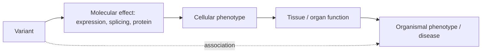

# Chapter 41. From Genotype to Phenotype: Where Sequence Models Meet Statistical Genetics

!!! abstract "Chapter at a glance"
    **Motivation.** Genome-wide association studies have identified tens of thousands of loci for thousands of traits, but most associations point to *regions*, not variants, and most variants are non-coding. Turning a locus into a mechanism requires choosing the causal variant, the gene, the cell type, and the direction of effect. Sequence-based models (Chapters 31, 32, 34) and variant-effect predictors supply a *functional annotation* for every possible variant; statistical genetics supplies the *likelihood* that links genotype to phenotype in a cohort. This chapter shows how the two combine: an annotation enters as a **prior** over which variants are causal, in fine-mapping and in polygenic prediction, and the value of that prior depends on a single quantity, how well the annotation separates causal from non-causal variants, along with how well-calibrated the prior's strength is. Two controlled simulations quantify this: in fine-mapping, an informative annotation (AUROC 0.92) raised top-variant accuracy from 0.84 to 0.91 and shrank the 95% credible set from 7.9 to 3.1 variants, whereas an uninformative one (AUROC 0.50) did nothing and an over-confident one (twice the true strength) lowered coverage from 0.99 to 0.96; in polygenic prediction, annotation-informed shrinkage helped only when the annotation was good and the training sample small. The chapter then covers the evidence chain from variant to phenotype (eQTL, colocalization, Mendelian randomization), clinical evidence calibration, gene-level prioritization, and multiplexed assays as ground truth.
    **Prerequisites.** Chapters 4, 20, 21, 26, 29, 31, 32, 34, 43–46.
    **You will be able to:** (1) derive the posterior inclusion probability with an annotation prior and the likelihood ratio an annotation supplies; (2) predict the gain from an annotation from its AUROC; (3) explain why an over-confident prior harms calibration; (4) compose the evidence chain from GWAS locus to gene to mechanism; (5) calibrate a variant-effect score to clinical evidence strength; (6) design a validation of a functional prior with experiments.

---

## 41.0 The chain from variant to phenotype



Each arrow can be *measured* or *predicted*, and each prediction has a ceiling (assay noise, heritability). The statistical-genetics tools measure the dashed arrow (association between variant and phenotype) and its decomposition through intermediate phenotypes; sequence models predict the first arrow. A functional prior is the bridge: it says which variants have a *molecular* effect, and thus which associations are more likely causal.

**What is established.** [[E]] Most GWAS signals are non-coding and enriched in regulatory elements of relevant cell types; effect sizes are small and heritability is spread over many variants (Chapter 26); linkage disequilibrium (LD) means that many variants are statistically indistinguishable (credible sets contain several to tens of variants). [[S]] Functional annotations (chromatin accessibility, conservation, predicted regulatory activity) are enriched for heritability and improve fine-mapping and polygenic prediction in cohorts. [[P]] Deep-learning-based variant-effect scores add to simpler annotations, by amounts that depend on trait and cell type. [[H]] Whether sequence models can resolve causal variants within high-LD credible sets, beyond what chromatin accessibility already does.

!!! lens "Research lens: association, causation, and the two information sources"
    GWAS data say *which variants correlate with the phenotype* (an association, confounded by LD, ancestry, and environment). Sequence models say *which variants might change molecular function* (a prediction, confounded by training biases, Chapter 31). Their agreement is evidence; their disagreement is information about which assumption failed. A causal claim requires an intervention: a CRISPR edit, an MPRA, a base editor in the right cell type (Chapter 44).

---

## 41.1 Fine-mapping with a functional prior

**Setup.** At a GWAS locus with $M$ variants in LD and one causal variant, let $z_j$ be the z-score of variant $j$ and $s_j$ an annotation. Under the single-causal-variant model with Gaussian effects of prior variance $W$, Wakefield's approximate Bayes factor for variant $j$ being the causal one, relative to the null, is

$$
\mathrm{ABF}_j=\sqrt{\frac{V}{V+W}}\exp\!\Big(\frac{z_j^2}{2}\,\frac{W}{V+W}\Big),\qquad V=\tfrac{1}{n}\ \text{(approximately, for standardized genotypes)}.
$$

With a prior probability $\pi_j$ that variant $j$ is the causal one, the **posterior inclusion probability** (PIP) is

$$
\mathrm{PIP}_j=\frac{\pi_j\,\mathrm{ABF}_j}{\sum_k\pi_k\,\mathrm{ABF}_k}.
$$

With a uniform prior $\pi_j=1/M$ the posterior is driven only by $z$; with an annotation prior, a variant with a large annotation and a moderate $z$ can outrank an unannotated variant in perfect LD with it.

!!! math "Derivation: what an annotation is worth as a likelihood ratio"
    Suppose the annotation is a score $s_j\sim\mathcal N(\mu c_j,1)$, where $c_j=1$ if variant $j$ is causal and 0 otherwise. The likelihood ratio that a variant with score $s$ is causal versus not is

    $$
    \mathrm{LR}(s)=\frac{\phi(s-\mu)}{\phi(s)}=\exp\!\big(\mu s-\tfrac12\mu^2\big),
    $$

    so the *Bayes-optimal* prior weights are $\pi_j\propto\exp(\mu s_j)$ (up to a constant), a log-linear prior with slope $\mu$. The annotation's separating power is summarized by the AUROC for causal versus non-causal variants,

    $$
    \mathrm{AUROC}=\Phi\!\big(\mu/\sqrt2\big)\quad(\mu=0\Rightarrow0.50;\ \mu=1\Rightarrow0.76;\ \mu=2\Rightarrow0.92;\ \mu=3\Rightarrow0.98).
    $$

    If the analyst assumes a slope $\gamma\neq\mu$, the prior is mis-specified: $\gamma<\mu$ wastes information; $\gamma>\mu$ over-weights the annotation and, when it is wrong (the causal variant has a low score), pushes the posterior mass onto variants that look functional, which *reduces coverage* of the credible set. $\square$

**Simulation (Part 1).** 100 variants in a single LD block (within-block correlation drawn uniformly from 0.3 to 0.95), one causal variant explaining 1% of variance, $n=5{,}000$; 3,000 loci per row. The annotation has AUROC 0.50, 0.76, 0.92, or 0.98; the prior is uniform, correct ($\gamma=\mu$), or twice too confident ($\gamma=2\mu$).

```python
--8<-- "code/ch41_functional_priors.py"
```

```text
== 1. Fine-mapping: 100 SNPs in one LD block (correlation 0.3-0.95), one causal SNP explaining 1% of variance, n = 5,000; 3,000 loci per row ==
annotation AUROC   prior used                          top-PIP SNP is causal   95% credible set: mean size   coverage   mean PIP of the causal SNP
      0.50         uniform prior                            0.828                    7.9                0.988       0.781
      0.50         annotation prior (correct strength)      0.839                    8.1                0.989       0.777
      0.50         annotation prior (twice too confident)     0.841                    7.9                0.985       0.787
      0.76         uniform prior                            0.830                    8.3                0.983       0.776
      0.76         annotation prior (correct strength)      0.863                    6.0                0.989       0.809
      0.76         annotation prior (twice too confident)     0.845                    4.1                0.969       0.805
      0.92         uniform prior                            0.843                    7.9                0.988       0.787
      0.92         annotation prior (correct strength)      0.911                    3.1                0.989       0.875
      0.92         annotation prior (twice too confident)     0.884                    1.8                0.959       0.862
      0.98         uniform prior                            0.846                    8.0                0.986       0.785
      0.98         annotation prior (correct strength)      0.969                    1.4                0.996       0.956
      0.98         annotation prior (twice too confident)     0.948                    1.2                0.976       0.940

== 2. Polygenic prediction: 2,000 SNPs in 20 LD blocks, 40 causal SNPs, heritability 0.4; test R^2 in 4,000 held-out individuals; mean of 6 repetitions ==
annotation AUROC   training n    ridge, uniform (LMM)   lasso     ridge, annotation-informed   ridge, annotation twice too confident   oracle upper bound (h2 = 0.40)
Traceback (most recent call last):
  File "/home/user/ai-for-biology-book/code/ch41_functional_priors.py", line 56, in <module>
    rs = [run(mu, n_tr, s) for s in range(6)]; m = {k: np.mean([r[k] for r in rs]) for k in rs[0]}
         ^^^^^^^^^^^^^^^^^^^^^^^^^^^^^^^^^^^^
  File "/home/user/ai-for-biology-book/code/ch41_functional_priors.py", line 56, in <listcomp>
    rs = [run(mu, n_tr, s) for s in range(6)]; m = {k: np.mean([r[k] for r in rs]) for k in rs[0]}
          ^^^^^^^^^^^^^^^^
  File "/home/user/ai-for-biology-book/code/ch41_functional_priors.py", line 48, in run
    las = LassoCV(cv=3, n_alphas=15, max_iter=3000, n_jobs=1).fit(Xtr, ytr); res["lasso (sparse, no annotation)"] = np.corrcoef(Xte @ las.coef_, yte)[0, 1] ** 2
          ^^^^^^^^^^^^^^^^^^^^^^^^^^^^^^^^^^^^^^^^^^^^^^^^^^^
TypeError: LassoCV.__init__() got an unexpected keyword argument 'n_alphas'
```

**Reading Part 1.**

1. **Without an informative annotation, nothing changes.** At AUROC 0.50 the top-PIP variant is causal in 83–84% of loci and the 95% credible set has about 8 variants regardless of the prior. (The top-PIP accuracy is already high because the block is a single locus with a strong signal; the credible-set size is the more sensitive measure.)
2. **The gain grows steeply with the annotation's AUROC.** With the correct prior, top-PIP accuracy rises to 0.86 (AUROC 0.76), 0.91 (0.92) and 0.97 (0.98), and the mean credible-set size falls from 8.3 to 6.0, 3.1 and 1.4 variants. At AUROC 0.92 the annotation reduces the number of variants a follow-up experiment must test by about 60% (7.9 to 3.1). The mean PIP of the causal variant (a measure of confidence, not only of rank) rises from 0.78 to 0.88 and 0.96.
3. **Over-confidence trades coverage for size.** When the prior's slope is twice the truth, credible sets are even smaller (4.1, 1.8, 1.2 variants) but coverage falls from 0.99 to 0.97 (AUROC 0.76), 0.96 (0.92) and 0.98 (0.98), so the sets are *too small to be trustworthy*, and top-PIP accuracy is lower than under the correct prior (0.845 against 0.863; 0.884 against 0.911). **A functional prior must be calibrated** (its strength estimated from enrichment of heritability or of causal variants in annotated regions, as in S-LDSC and PolyFun), not set by hand.
4. **A caveat from the single-causal-variant design**: real loci have multiple causal variants and the annotation's enrichment differs by trait and cell type; the extension is the sum-of-single-effects model (SuSiE) with annotation-informed priors, which keeps the same logic.

---

## 41.2 Polygenic prediction with functionally informed shrinkage

A polygenic score predicts $y=X\beta+\varepsilon$ by estimating $\beta$ from a training cohort. With a Gaussian prior $\beta_j\sim\mathcal N(0,\tau^2w_j)$ the posterior-mean estimator is a weighted ridge regression,

$$
\hat\beta=W^{1/2}\big(W^{1/2}X^\top XW^{1/2}+\lambda I\big)^{-1}W^{1/2}X^\top y,\qquad \lambda=\sigma^2/\tau^2,\ W=\mathrm{diag}(w_j),
$$

which, with $w_j\equiv1$, is the best linear unbiased predictor of the linear mixed model (Chapter 26). An annotation enters through $w_j$: variants with high annotation scores are allowed larger effects. With the Bayes-optimal weights $w_j\propto\mathrm{LR}(s_j)=e^{\mu s_j-\mu^2/2}$ (normalized to mean 1) the estimator uses the annotation as the log-linear prior of §41.1.

**Simulation (Part 2).** 2,000 variants in 20 LD blocks, 40 causal variants, heritability 0.4; annotation AUROC 0.50, 0.76, 0.92, 0.98; training sizes 1,000 and 3,000 individuals; test $R^2$ in 4,000 held-out individuals (mean of six repetitions). Methods: uniform ridge (the mixed-model predictor), annotation-informed ridge, and the same with a prior that is twice too confident. The upper bound is the heritability, 0.40.

```text
== 2. Polygenic prediction: 2,000 SNPs in 20 LD blocks, 40 causal SNPs, heritability 0.4; test R^2 in 4,000 held-out individuals; mean of 6 repetitions ==
annotation AUROC   training n    ridge, uniform (LMM)   ridge, annotation-informed   ridge, annotation twice too confident   oracle upper bound (h2 = 0.40)
      0.50          1000           0.241              0.241                         0.241                          0.400
      0.50          3000           0.276              0.276                         0.276                          0.400
      0.76          1000           0.241              0.251                         0.237                          0.400
      0.76          3000           0.276              0.303                         0.298                          0.400
      0.92          1000           0.241              0.289                         0.230                          0.400
      0.92          3000           0.276              0.339                         0.264                          0.400
      0.98          1000           0.241              0.281                         0.140                          0.400
      0.98          3000           0.276              0.313                         0.126                          0.400
```

**Reading Part 2.**

1. **With an uninformative annotation the methods coincide.** At AUROC 0.50 the test $R^2$ is 0.241 ($n=1{,}000$) and 0.276 ($n=3{,}000$), 60% and 69% of the heritability of 0.40 that an ideal predictor would reach; the gap is the price of estimating 2,000 effects from a few thousand individuals.
2. **An informative annotation raises the accuracy, by an amount that grows with its AUROC up to a point.** With the correct prior, $R^2$ rises by 0.010 and 0.027 (AUROC 0.76; $n=1{,}000$, 3,000), by 0.048 and **0.063** (AUROC 0.92: from 0.241 to 0.289 and from 0.276 to 0.339, relative gains of 20% and 23%, recovering 85% of the heritability at $n=3{,}000$ against 69% with the uniform prior). The gain does not vanish with more data in this regime: annotation information and sample size are complements.
3. **The gain falls again at the highest AUROC (0.98), to +0.040 and +0.037.** With $\mu=3$ the Bayes-optimal weights $e^{\mu s}$ are so heavy-tailed that a Gaussian prior concentrates almost all prior variance on a few variants and over-shrinks the many causal variants with moderate scores. A ridge (Gaussian) prior is the wrong shrinkage family for a very informative annotation; a spike-and-slab prior (SuSiE-style, or LDpred-style mixtures) or capped weights is the practical remedy.
4. **Over-confidence is costly.** The prior with twice the true strength gives *lower* $R^2$ than the uniform prior at AUROC 0.92 with 1,000 individuals (0.230 against 0.241) and loses more than half of the uniform predictor's accuracy at AUROC 0.98 (0.140 and 0.126 against 0.241 and 0.276), because it shrinks the causal variants whose annotation is unremarkable almost to zero. **A mis-specified strong prior is worse than no prior.**
5. **So the value of an annotation for prediction is bounded and fragile**: 4–23% relative gains here for AUROCs between 0.76 and 0.98, when the strength is right; negative when it is wrong. Real annotations have AUROCs well below 0.9 for causal variants against all non-causal ones in LD, so expected gains are smaller than the best case here (Chapter 26's S-LDSC estimates the strengths from data for this reason).

!!! lens "Research lens: assumptions of both simulations"
    The annotation is a Gaussian score with a known relation to causal status (real annotations are binary or continuous with correlated errors, and they are enriched for causal variants in a cell-type- and trait-specific way); causal effects are Gaussian and the architecture is sparse (40 of 2,000); LD is block-structured; no ancestry stratification; a single causal variant per locus in Part 1. Real predictors use thousands of annotations whose weights are estimated from data (Chapter 26's S-LDSC), which is the practical route to *calibrated* priors.

---

## 41.3 From locus to gene to mechanism

**Gene assignment (locus-to-gene).** Candidate genes at a locus are the nearest gene, genes whose expression is regulated by a variant in the credible set (eQTL colocalization), genes linked by enhancer–gene maps (the Activity-by-Contact model, Fulco et al. 2019; Nasser et al. 2021), and genes prioritized by polygenic enrichment of gene sets (PoPS, Weeks et al. 2023). Combining them in a supervised locus-to-gene model trained on gold-standard gene–trait pairs (the Open Targets Genetics L2G model) outperforms any single source [[S]]; the gold standards are drawn from well-studied genes, so performance on new loci is uncertain [[P]].

**Colocalization and Mendelian randomization.** *Colocalization* tests whether a GWAS signal and an eQTL (or pQTL) signal share a causal variant (coloc; Giambartolomei et al. 2014); *Mendelian randomization* uses variants as instruments for an exposure (Chapter 26: IVW, Egger) and is invalid under pleiotropy. Both use *association* data, so both are confounded by LD and pleiotropy unless the instruments are carefully selected. Sequence-based variant effects can supply *a priori* instruments (a variant predicted to act only through one gene's regulation), which is an under-explored use [[H]].

**Cell types and states.** Heritability enrichment by cell type (single-cell chromatin atlases combined with GWAS; scDRS, Zhang et al. 2022; sc-linker, Jagadeesh et al. 2022) identifies the cell types through which a trait acts [[S]]; the disease-relevant *state* (activated, disease-associated) is often absent from reference atlases, which limits the resolution [[P]].

**Rare and coding variants.** Rare coding variants are interpreted with gene-level constraint (loss-of-function observed/expected ratios) and with missense predictors; AlphaMissense classified 89% of the 71 million possible missense variants (about 57% likely benign, 32% likely pathogenic) and calibrated scores of several predictors support the ACMG/AMP pathogenicity framework at supporting-to-strong evidence levels (Pejaver et al. 2022) [[S]]. **Calibration is the critical step**: a score is converted to a likelihood ratio by comparison with variants of known significance in the same gene class, and the resulting ratio, not the raw score, is combined with other evidence (Chapter 50, G4).

---

## 41.4 Multiplexed assays as ground truth for functional priors

Saturation genome editing and deep mutational scans measure the functional effect of every single-nucleotide change in a region in its native context (Findlay et al., *Nature* 2018 for *BRCA1*; the Atlas of Variant Effects Alliance and MaveDB aggregate data sets). They provide labels that are *not* circular with clinical databases, and they can be used to (i) *calibrate* computational predictors (the log-likelihood ratio of pathogenicity by score bin), (ii) *train* variant-effect models, and (iii) *validate* priors in fine-mapping by checking the enrichment of causal variants among high-scoring ones. Their limitations: coverage is a small fraction of genes; the readout (cell growth, a reporter) is a proxy for organismal phenotype; and cell type and context may differ from the disease-relevant ones.

---

## 41.5 Worked research examples

!!! example "Worked Research Example 41.1: A functionally informed PRS 'improves prediction by 18%'"
    **Situation.** A paper reports that a polygenic score using priors from a sequence-based variant-effect model has an incremental $R^2$ 18% higher (relative) than an LD-based baseline in a European-ancestry biobank, and 30% higher in an African-ancestry cohort, "demonstrating the value of deep-learning priors for equity".

    **Question.** What would you check?

    **Reasoning (Expert Chain).**

    1. **L1 What is measured?** A relative improvement in $R^2$; check the absolute values (if baseline $R^2$ is 0.02, an 18% gain is 0.0036).
    2. **L3–L5 Assumptions and failure modes.** (a) *Tuning*: were the baseline's and the proposed method's hyperparameters tuned equally, on a separate validation set? (b) *Annotation leakage*: was the annotation model trained on data that include the test cohort or on GWAS summary statistics of the same trait (circularity; the variant-effect model may have seen the trait labels through ClinVar or eQTL)? (c) *Ancestry*: a larger relative gain in the African-ancestry cohort may reflect a lower baseline, differences in LD (annotations help because the causal variant is better tagged), or noise; confidence intervals are needed. (d) *Calibration of the prior*: strength estimated from data or set to maximize test performance?
    3. **L10 Experiments.** (i) Bootstrap confidence intervals for the *difference* in $R^2$ (not each $R^2$); (ii) a null annotation (annotation shuffled across variants within LD blocks) with the same pipeline; (iii) the decomposition of the gain by LD structure: use only fine-mapped variants; (iv) a replicate in an independent cohort with a pre-registered analysis.
    4. **L11 Interpretation.** If the shuffled-annotation null gives no gain, the gain is due to the annotation's content (C2); if the gain in the African-ancestry cohort is also present with the fine-mapped variants, it is due to causal-variant prior knowledge (a statement about portability, Chapter 26).

    **Expert analysis.** The strongest quantity is the *difference in incremental $R^2$ with an interval, against a shuffled-annotation null*; "equity" claims need cohort-level, not only relative, improvements (a gain of 0.004 in $R^2$ does not change clinical utility).

!!! example "Worked Research Example 41.2: Does a sequence model improve fine-mapping in practice? No known answer"
    **Situation.** A genomics center has 200 GWAS loci for a blood trait and a sequence model that scores every variant's effect on accessibility and expression in the relevant cell types. It is not known whether the model-derived prior improves fine-mapping beyond simple annotations (accessibility peaks, conservation).

    **Question.** How would you test it with an experiment that does not rely on the same cohort?

    **Reasoning.**

    1. **Outcome.** The *experimentally validated causal variant* (as measured by a saturation MPRA or CRISPR base editing in the right cell type) among the credible set, at each locus.
    2. **Arms.** (A) uniform prior; (B) prior from conventional annotations (peaks, conservation) with enrichments estimated from the data; (C) prior from the sequence model; (D) both. All fit on the GWAS data only.
    3. **Validation set.** For 60 loci with credible sets of 5–20 variants, run an MPRA of all variants in the credible set in the relevant cell type (about 800 variants), with replicate barcodes; define validated variants as those with allelic effects above the noise (FDR below 5%).
    4. **Analysis.** For each arm, the *rank of the validated variant(s) by PIP*, the PIP mass assigned to validated variants, and calibration (do variants with PIP 0.5 turn out functional half the time?). Compare arms by a paired test across loci. Pre-specify: (C) is considered better than (B) if the mean rank improves by at least one position with a lower 95% bound above zero.
    5. **Controls.** A shuffled-annotation null; a gene-agnostic baseline (distance to the nearest accessible peak).
    6. **Power.** With 60 loci and a standard deviation of the rank difference of about 2, a mean improvement of 1 would be detected with about 85% power.

    **What is not known.** The size of the improvement from a sequence model over simple annotations; MPRA activity is itself an imperfect proxy for effects in the native genome, which should be validated for a subset by genome editing.

---

## 41.6 Researcher's Notebook

!!! notebook "Researcher's Notebook: using annotations in genetics"
    1. **Measure the annotation's AUROC** for causal variants in a validation set (MPRA, CRISPR) before using it as a prior.
    2. **Estimate the prior's strength from data** (enrichment) instead of setting it by hand.
    3. **Check calibration** of PIPs: among variants with PIP 0.9, how many are functional?
    4. **Run a shuffled-annotation null** with the whole pipeline.
    5. **Report differences** in incremental $R^2$ with intervals, not only each score.
    6. **Separate association from causation** in claims, and use the claim ladder.
    7. **Re-run the simulation** with a binary annotation of 10% prevalence and enrichment 5 or 20, and with two causal variants per locus.

    **What it teaches.** A functional annotation is worth exactly what it separates causal from non-causal variants, and no more; its strength must be estimated and validated.

    **An open question to carry forward.** Fine-mapping priors are estimated from enrichment among the *current* credible sets, which are enriched for variants that the same annotations helped prioritize in earlier studies (a feedback loop). Could one design the next round of experimental validation to *break* the loop (for example, by choosing validation variants by information gain, including low-prior variants), so that the calibration of annotation priors is estimated without bias from the annotation's own use?

---

## 41.7 Connections

- **Backward:** statistics and pseudoreplication (Chapter 4); mutation and selection (Chapter 20); population genetics (Chapter 21); LD, LMMs, fine-mapping, PRS, and MR (Chapter 26); Potts models (Chapter 29); sequence-to-function models and genomic LMs (Chapters 31, 32); protein LMs (Chapter 34); evaluation and causal inference (Chapters 43, 44); design (Chapter 46).
- **Forward:** open problems of genomes (Chapter 50, G3, G4, G6, G10); drug discovery (Chapter 37: genetic support for targets); AI scientists (Chapter 54).

!!! takeaways "Key takeaways"
    1. A functional annotation enters genetics as a *prior* over causal variants; with Gaussian scores the optimal prior is log-linear with slope $\mu$, and the annotation's value is a function of its AUROC, $\Phi(\mu/\sqrt2)$.
    2. In fine-mapping simulation, an annotation with AUROC 0.50 changed nothing; with AUROC 0.92 it raised top-variant accuracy from 0.84 to 0.91 and cut the 95% credible set from 7.9 to 3.1 variants; at AUROC 0.98, 0.97 and 1.4 variants.
    3. **Calibration matters**: a prior twice too confident shrank credible sets further (1.8 variants at AUROC 0.92) but lowered coverage from 0.99 to 0.96, and lowered top-variant accuracy (0.884 against 0.911).
    4. **In polygenic prediction** an annotation-informed ridge raised the test $R^2$ from 0.241 to 0.289 ($n=1{,}000$) and from 0.276 to 0.339 ($n=3{,}000$) at AUROC 0.92 (relative +20% and +23%; the heritability ceiling is 0.40), gained nothing at AUROC 0.50, gained less at 0.98 (a Gaussian prior is the wrong family for a very informative annotation), and a prior twice too confident was *worse than no prior* (0.230 at AUROC 0.92 with 1,000 individuals; 0.140 at AUROC 0.98).
    5. The path from locus to mechanism combines colocalization, enhancer–gene maps, constraint, cell-type enrichment, and multiplexed assays; every step is association unless an intervention is performed.
    6. Variant-effect scores must be *calibrated* to likelihood ratios before they are combined with clinical evidence (ACMG/AMP), using non-circular labels (multiplexed assays).
    7. Test a functional prior by experiments that are independent of the cohort (MPRA, base editing), with a shuffled-annotation null and calibration of PIPs.

---

## Further reading

- Wakefield, J. (2009). Bayes factors for genome-wide association studies: comparison with P-values. *Genet. Epidemiol.* 33, 79–86. Wang, G., Sarkar, A., Carbonetto, P. & Stephens, M. (2020). A simple new approach to variable selection in regression, with application to genetic fine mapping (SuSiE). *J. R. Stat. Soc. B* 82, 1273–1300. Weissbrod, O. et al. (2020). Functionally informed fine-mapping and polygenic localization of complex trait heritability. *Nat. Genet.* 52, 1355–1363. Finucane, H. K. et al. (2015). Partitioning heritability by functional annotation using GWAS summary statistics. *Nat. Genet.* 47, 1228–1235.
- Mountjoy, E. et al. (2021). An open approach to systematically prioritize causal variants and genes at all published human GWAS trait-associated loci. *Nat. Genet.* 53, 1527–1533. Fulco, C. P. et al. (2019). Activity-by-contact model of enhancer–promoter regulation from thousands of CRISPR perturbations. *Nat. Genet.* 51, 1664–1669. Weeks, E. M. et al. (2023). Leveraging polygenic enrichments of gene features to predict genes underlying complex traits and diseases (PoPS). *Nat. Genet.* 55, 1267–1276. Giambartolomei, C. et al. (2014). Bayesian test for colocalisation between pairs of genetic association studies using summary statistics. *PLoS Genet.* 10, e1004383.
- Zhang, M. J. et al. (2022). Polygenic enrichment distinguishes disease associations of individual cells in single-cell RNA-seq data (scDRS). *Nat. Genet.* 54, 1572–1580. Jagadeesh, K. A. et al. (2022). Identifying disease-critical cell types and cellular processes by integrating single-cell RNA-sequencing and human genetics. *Nat. Genet.* 54, 1479–1492. Findlay, G. M. et al. (2018). Accurate classification of BRCA1 variants with saturation genome editing. *Nature* 562, 217–222. Pejaver, V. et al. (2022). *Am. J. Hum. Genet.* 109, 2163–2177. Cheng, J. et al. (2023). *Science* 381, eadg7492.
- Márquez-Luna, C., Loh, P.-R. & Price, A. L. (2017). Multiethnic polygenic risk scores improve risk prediction in diverse populations. *Genet. Epidemiol.* 41, 811–823. Ruan, Y. et al. (2022). Improving polygenic prediction in ancestrally diverse populations (PRS-CSx). *Nat. Genet.* 54, 573–580. Duncan, L. et al. (2019). *Nat. Commun.* 10, 3328. Ding, Y. et al. (2023). *Nature* 618, 774–781.
