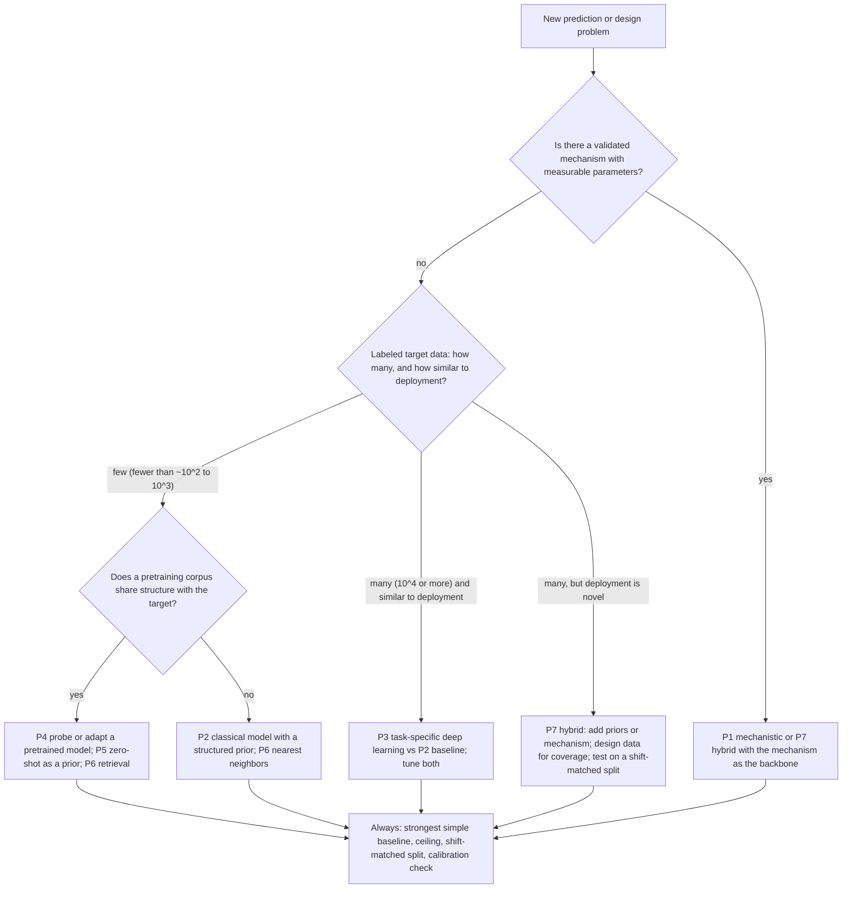

# Chapter 49. Competing Paradigms: A Comparative Map

!!! abstract "Chapter at a glance"
    **Motivation.** A researcher facing a new biological prediction or design problem must choose among very different families of method: a mechanistic model, a classical statistical model, a task-specific neural network, a pretrained foundation model (probed or fine-tuned), a zero-shot generative model, a retrieval- or family-conditioned model, a hybrid of physics and learning, or an agentic system that orchestrates tools. Advocates of each argue from their best examples. This chapter compares the paradigms on equal terms: what information each uses and ignores, what it needs, when it extrapolates, what it costs, and how it fails. It then draws together the controlled experiments of Chapters 32–48, which compared paradigms on tasks with known answers, into an evidence ledger with eight regularities (for example: the strongest baseline is the one whose inductive bias matches the data-generating structure; pretraining helps when target data are scarce *and* the target shares structure with the pretraining corpus; hybrids and averages beat their parts; evaluation decides who wins). It closes with a decision procedure, a protocol for fair comparison, and two worked examples, one of them a forecast about a question nobody can yet answer.
    **Prerequisites.** Chapters 7, 13, 17, 29, 32–48 (this chapter synthesizes them).
    **You will be able to:** (1) place any method in the paradigm map and name its inductive bias; (2) read a comparison between paradigms for its hidden choices (tuning, split, metric, budget); (3) use the evidence ledger to predict which paradigm will win under stated conditions; (4) apply the decision procedure to a new problem; (5) design a fair comparison; (6) state a forecast about paradigm dominance with resolution criteria.

---

## 49.0 The paradigm map

| Paradigm | Core idea | Representative systems in this book |
|---|---|---|
| **P1. Mechanistic / biophysical** | A model from first principles or measured mechanism, with few parameters | Thermodynamic TF-binding model (Ch22); stochastic gene expression (Ch19); FEP (Ch37); loop-extrusion polymer (Ch50); whole-cell models (Ch51); connectome-based LIF (Ch53) |
| **P2. Classical statistical** | A simple probabilistic model with explicit independence or sparsity | PWM, Markov chains, HMM gene finder, Potts/DCA (Ch29); PCA; ridge/LMM (Ch26); additive baselines (Ch39); site-independent profiles (Ch34) |
| **P3. Task-specific deep learning** | A neural network trained from scratch on labeled data for one task | CNN on motifs (Ch10); sequence-to-function (Ch31); GCN on BACE (Ch37); NB-VAE (Ch30) |
| **P4. Pretrained foundation models, probed or fine-tuned** | Large self-supervised model; a small head or fine-tuning for the task | ESM-2 embeddings (Ch34); Evo 2 embeddings (Ch32); pathology and cell FMs (Ch38, 40) |
| **P5. Zero-shot generative / likelihood models** | Use the model's likelihood or samples directly without labels | pLM masked-marginal scores (Ch34); DNA-LM log-likelihood ratios (Ch32); generative design (Ch36) |
| **P6. Retrieval, family-conditioned, and nearest-neighbor** | Condition on or retrieve related examples at test time | MSA-based models, PoET (Ch34); kNN on Tanimoto (Ch37); BLAST-like baselines |
| **P7. Hybrids** | Combine the above: physics + learning, priors + data, models + active learning | Annotation-informed priors (Ch41); FM features + simple head; Boltz-2 affinity heads (Ch37); KL-regularized design (Ch36); design–build–test–learn (Ch46) |
| **P8. Agentic systems** | A language-model controller that plans, calls tools, and iterates | Co-Scientist, Robin, Kosmos, Virtual Lab (Ch54) |

!!! lens "Research lens: three questions that place any method"
    (i) **What is the inductive bias?** What structure does the method assume (additivity, locality, symmetry, family relatedness, a mechanism)? (ii) **Where does its information come from?** Labels, unlabeled corpora, physics, or the literature. (iii) **What is its generalization regime?** Interpolation within the training distribution, extrapolation to new members of a seen family, or extrapolation to new families. The same method can be excellent in one regime and poor in another; most disagreements between paradigms are disagreements about the regime.

---

## 49.1 Comparing paradigms on common dimensions

| | Information used | Needs | Extrapolates to | Interpretability | Cost | Typical failure | Evidence in biology |
|---|---|---|---|---|---|---|---|
| **P1 Mechanistic** | A mechanism, measured parameters | Parameter measurements; identifiability | Conditions covered by the mechanism | High | Expert time; compute for simulation | Wrong or incomplete mechanism; unidentifiable parameters | Strong where mechanisms are known (MD, FEP, minimal cells); [[S]] |
| **P2 Classical statistical** | Training data under a structured model | Modest data | Within the model class | High | Low | Misspecification (e.g., no epistasis) | Hard to beat when the structure matches (Potts at large $N$; PCA for clusters) [[S]] |
| **P3 Task-specific DL** | Labeled data | Thousands to millions of labels | Interpolation | Low–medium | Medium | Shortcuts; no gain over P2 on small data | Strong when labels are abundant (splicing, binding); mixed otherwise [[S]] |
| **P4 Pretrained FM + head** | Large unlabeled corpus + labels | Corpus sharing structure with target; few labels | New members of represented families | Low | High to pretrain; low to use | Pretraining objective mismatch; memorization | Strong for proteins; mixed for cells and DNA regulation [[S]] |
| **P5 Zero-shot** | Corpus only | A corpus covering the target | Where likelihood tracks the property | Low | Compute at inference | Likelihood confounds (composition, preference) | Good for coding variants, weak for regulatory; [[S]] |
| **P6 Retrieval / family** | Related examples at test time | Homologs, neighbors | Near the retrieved set | Medium | Retrieval infrastructure | Fails far from any neighbor | Strong baselines for variants and chemistry [[S]] |
| **P7 Hybrid** | Multiple sources | Calibration data | Better of the parts, when calibrated | Medium | Medium | Mis-specified weights (§41.2) | Often the best results (Ch37, 41) [[S]] |
| **P8 Agentic** | Literature, tools, data | Tools; verification | Not established | Low | Compute; expert verification | Forking paths, judge drift | [[P]]/[[H]] (Ch54) |

---

## 49.2 The evidence ledger: controlled comparisons from this book

Each row is an experiment with a known generating process or a real data set, in which different paradigms competed on the same split and metric.

| Chapter | Task | Contenders | Result | What decided it |
|---|---|---|---|---|
| 32 | Next-base prediction; zero-shot variant effects on a real genome | Markov chains (P2), a 159k-parameter transformer (P3/P5) | Transformer 1.883 vs order-4 Markov 1.887 bits per base on unique DNA; an order-8 chain *memorized* an inverted repeat (1.465 vs 1.940); zero-shot AUROC for stop-gain vs synonymous 0.40 (transformer), 0.42 (Markov), 0.31 (composition only) | Scale (the small model learned only local statistics); a composition confound for the likelihood |
| 34 | Variant effects in a new Potts family with known truth | Site-independent (P2), Potts pseudolikelihood (P2), MLP from scratch (P3), pretrained MLP zero-shot and adapted (P4/P5) | Related families: pretrained zero-shot 0.75; Potts 0.51 at $N=20$ and 0.88 at $N=1000$ (pretrained adapted 0.78); unrelated families: zero-shot $-0.03$ | Shared structure with the pretraining corpus; target-data size; model-class match |
| 35 | Structure from contacts, real protein | Distance geometry with contacts of different precision | TM 0.85 with 24 true contacts; 0.30 with 47 contacts at 70% precision; random-start optimizer failed at 0.19 even with all true contacts | Precision of the information; the *inference* procedure (information was sufficient) |
| 36 | Design against a surrogate | Pairwise ridge (matched), additive ridge (misspecified), MLP | True fitness 22.8 (pairwise) vs 18.4 (additive) with the same 400 sequences; trust-region phase transition at small $\beta$ | Model class vs truth; optimizer's curse |
| 37 | BACE-1 potency, random and cluster splits | RF on fingerprints (P2/P3), kNN (P6), GCN (P3), RF+GCN average (P7) | RF 0.856 / 0.632; GCN ensemble 0.837 / 0.597; kNN 0.833 / 0.560; RF+GCN 0.861 / 0.638 | A strong simple baseline; averaging different biases |
| 38 | Cell types in a new study | PCA (P2), NB-VAE (P3), mini-FM zero-shot (P5/P4) | PCA 0.94–0.96 label transfer; FM 0.49 (random weights 0.50); FM novelty AUROC 0.98 vs 0.60; FM study mixing 0.04 vs PCA 0.46–0.52 | Objective; the evaluation (mixing rewards uninformative embeddings) |
| 39 | Unseen perturbations in a simulated network | No-change, mean shift, generic embedding regression (P3), graph propagation (P7), additive | Delta-correlation: mean shift 0.06, generic regression 0.12, graph propagation 0.29–0.58 (graph recall 0.3–1.0), ceiling 0.83; additive near-optimal for doubles | Inductive bias that ties embeddings to outputs; interactions below noise |
| 40 | Cell type from two modalities | Raw concatenation, aligned shared embeddings (P5) | 0.92 vs 0.57–0.65 | The objective discards private information |
| 41 | Fine-mapping and polygenic prediction with annotations | Uniform prior (P2) vs annotation-informed (P7) | Credible set 7.9 → 3.1 and $R^2$ 0.276 → 0.339 at AUROC 0.92; over-confident prior worse than none | Annotation strength and calibration |
| 42 | Ancestral root reconstruction | Parsimony, ML with simple models, ML with the true model, posterior sampling | Accuracy 0.61–0.67 at depth 3 for all; ML biased toward the consensus ($+0.32$); sampling from a wrong model biased the other way | Depth of the node; bias of the point estimate |
| 47 | Learning curves on BACE | Random forest under random and cluster splits | Random-split RMSE 1.16 → 0.77; cluster 1.29 → 1.12; free-floor extrapolation below the noise ceiling | The split (shift floor); diversity over volume |
| 48 | Interpreting a CNN | Ablation, probes, patching, SAE | Direction erasure to chance; single-unit ablation 0.05–0.08; SAE not better than neurons | The method's assumptions (distributed features) |

---

## 49.3 Eight regularities

1. **The best baseline is the one whose inductive bias matches the data-generating structure.** Potts models for epistatic families (Ch34) at large $N$; PCA for clustered cell types (Ch38); additive predictors for doubles with small interactions (Ch39); fingerprint forests for small chemical data (Ch37); a pairwise surrogate when the truth is pairwise (Ch36). Before concluding that a larger model won, ask what structure the baseline assumes and whether it holds.
2. **Pretraining pays when target data are scarce *and* the target shares structure with the corpus *and* the objective rewards that structure.** Chapter 34's zero-shot ability exists only when families are related; Chapter 38's miniature fails the third condition (masked-gene prediction does not reward cell identity) and Chapter 32's small DNA model fails the first (scale).
3. **Scale improves likelihood; downstream metrics need data of the right kind** (Ch34, 47): fitness prediction peaked at 650M parameters, and ten times more pretraining cells did not help label transfer.
4. **Evaluation decides who wins.** Raw-expression correlation (Ch39), batch-mixing scores (Ch38), random splits (Ch37, 47), single-seed comparisons, and unequal tuning budgets can reverse conclusions. A comparison without a ceiling, a baseline that cannot learn, and a split that matches deployment is not a comparison.
5. **Hybrids and averages beat their parts when the parts have different errors and the combination is calibrated** (Ch37: RF+GCN; Ch41: annotation-informed priors); a mis-calibrated hybrid is worse than either (Ch41: over-confidence).
6. **Novelty is the problem.** Every method degraded under cluster splits (Ch37, 47), co-folding degrades with dissimilarity (Ch35), and more data of the same kind does not help (Ch47). Paradigms differ mainly in *how fast* they degrade.
7. **Information and inference are different failures.** Contacts sufficed for a fold but the optimizer did not find it (Ch35); a contrastive objective discarded private information (Ch40). Diagnose which one is failing before changing the method.
8. **Uncertainty must be tested, not assumed**: a GCN ensemble's nominal 90% intervals covered 31–36% (Ch37); a Gaussian prior with exaggerated strength degraded prediction (Ch41); bootstrap uncertainty shared the surrogate's blind spot (Ch36).

---

## 49.4 A decision procedure

The procedure is a prior over what to try first; the evaluation protocol of §49.5 decides.

---

## 49.5 A protocol for fair comparison between paradigms

1. **Define the deployment shift** and make the test split match it (random, cluster, clade, donor, context; Chapter 45).
2. **Fix the metric before running**, choose a decision-relevant version (enrichment, delta-correlation, label transfer with novelty), and add a paired metric that an uninformative method cannot win.
3. **Include a baseline that cannot learn** (no-change, mean, additive) and the **strongest classical baseline**, with equal tuning budgets.
4. **Report the noise ceiling and, if possible, the shift floor.**
5. **Run multiple seeds and report variance**; report the learning curve (three or more data sizes), not a single point.
6. **Account for compute and cost** (§47.5).
7. **Randomize order and blind the person who tunes**, where feasible; pre-register the comparison when stakes are high.
8. **Test combinations**: averaging, stacking, using one paradigm's output as another's feature.
9. **Report the regime** (interpolation vs extrapolation) in the abstract.

---

## 49.6 Will scale absorb inductive bias?

The "bitter lesson" (Sutton 2019) is that, in vision, language, and games, general methods that leverage computation beat methods built on human knowledge. Applied to biology it makes a prediction: *scaled foundation models will eventually beat structured baselines in every domain*. The ledger above says the answer depends on the domain: *in proteins*, large pLMs with MSA-like conditioning are at or near the top of zero-shot rankings and plausibly will continue to improve [[S]]/[[P]]; *in genomic regulation and cells*, the gap between tuned simple models and foundation models is small or negative at present [[S]], with no established scaling law [[H]]; *in chemistry*, gains from scale are modest [[P]]; *in perturbation prediction*, the limiting factor is the identifiability of interventions from the data, which scale of observational data does not alter [[S]].

!!! openproblem "Open problem: a baseline-gap tracker"
    To answer "will scale absorb inductive bias in biology?" one needs *longitudinal evidence*, not anecdotes. **Diagnostic questions:** Could the community maintain, for a registry of tasks (pre-registered splits, metrics, ceilings), the *gap between the best scaled model and the best tuned simple baseline* as a function of date and compute, in the manner of a leaderboard but of gaps? Which tasks show a monotone growth of the gap in favor of scale, and what do they have in common (abundant unlabeled data, stable distribution, self-supervised objective aligned with the target)? A shared tracker would turn the question into a measurement.

---

## 49.7 Worked research examples

!!! example "Worked Research Example 49.1: Choosing a paradigm for RNA-binding-protein specificity with 5,000 labeled sequences"
    **Situation.** A lab has in-vitro binding data for one RNA-binding protein (5,000 labeled 40-mers, binary bound/unbound, noisy) and wants a model to predict binding for 500,000 transcript regions, including from a related species.

    **Question.** Which paradigm should it try first, and how should it decide?

    **Reasoning (Expert Chain).**

    1. **Place the problem.** Labels: moderate (5,000); deployment: new sequences from a related species (a mild shift); mechanism: a sequence motif with possible structure context. This points to P2/P3 first (PWM or $k$-mer logistic regression and a small CNN), then P4 (a pretrained RNA or DNA model's embeddings plus a linear head) if the CNN is not at the ceiling, and P7 (add predicted RNA structure accessibility as a feature, a mechanism-informed hybrid).
    2. **Baselines and ceiling.** Replicate-based ceiling for the bound/unbound label (AUROC of replicate agreement); a $k$-mer logistic regression with $k=3$–6 as the strongest simple baseline; a CNN with reverse-complement-aware design where relevant.
    3. **Split.** A cluster split by sequence similarity (to prevent near-duplicates) and a *species-held-out* evaluation if cross-species data exist.
    4. **Metric.** AUROC and enrichment at the top 1% (the use is to select regions); calibration on the held-out species.
    5. **Experiments in order of cost.** (a) $k$-mer baseline; (b) CNN (three seeds); (c) a pretrained model as a feature extractor with a linear head, at 500, 2,000, and 5,000 training examples (learning curve); (d) the average of (b) and (c); (e) structure features.
    6. **Decision.** Adopt the cheapest method within the ceiling's noise of the best on the species-held-out split; use the learning curves to decide whether to buy more labels (if the curves are still rising, more labels; if flat, a different data type).

    **Expert analysis.** The procedure does not presuppose a winner; it orders the experiments by cost and by what each would teach.

!!! example "Worked Research Example 49.2: Will a zero-shot cell foundation model beat the best baseline by 2030? A forecast with no known answer"
    **Situation.** A funder asks for a probability that, by 31 December 2030, a *zero-shot* single-cell foundation model will outperform the best of {HVG+PCA, scVI, Harmony} on at least three of four pre-registered tasks (cross-study label transfer, rare-subtype recovery, novel-type detection, batch-robust trajectory ordering) on held-out studies with ceilings reported.

    **Question.** How would you reason to a probability, and what would update it?

    **Reasoning.**

    1. **Resolution criteria.** Define the data sets, splits, metrics, and "outperform" (a lower 95% bound on the difference above zero), and who runs the evaluation (an independent group; models evaluated without access to the test studies).
    2. **Reference class.** In domains where a self-supervised objective aligns with the task (protein sequence likelihood versus fitness), foundation models took several years from first demonstration (2019) to a leading or near-leading position on community benchmarks (an informal reading of the ProteinGym history, not a measured rate); in domains where it did not (regulatory genomics, 2021–2026), they have not. Zero-shot cell FMs in 2025 are behind baselines on several of these tasks.
    3. **Mechanisms that could close the gap.** Better objectives (contrastive, invariance), better tokenization, more diverse data, paired perturbation and multimodal data. The factorial pilot of Chapter 58 (Case 1) would tell which matter; the miniature of Chapter 38 suggests the objective is a candidate.
    4. **Mechanisms that could keep the gap.** Strong simple baselines (PCA is already near ceiling on easy tasks), benchmarks that saturate, annotation noise ceilings, and the lack of an objective that rewards identity.
    5. **A calibrated prior.** Combine a subjective base rate for "foundation-model wins a stable benchmark within 5 years in biology" (say one in two for domains with aligned objectives, one in five for the others; these are guesses to be replaced by the baseline-gap tracker of §49.6) with the 2025 evidence that the objective is not aligned: perhaps 0.30–0.40.
    6. **Updates.** Raise to 0.55 if a controlled factorial study shows a scale-and-objective interaction with a lower bound above the baseline; lower to 0.15 if two independent evaluations find no zero-shot advantage on the hard tasks (rare subtypes) as models reach 10× scale by 2027.
    7. **Hedging.** Invest in the evaluation suite and data (paired, perturbation) under any outcome: it is the asset that resolves the question.

    **What is not known.** The probability. The exercise is the structure: resolution criteria, reference classes, mechanisms for and against, quantified updates, and a decision that is robust to the outcome.

---

## 49.8 Researcher's Notebook

!!! notebook "Researcher's Notebook: comparing paradigms honestly"
    1. **Write the regime** (interpolation or extrapolation; shift type) before running.
    2. **List the baselines** with their inductive biases and the structures they assume.
    3. **Match budgets**: tuning effort, compute, labeled data.
    4. **Run the paired metrics** (task metric plus an uninformative-method-fails metric).
    5. **Report learning curves and seeds.**
    6. **Test the average.**
    7. **Say what would change your mind** and which paradigm you would then use.

    **What it teaches.** The question "which paradigm is best?" has no answer without a regime; the experiments in this book are small instances of answering it with one.

    **An open question to carry forward.** The ledger suggests that the *inductive bias of the objective* (what pretraining rewards) matters at least as much as scale in biology. Could one *measure* the alignment between a pretraining objective and a downstream task before training, for example by the mutual information between the objective's sufficient statistic and the task label on a small labeled sample, and use it to predict whether pretraining will help? Such a predictor would turn Chapter 34's toy (shared fraction) and Chapter 38's miniature (objective mismatch) into a practical screening tool.

---

## 49.9 Connections

- **Backward:** the experiments of Chapters 32–48; statistical learning and inductive bias (Chapter 7); representation learning (Chapter 13); scaling (Chapters 17, 47); classical models (Chapter 29); evaluation and shift (Chapters 43, 45).
- **Forward:** the open-problem atlases (Chapters 50–52); AI scientists (Chapter 54); evaluating ideas (Chapter 56); writing up comparisons (Chapter 59).

!!! takeaways "Key takeaways"
    1. Paradigms (mechanistic, classical statistical, task-specific DL, pretrained FM, zero-shot, retrieval, hybrid, agentic) differ in inductive bias, information source, and generalization regime; compare them within a regime.
    2. **The strongest baseline matches the data-generating structure**: Potts at large $N$ (0.88 against 0.78 for a pretrained network at $N=1000$); PCA for cell types (0.94–0.96 against 0.49 for a mini-FM); a forest for BACE (0.856 against 0.837 for a GCN).
    3. **Pretraining helps when target data are scarce, the target shares structure with the corpus, and the objective rewards that structure**; the three conditions fail separately in Chapters 32, 34, and 38.
    4. **Evaluation decides**: raw correlations, mixing scores, random splits, and unequal tuning reverse conclusions; use ceilings, baselines that cannot learn, paired metrics, shift-matched splits, and several seeds.
    5. **Hybrids and averages win when calibrated** (RF+GCN 0.861 / 0.638; annotation priors lowered the credible set from 7.9 to 3.1) and lose when over-confident.
    6. Novelty is the common enemy; information and inference fail differently; uncertainty must be tested.
    7. Whether scale will absorb inductive bias in biology is an empirical question that varies by domain; a longitudinal baseline-gap tracker would measure it.

---

## Further reading

- Sutton, R. (2019). The bitter lesson. *Essay.* Domingos, P. (2012). A few useful things to know about machine learning. *Commun. ACM* 55, 78–87. Wolpert, D. H. (1996). The lack of a priori distinctions between learning algorithms. *Neural Comput.* 8, 1341–1390. Grinsztajn, L., Oyallon, E. & Varoquaux, G. (2022). Why do tree-based models still outperform deep learning on typical tabular data? *NeurIPS Datasets and Benchmarks.*
- Kapoor, S. & Narayanan, A. (2023). Leakage and the reproducibility crisis in machine-learning-based science. *Patterns* 4, 100804. Bender, E. M. & Koller, A. (2020). Climbing towards NLU: on meaning, form, and understanding in the age of data. *ACL* (on what objectives can teach). Raji, I. D. et al. (2021). AI and the everything in the whole wide world benchmark. *NeurIPS D&B.*
- Tang, Z. et al. (2025), *Genome Biol.*; Kedzierska, K. Z. et al. (2025), *Genome Biol.*; Ahlmann-Eltze, C., Huber, W. & Anders, S. (2025), *Nat. Methods* 22, 1657; Notin, P. et al. (2023), ProteinGym; Škrinjar, P. et al. (2025). The comparisons of foundation models with baselines across genomics, cells, perturbation, proteins, and co-folding.
