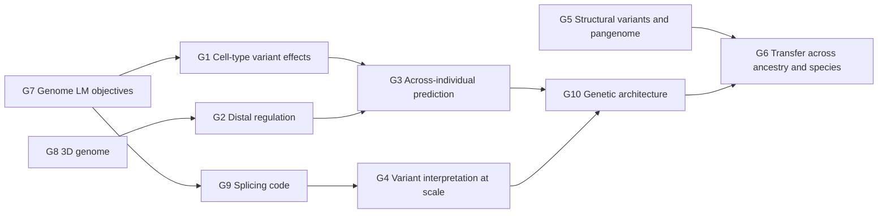

# Chapter 50. Open Problems I: Genomes

!!! abstract "Chapter at a glance"
    **Motivation.** The first of three atlases of open problems. Each entry states a measurable goal, what is established and what is not (with the evidence grades of this book), which of the four gaps makes it hard (measurement G-M, objective G-O, inference G-I, generalization G-G), diagnostic questions that a researcher can test, the smallest decisive experiment, the attack (A1–A10, Chapter 55) most likely to open it, and a success criterion stated as a number. The atlas is meant to be *used*: choose a problem whose measurement exists, whose competing explanations can be separated by an experiment you can afford, and whose answer would change what others do. Ten problems cover the regulatory code and its variants, individual-level prediction, population and species transfer, genome structure, and genome design.
    **Prerequisites.** Chapters 20–33, 41, 42, and 55–58 for the method.
    **You will be able to:** (1) state a genomics problem as a measurable quantity with a ceiling; (2) place it among the four gaps and the Ten Attacks; (3) identify the smallest experiment that would separate its leading explanations; (4) judge whether a claimed advance addresses the problem or its proxy; (5) pick a problem that fits your resources.

---

## 50.0 How to read an atlas entry

Each entry has the same fields.

| Field | Content |
|---|---|
| **Goal** | A measurable quantity $y$ and the data that measure it |
| **Status** | Established [[E]], strong [[S]], plausible [[P]], open [[H]] |
| **Why hard** | Which gaps (G-M, G-O, G-I, G-G) bind |
| **Diagnostics** | Questions whose answers split the leading explanations |
| **Minimal experiment** | The smallest design that would give a decisive answer |
| **Attack** | The idea-generation attack (A1–A10) that fits |
| **Success** | The number that counts as progress |

!!! lens "Research lens: problems and proxies"
    Most disagreement about progress is about *which quantity is being optimized*. The recurring proxies in genomics are (i) predictive accuracy on held-out *genes* (a between-gene quantity) for a within-gene variant-effect problem; (ii) AUROC on clinical-database labels (confounded by ascertainment); (iii) agreement with annotation tracks that were themselves model-derived. Each entry names the proxy to avoid.

---

## 50.1 G1. Variant effects in cell types and states absent from training

**Goal.** Predict the effect of a regulatory variant on expression, accessibility, or a cellular phenotype in a cell type, developmental stage, or state for which no training tracks exist, scored by saturation-mutagenesis MPRAs and CRISPR-based assays in that context.

**Status.** Sequence-to-function models treat cell types as output indices (Chapter 31): there is no way to *ask* about a new cell type except by training on it [[S]]. Transfer from a related cell type works for shared regulators and fails for cell-type-specific ones [[P]].

**Why hard.** G-G (the cell type is a context variable the model has no representation for) and G-M (sparse ground truth in rare cell types).

**Diagnostics.** (i) For a held-out cell type, how much accuracy is recovered by the *nearest* training cell type, and how does it decline with the distance between their transcription-factor expression profiles? (ii) Does conditioning on the cell's measured TF expression (or chromatin state) predict regulatory activity better than an index? (iii) Is the gap in the *enhancer* or the *promoter* component of the prediction?

**Minimal experiment.** Pick 10 cell types with MPRAs or accessibility QTL data; hold out each in turn; train models with (a) per-cell-type output heads, (b) a head conditioned on a learned TF-expression embedding, (c) a head conditioned on measured TF expression; report ceiling-normalized correlation for the held-out cell type as a function of its distance to the nearest training cell type.

**Attack.** A2 (representation: make the cell type a continuous input), A7 (cross-domain transfer: conditional generation as in language models).

**Success.** Ceiling-normalized within-element correlation in a held-out cell type of at least 0.7, with the performance-versus-distance curve reported.

**Proxy to avoid.** Accuracy of tracks averaged across genes in cell types that were in training.

---

## 50.2 G2. Distal regulation and enhancer–gene specificity

**Goal.** Predict which distal elements regulate which genes, and the quantitative effect of deleting or perturbing a distal element, scored by CRISPRi/CRISPRa tiling screens and by deletions.

**Status.** Models with context windows of hundreds of kilobases (Enformer, Borzoi, AlphaGenome) predict many tracks, but most predictive signal comes from promoter-proximal sequence and long-range effects are underestimated [[S]] (Karollus et al. 2023, Chapter 31). Enhancer–gene linking models trained on CRISPRi data and chromatin contact features perform better on this task than sequence models alone [[S]]; whether sequence models can reach their accuracy is open [[H]].

**Why hard.** G-O (training objectives reward tracks, not distal causal effects), G-M (CRISPRi screens cover a small subset of loci and cell types), G-I (contact does not equal regulation).

**Diagnostics.** (i) Does the model's prediction change when a *known* distal enhancer is deleted in silico, and is the change of the right size? (ii) Is performance on distal effects limited by *context length*, by *training signal*, or by *label scarcity*? (iii) Does adding CRISPRi data to the training set restore distal sensitivity (an experiment on the data, not the architecture)?

**Minimal experiment.** For 1,000 CRISPRi-validated enhancer–gene pairs and 4,000 non-regulatory pairs at matched distance, compute in silico deletion effects for three model classes; report the AUROC for regulation and the correlation of predicted and measured effect sizes, stratified by distance (0–10 kb, 10–100 kb, 100 kb–1 Mb). Then fine-tune on half the CRISPRi data and test on held-out loci.

**Attack.** A3 (objective: train on perturbation effects, not tracks), A4 (data: pooled CRISPRi screens), A9 (biological constraint: chromatin loops and insulators as architecture).

**Success.** AUROC for distal (>100 kb) regulation above 0.8 on held-out loci without CRISPRi training data from the same loci; effect-size correlation above 0.5 at ceiling.

**Proxy to avoid.** Correlation of predicted and observed track values near the promoter.

---

## 50.3 G3. Across-individual prediction of expression and phenotype

**Goal.** Predict the difference in expression of a gene between individuals from their sequence, scored against paired genome and transcriptome data, with the ceiling set by cis-heritability.

**Status.** Four sequence-based models had across-individual correlations near zero for most genes (Huang et al., Sasse et al. 2023), and per-gene regularized regression on nearby variants outperformed them [[S]]. Chapter 58 (Case 2) lays out five competing explanations.

**Why hard.** G-O (the objective never rewards within-gene discrimination), G-I (LD-tag labels), G-M (heritable signal is small).

**Diagnostics.** See Chapter 58, Case 2: ceiling-normalized evaluation; MPRA within-element logic; fine-tuning with within-gene loss; distal deletion tests; fine-mapped variants.

**Minimal experiment.** Chapter 58, Case 2, experiments 1–3.

**Attack.** A3 (objective), A4 (data: paired individuals), A8 (reformulate: predict *differences* from reference).

**Success.** Ceiling-normalized across-individual correlation above 0.5 for the top quintile of cis-heritable genes, outperforming per-gene regression, in held-out individuals and genes.

**Proxy to avoid.** Between-gene correlation of reference-sequence predictions.

---

## 50.4 G4. Variant interpretation at population scale, calibrated to clinical evidence

**Goal.** Assign every possible human variant a calibrated probability of pathogenicity (and a magnitude), so that computational evidence can be combined with clinical evidence under the ACMG/AMP framework.

**Status.** AlphaMissense (Cheng et al., *Science* 2023) classified 89% of the 71 million possible human missense variants (about 57% likely benign and 32% likely pathogenic, with the rest ambiguous), and calibrated scores of several tools are recommended as supporting-to-strong evidence by ClinGen (Pejaver et al. 2022) [[S]]. Coding variant interpretation is good for well-studied genes and weak for genes with little clinical data and for non-missense variants [[S]]; non-coding interpretation is early [[P]]. Variant-effect maps from multiplexed assays (MaveDB; the Atlas of Variant Effects Alliance) provide *functional* ground truth, but cover a small fraction of the genome [[S]].

**Why hard.** G-M (labels are ascertained and circular: clinical databases are enriched for variants that earlier tools called pathogenic), G-I (functional effect is not clinical effect), G-G (gene- and context-specific mechanisms).

**Diagnostics.** (i) How much of the AUROC on ClinVar is explained by gene-level features (constraint, family) alone? (ii) Are likelihood ratios *calibrated* within each gene and variant class? (iii) Do predictions agree with multiplexed functional assays where they exist (an independent label)?

**Minimal experiment.** For 50 genes with saturation-mutagenesis data and clinical labels, compare four evidence sources (gene-level constraint only; model score; functional assay; a combination) with respect to the log-likelihood ratio of pathogenicity, with matched allele frequency; report calibration curves by gene.

**Attack.** A5 (evaluation: label sources that are not circular), A9 (biological constraint: the allele-frequency spectrum as evidence).

**Success.** Calibrated posterior probabilities with calibration error below 0.05 within gene families, validated against an independent functional assay, and a stated fraction of variants for which the evidence is *insufficient*.

**Proxy to avoid.** AUROC against ClinVar with random splits.

---

## 50.5 G5. Structural variants, repeats, and the pangenome

**Goal.** Represent and predict function across the genome including repeats, structural variants, and population diversity of sequence, not only a single linear reference.

**Status.** A complete human reference (T2T-CHM13; Nurk et al., *Science* 2022) and a pangenome reference from the Human Pangenome Reference Consortium (Liao et al., *Nature* 2023) exist [[E]]. Models are still trained on a linear reference genome (a hg38-like assembly) and ignore structural variation [[S]]. Repeat and centromeric regions, 8% of the T2T genome that was previously unresolved, have almost no sequence-to-function training data [[P]].

**Why hard.** G-M (short-read mappability), G-O (linear-genome objectives), G-G (many individuals; population-specific haplotypes).

**Diagnostics.** (i) How much of the effect of a structural variant is predicted by summing the effects of the sequence it removes or inserts? (ii) Do models trained on the pangenome (graph or multi-haplotype input) predict regulatory differences between haplotypes better than the reference? (iii) What is the mappability ceiling for repeat-region measurements?

**Minimal experiment.** Choose 200 SVs with matched expression data (eQTLs, or CRISPR-engineered deletions); compare predictions from reference-sequence models with in-silico editing of the haplotype versus a haplotype-aware model.

**Attack.** A2 (representation: graphs and haplotype sets), A4 (data: long-read tracks).

**Success.** Prediction of the direction and size of SV effects on expression with correlation above 0.5 at ceiling in held-out loci.

**Proxy to avoid.** Accuracy on a reference-only test set.

---

## 50.6 G6. Transfer across ancestry and across species

**Goal.** Make predictions (polygenic scores, variant effects, regulatory models) that transfer to ancestries underrepresented in training and to species without training data.

**Status.** Polygenic score accuracy declines with genetic distance from the training population, in a way explained largely by differences in LD and allele frequencies at tagging variants, plus, in part, differences in effect sizes and environments (Chapter 26) [[S]]. Multi-ancestry fine-mapping improves transfer [[S]]. Cross-species regulatory models trained on human and mouse data transfer *within* the mammals tested and are weaker for non-conserved elements [[P]].

**Why hard.** G-G (shift, Chapter 45), G-I (causal versus tagging variants).

**Diagnostics.** (i) What fraction of the loss is explained by LD differences (testable by predicting with *causal* variants only)? (ii) By allele-frequency differences? (iii) By true effect-size differences (gene–environment)? (iv) For species transfer, what fraction of variance is carried by conserved sequence versus species-specific elements?

**Minimal experiment.** Use a simulation-calibrated decomposition (Chapter 26's experiment) on real cohorts with multi-ancestry genotype data: fit with fine-mapped variants only; with tags; with ancestry-specific effect sizes; report the attributable fraction of the portability gap.

**Attack.** A5 (evaluation: decompose the gap), A9 (biological constraint: causal variants shared across ancestries).

**Success.** A prediction model whose accuracy in the least-represented ancestry group is within 20% of that in the training ancestry group, validated in an independent biobank.

**Proxy to avoid.** Average accuracy across ancestry groups weighted by sample size.

---

## 50.7 G7. Objectives for genomic language models

**Goal.** An unsupervised or self-supervised objective for DNA whose learned representation, used zero-shot or with a linear head, matches or exceeds tuned supervised one-hot models on regulatory tasks.

**Status.** Zero-shot likelihood ratios of DNA LMs were dominated by composition in a controlled test (Chapter 32), evolutionary breadth (GPN-MSA, Evo 2) makes the likelihood informative for coding variants, and pretrained DNA LMs do not consistently beat tuned supervised baselines for regulatory activity (Tang and Koo 2025; DART-Eval) [[S]].

**Why hard.** G-O (next-base prediction spends capacity on repeats and composition), G-M (no cell-type context).

**Diagnostics.** (i) Does reweighting the loss toward conserved positions improve regulatory transfer at matched compute? (ii) Does adding *population variation* (alleles and frequencies) to pretraining help? (iii) Does a contrastive objective between orthologous regulatory elements help? (iv) Is the gain in the *representation* or in the *fine-tuned head*?

**Minimal experiment.** At 100M parameters and fixed compute, train four variants (next-base; conservation-weighted; population-variation-augmented; contrastive-ortholog) and evaluate each, with a probe and with fine-tuning, on three held-out regulatory benchmarks against a tuned one-hot CNN and a composition-only null.

**Attack.** A3 (objective), A4 (data: population variation), A7 (cross-domain: contrastive learning).

**Success.** A representation whose linear probe is within 5% of a tuned supervised CNN on held-out cell types of three benchmarks, with scaling shown across at least three model sizes.

**Proxy to avoid.** Perplexity on a held-out genome.

---

## 50.8 G8. Three-dimensional genome organization and its dynamics

**Goal.** Predict contact maps from sequence, the effect of variants and structural variants on them, and their cell-to-cell variability and dynamics.

**Status.** Sequence-based models (Akita, Orca, C.Origami) predict averaged Hi-C maps with reasonable accuracy in cell types where they were trained, with accuracy driven by CTCF motif orientation and loop extrusion rules [[S]]; predictions of cell-type differences and of the consequences of structural variants are weaker [[P]]; single-cell variability and dynamics are open [[H]].

**Why hard.** G-M (population-averaged contacts; sparse single-cell data), G-O (average-map objectives), G-I (contact does not imply regulation).

**Diagnostics.** (i) How well does a *loop-extrusion polymer simulation* with sequence-derived barrier strengths match the neural prediction? (ii) Do models predict the contact changes for CTCF-site deletions that have been experimentally made? (iii) Does the model capture the *distribution* of single-cell contacts or only the mean?

**Minimal experiment.** Compile 100 engineered deletions/inversions with Hi-C; test predicted versus observed insulation changes; compare a neural model to a mechanistic polymer model with the same input features.

**Attack.** A9 (biological constraint: the loop-extrusion mechanism as an inductive bias), A8 (reformulate as a distribution prediction).

**Success.** Predicted insulation changes correlate with observed above 0.7 for engineered deletions in held-out loci and cell types.

**Proxy to avoid.** Pearson correlation of whole contact maps, dominated by distance decay.

---

## 50.9 G9. The splicing and RNA-processing code

**Goal.** Predict tissue-specific splicing, the effect of variants on splice site usage and isoform ratios, and the effects of therapeutic antisense oligonucleotides, scored by minigene assays, RNA-seq in carriers, and clinical outcomes.

**Status.** Deep models of splice sites (SpliceAI, Pangolin) are strong at predicting canonical splice-site disruptions and cryptic sites and are used clinically as supporting evidence [[S]]; tissue-specific and quantitative predictions, branchpoint and exonic regulatory elements, and long-range effects are weaker [[P]] (Chapter 33). Translation-level effects of 5′ UTR and codon variation are measured by massively parallel assays, with models of moderate accuracy [[P]].

**Why hard.** G-M (tissue-specific splicing needs matched RNA data and rare variants), G-O (models trained on annotations rather than on quantitative isoform usage).

**Diagnostics.** (i) How does accuracy fall with distance of the variant from the splice site? (ii) Does a model trained on *quantitative* isoform ratios from perturbation data predict held-out variant effects better than one trained on annotated sites? (iii) How well do predictions of ASO effects match screens?

**Minimal experiment.** Choose 500 variants with minigene or RNA-seq-measured percent-spliced-in changes in at least two tissues; compare models by tissue-specific effect correlation (ceiling-normalized), stratified by distance to the splice site.

**Attack.** A4 (data: saturation minigene libraries), A5 (evaluation: quantitative, tissue-specific).

**Success.** Ceiling-normalized correlation above 0.7 for exonic and deep intronic variants at 50–500 bp from the nearest splice site.

**Proxy to avoid.** Binary accuracy of splice-site loss at the canonical dinucleotide.

---

## 50.10 G10. Genetic architecture: epistasis, gene–environment, and the heritability that remains

**Goal.** Predict phenotypes from the full genome, including non-additive and context-dependent effects, to the heritability ceiling.

**Status.** Whole-genome sequence data capture most of the pedigree-based narrow-sense heritability for common traits, with rare variants contributing, and common-variant polygenic scores explain a fraction that varies from trait to trait (Chapter 26) [[S]]. Non-additive variance is usually small relative to additive variance in humans, and *detecting specific epistatic interactions* is statistically hard [[S]]. Whether deep models can find non-additive and gene–environment signal beyond additive models in biobanks is open [[H]].

**Why hard.** G-M (power: the number of pairwise interactions grows quadratically), G-I (environment is imperfectly measured), G-O (the additive linear model is a strong baseline).

**Diagnostics.** (i) How much predictive accuracy does a deep model add over the best additive PRS in a held-out set, after matching for covariates? (ii) Are gains concentrated in a few traits with known non-additive biology? (iii) Does adding functional priors (Chapter 41) shift the answer?

**Minimal experiment.** On three traits in a large biobank with a pre-registered train/validation/test split, compare additive PRS, PRS with annotation-informed priors, and a nonlinear model with interaction capacity; report incremental $R^2$ with intervals and its dependence on sample size.

**Attack.** A1 (assumptions: additivity), A6 (scale: sample size), A9 (biological constraint: pathways).

**Success.** A nonlinear model that adds at least 10% relative incremental $R^2$ over additive PRS in a replicated, pre-registered test on at least two traits.

**Proxy to avoid.** In-sample or cross-validated $R^2$ without a held-out cohort.

---

## 50.11 Worked research example: choosing among the atlas

!!! example "Worked Research Example 50.1: Choosing a problem for a six-month project with one GPU and access to a small wet lab"
    **Situation.** A new group has one GPU node, a collaborator with MPRA and CRISPRi capability, and six months.

    **Question.** Which atlas problem should it take, and what is the plan?

    **Reasoning.**

    1. **Filter by resources.** G5 (pangenome) needs long-read data and graph infrastructure; G10 needs a large biobank; G8 needs Hi-C data. G1, G2, G3, G7 can be started with public data and a small wet-lab collaboration.
    2. **Filter by decisiveness.** G2 and G3 have sharp experiments with ceilings; G7's experiment is compute-heavy at the scale that matters; G1's depends on available multi-cell-type MPRAs.
    3. **Filter by novelty and reach.** G3 has a clear, published failure and a well-defined ceiling; the MPRA test of Chapter 58 Case 2 can be run in the collaborator's lab.
    4. **Plan.** Month 1: re-evaluate three public models with ceiling-normalized across-individual correlation on public GTEx-type data (no wet lab). Month 2: MPRA saturation mutagenesis of 100 promoters/enhancers in one cell type. Months 3–4: compare model predictions with MPRA; fine-tune with a within-element loss. Months 5–6: ablate (data size, context length) and write up with the ceiling.
    5. **Pre-register** the decision rule (Chapter 58 Case 2) and what would change the plan: if ceiling-normalized correlations are already above 0.5, the problem is measurement-limited and the project becomes an evaluation paper.

    **Expert analysis.** The choice is not "the most important problem" but the problem where the group's resources give it an unusual ability to run the decisive experiment.

---

## 50.12 Researcher's Notebook

!!! notebook "Researcher's Notebook: before you start an atlas problem"
    1. **Write the goal as a number with a ceiling** (heritability, replicate agreement, measurement noise).
    2. **Find the proxy** most papers optimize and say why it differs from the goal.
    3. **List the competing explanations** and which diagnostic separates them.
    4. **Check that the data exist** in the matched cell type and at the needed resolution.
    5. **Pre-register** the success criterion and the failure analysis.
    6. **Search for the null model**: the simplest baseline that might already reach the target.
    7. **Plan the negative result**: what is publishable if the model fails.

    **What it teaches.** Choosing the problem is half of the research; the atlas is a start, and the entries will go stale as the field moves (date your reading).

    **An open question to carry forward.** Which entries of this atlas share a *common bottleneck* (for example, the absence of within-locus perturbation data), so that a single data resource (a large registry of saturation mutagenesis and CRISPRi screens in matched cell types) would advance several at once? A dependency analysis of the atlas, with data needs as nodes, could prioritize community data generation.

---

## 50.13 Connections

- **Backward:** the chapters on genomes, sequence-to-function, genomic LMs, RNA, and genetics (Chapters 20, 21, 26, 31–33, 41, 42); method chapters (43–46, 55–58).
- **Forward:** open problems in cells and in proteins and molecules (Chapters 51, 52); independent research (Chapter 59).

!!! takeaways "Key takeaways"
    1. An atlas entry is a measurable goal with a ceiling, a status graded by evidence, the gaps that bind, diagnostics, a minimal experiment, an attack, and a numeric success criterion.
    2. The central genomic gaps are the **within-locus gap** (models predict between-gene differences, not variant effects within a gene), the **context gap** (cell types and states), and the **representation gap** (linear reference genomes, one ancestry).
    3. Distal regulation (G2) and across-individual prediction (G3) are separated by experiments that already exist (CRISPRi screens, MPRA saturation mutagenesis, paired genomes) and could be run with modest resources.
    4. Variant interpretation (G4) needs calibrated, non-circular evidence and an honest "insufficient evidence" category.
    5. Transfer across ancestry and species (G6) is decomposable into LD, allele frequency, effect-size, and environment components, each testable.
    6. Genomic LM objectives (G7) are an open design space: conservation weighting, population variation, and contrastive objectives are untested at scale.
    7. Pick a problem by where your resources give you an unusual ability to run the decisive experiment.

---

## Further reading

- Karollus, A., Mauermeier, T. & Gagneur, J. (2023). *Genome Biol.* 24, 56. Huang, A. C. et al. (2023). *Nat. Genet.* 55, 2056–2059. Sasse, A. et al. (2023). *Nat. Genet.* 55, 2060–2064. Avsec, Ž. et al. (2026). AlphaGenome. *Nature.* Brixi, G. et al. (2026). Evo 2. *Nature.*
- Cheng, J. et al. (2023). Accurate proteome-wide missense variant effect prediction with AlphaMissense. *Science* 381, eadg7492. Pejaver, V. et al. (2022). Calibration of computational tools for missense variant pathogenicity classification and ClinGen recommendations for PP3/BP4 criteria. *Am. J. Hum. Genet.* 109, 2163–2177. Richards, S. et al. (2015). Standards and guidelines for the interpretation of sequence variants (ACMG/AMP). *Genet. Med.* 17, 405–424. Fowler, D. M. et al. (2023). An Atlas of Variant Effects to understand the genome at nucleotide resolution. *Genome Biol.* 24, 147.
- Nurk, S. et al. (2022). The complete sequence of a human genome. *Science* 376, 44–53. Liao, W.-W. et al. (2023). A draft human pangenome reference. *Nature* 617, 312–324. Fudenberg, G., Kelley, D. R. & Pollard, K. S. (2020). Predicting 3D genome folding from DNA sequence with Akita. *Nat. Methods* 17, 1111–1117. Zhou, J. (2022). Sequence-based modeling of three-dimensional genome architecture from kilobase to chromosome scale. *Nat. Genet.* 54, 725–734.
- Jaganathan, K. et al. (2019). Predicting splicing from primary sequence with deep learning. *Cell* 176, 535–548. Zeng, T. & Li, Y. I. (2022). Predicting RNA splicing from DNA sequence using Pangolin. *Genome Biol.* 23, 103. Duncan, L. et al. (2019). Analysis of polygenic risk score usage and performance in diverse human populations. *Nat. Commun.* 10, 3328. Ding, Y. et al. (2023). Polygenic scoring accuracy varies across the genetic ancestry continuum. *Nature* 618, 774–781 (see Chapter 26 for the decomposition of portability).
