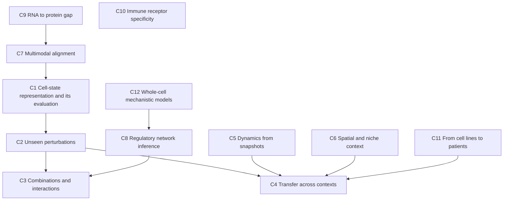

# Chapter 51. Open Problems II: Cells

!!! abstract "Chapter at a glance"
    **Motivation.** The second atlas covers cells: representations of cell state, perturbation and its prediction, dynamics, tissue context, regulatory networks, immune specificity, and the whole-cell mechanistic models that would make a "virtual cell" more than a statistical emulator. The entries use the same fields as Chapter 50 (goal, status, why hard, diagnostics, minimal experiment, attack, success, proxy to avoid). The common theme is that *most cell data are observational snapshots of destroyed cells*, so almost every open problem is a problem of inference about interventions and time from data that contain neither directly (Chapters 25, 39, 44, 45).
    **Prerequisites.** Chapters 19, 25, 30, 38–40, 44–46, 50, 55–58.
    **You will be able to:** (1) state a cell-biology modeling problem as a measurable goal with a ceiling; (2) identify which measurement or identifiability limit binds it; (3) design the smallest experiment that separates its leading explanations; (4) judge whether a proposed benchmark measures the goal or a proxy; (5) pick a problem that matches your data access.

---

## 51.0 The shape of the field

!!! lens "Research lens: the three recurring identifiability limits"
    (i) *Snapshots, not trajectories*: cells are destroyed by measurement, so dynamics are inferred from ensembles. (ii) *Observation, not intervention*: atlases record what cells do, not what they would do under perturbation. (iii) *Averages, not individuals*: a cell's fate is stochastic, and models predict distributions. An entry should say which of the three binds it.

---

## 51.1 C1. Cell-state representation and its evaluation

**Goal.** An embedding of cells, usable across studies, species, platforms, and conditions, whose geometry preserves types, states, and continuous variation, scored by cross-study label transfer, detection of novel states, recovery of rare types, and preservation of continuous gradients, against ceilings set by annotator agreement and replicate agreement.

**Status.** Zero-shot embeddings from several single-cell foundation models lose to simple baselines on several tasks [[S]] (Kedzierska et al. 2025). In the miniature experiment of Chapter 38, a rank-encoding transformer pretrained on 19,800 cells matched a random-weight network in label transfer (0.49 against 0.50, PCA 0.94–0.96), detected a novel type well (AUROC 0.98 against 0.60 for random weights; PCA 1.00), and mixed studies far better than PCA (study separation 0.04 against 0.46–0.52) because its embedding carried little cell-type structure: **batch mixing rewards uninformative embeddings** [[S]] for this finding in simulation; its transfer to real data is [[H]]. Adding a *contrastive depth-invariance* term to the same model's objective (two thinned views of each cell embedded together) lifted label transfer from 0.48 to 0.94 with study mixing 0.11, a larger change than a ten-fold increase in pretraining data (single seed, a simulated world whose nuisance the augmentation targets; Chapter 38).

**Why hard.** G-O (masked-gene objectives), G-M (annotation noise sets a ceiling), G-G (studies differ in depth, chemistry, tissue handling).

**Diagnostics.** (i) Does the metric suite include a task that an uninformative embedding fails (label transfer, rare-type recovery) alongside mixing? (ii) Does a contrastive, depth-invariant objective change label transfer more than 10× data? (iii) How does performance depend on the *effective* diversity of pretraining data (number of distinct studies and types), not the cell count?

**Minimal experiment.** The factorial pretraining study of Chapter 58, Case 1, with the metrics above and rare-subtype recovery, repeated on real data from at least three tissues.

**Attack.** A3 (objective), A5 (evaluation), A2 (tokenization).

**Success.** A zero-shot embedding that exceeds PCA-on-HVGs and scVI on cross-study label transfer, rare-type recovery, and novel-type detection *simultaneously* on held-out studies, with ceilings reported.

**Proxy to avoid.** A single integration score that can be maximized by discarding biology.

---

## 51.2 C2. Predicting the response to unseen perturbations

**Goal.** Predict the change in expression (and, where measured, the distribution of cell states) after knockdown, knockout, activation, or drug treatment of a gene or compound not in the training set, in a context that is in the training set; scored by delta-correlation and top-DE-gene error against baselines and replicate ceilings.

**Status.** Chapter 39: in 2025, five foundation models and two other deep models did not outperform additive or mean baselines for double perturbations on standard metrics (Ahlmann-Eltze et al.); metrics matter, and a graph-structured model whose structure was tied to a partial network scaled with graph recall while a generic embedding head did not (§39.4) [[S]]. The Virtual Cell Challenge 2025 produced a blind benchmark, with hybrid winners and no model consistently beating naive baselines on all metrics [[S]].

**Why hard.** G-I (observation does not identify intervention), G-M (small effects; noise), G-G (unseen genes).

**Diagnostics.** (i) How much of the apparent skill is *systematic variation* shared across perturbations? (ii) Does performance track the *similarity* of the held-out perturbation to training perturbations in a functional embedding? (iii) Are there perturbation classes (essential genes; transcription factors) for which prediction is at the ceiling?

**Minimal experiment.** Chapter 39's design on two public Perturb-seq data sets: report delta-correlation and top-DE error, stratified by effect size and by functional similarity to the nearest training perturbation, with the nearest-neighbor baseline.

**Attack.** A5 (evaluation), A9 (biological constraint: pathways), A2 (structure-aware heads).

**Success.** Ceiling-normalized delta-correlation above 0.6 on held-out perturbations *with no functional neighbor in training*, beating the nearest-neighbor baseline.

**Proxy to avoid.** Correlation of raw expression.

---

## 51.3 C3. Combinatorial perturbations and genetic interactions

**Goal.** Predict the effect of perturbing two or more genes, and in particular the *non-additive* part, scored by precision and recall of top-ranked interacting pairs against replicated experimental screens.

**Status.** Additive baselines are near-optimal on aggregate metrics because interactions are sparse and small relative to noise (Chapter 39's simulation: interaction RMS 0.027 per gene against noise 0.05, additive error 0.093 against a noise-limited bound of 0.087) [[S]]; interaction models trained on random pairs learn almost nothing [[P]].

**Why hard.** G-M (power: $O(G^2)$ pairs), G-I (buffering and compensation are context-dependent).

**Diagnostics.** (i) What fraction of measured pairs has an interaction above the replicate noise? (ii) Are interactions predictable from *shared downstream targets* or *pathway membership*? (iii) Does enriching the training set for pairs sharing neighbors improve interaction prediction?

**Minimal experiment.** Choose 300 pairs from 50 genes by two rules (random; shared-neighbor-enriched); measure all; train interaction models on half and test on the other half; report enrichment of true interactions in the top 10% of predictions.

**Attack.** A4 (data: design pairs by information, Chapter 46), A9.

**Success.** At least 3-fold enrichment of true interactions in the top-ranked 10% of held-out pairs, and a design rule that reaches it with fewer than 100 measured pairs.

**Proxy to avoid.** Aggregate RMSE over all pairs.

---

## 51.4 C4. Transfer across cell types, contexts, and donors

**Goal.** A perturbation-response or state model trained in some cell types that predicts in another, scored with few or no target-context labels.

**Status.** Some transfer for core cellular machinery, little for context-specific regulators [[P]] (Chapter 45, Example 2); State and similar large cross-context models report gains on benchmarks of their authors' choosing [[P]]; no accepted benchmark isolates context transfer [[H]].

**Why hard.** G-G (concept shift: the same perturbation has different effects), G-M (few contexts with large perturbation data sets).

**Diagnostics.** (i) How does cross-context accuracy decline with the distance between contexts (TF expression profile)? (ii) How many target labels does adaptation need (§45.3.3: about 100 in a toy)? (iii) Does a context embedding learned from *unperturbed* data predict the *perturbed* response?

**Minimal experiment.** Use three or more cell-line Perturb-seq data sets with overlapping perturbations; for each pair, train on one and test on the other with 0, 10, 50, 200 target-context perturbations for adaptation; plot the learning curves against context distance.

**Attack.** A7 (transfer learning with a context variable), A5.

**Success.** Ceiling-normalized accuracy in a held-out context above 0.5 with at most 50 target perturbations, with the dependence on context distance reported.

**Proxy to avoid.** Within-context cross-validation.

---

## 51.5 C5. Dynamics from snapshots: trajectories, fates, and velocity

**Goal.** Predict the future states and fate probabilities of individual cells from snapshots, scored by held-out time points, lineage-traced fates, and perturbation outcomes.

**Status.** Optimal-transport trajectory inference (Waddington-OT, Schiebinger et al. 2019), RNA velocity (La Manno et al. 2018; scVelo, Bergen et al. 2020), and fate-probability models (CellRank, Lange et al. 2022) are widely used [[S]]; RNA velocity rests on assumptions (constant kinetic rates, a particular splicing model) that are often violated, and its directions can be unreliable (Gorin et al. 2022) [[S]]. Methods that combine metabolic labeling or lineage barcodes with snapshots provide ground truth for evaluation [[S]]; predictive dynamics beyond a few hours remain [[H]].

**Why hard.** G-M (snapshots), G-I (fate depends on unobserved signals), G-O (no standard objective across methods).

**Diagnostics.** (i) How often do velocity directions agree with metabolic-labeling time or lineage barcodes? (ii) Are fate predictions calibrated against clonal outcomes? (iii) Does adding perturbation data (what happens if a regulator is removed) constrain the dynamics better than adding time points?

**Minimal experiment.** Use a system with lineage-barcoded clones and snapshots at early time points; predict clonal fate distributions from early snapshots by three methods; score calibration of fate probabilities against held-out clones.

**Attack.** A8 (reformulate as transport), A9 (biological constraint: attractor dynamics; Chapter 19).

**Success.** Calibrated fate probabilities (reliability slope within 0.2 of 1) for held-out clones in at least two systems.

**Proxy to avoid.** Visual agreement of arrows with a known differentiation direction.

---

## 51.6 C6. Spatial context, niches, and cell–cell communication

**Goal.** Predict a cell's state from its spatial neighborhood, the effect of changing the neighborhood, and the signals exchanged between cells, scored by held-out tissues and by perturbation of niche components.

**Status.** Spatial platforms trade resolution, gene coverage, and cost (Chapter 25); deconvolution of low-resolution data has an error floor from reference mismatch [[S]]; cell–cell communication tools based on ligand–receptor co-expression disagree widely and are weakly validated (Dimitrov et al. 2022) [[S]]; foundation models for spatial and dissociated data are emerging [[P]].

**Why hard.** G-I (co-expression is not signaling), G-M (two-dimensional sections of three-dimensional tissue), G-G (tissue-to-tissue differences).

**Diagnostics.** (i) How well do predicted interactions agree with *perturbation* of ligand or receptor (knockouts and blocking antibodies) in the same tissue? (ii) Does neighborhood information improve prediction of cell state beyond the cell's own expression? (iii) How much does the choice of reference atlas change deconvolution?

**Minimal experiment.** In a tissue with a genetic perturbation of one cell type, compare the changes in neighboring cells' expression with predictions from three communication tools and a neighborhood-aware model.

**Attack.** A9 (biological constraint: diffusion ranges), A4 (data: perturbed spatial atlases).

**Success.** Predicted niche effects of a perturbation correlate with measured changes above 0.5 in held-out tissue sections.

**Proxy to avoid.** Enrichment of known ligand–receptor pairs.

---

## 51.7 C7. Multimodal alignment and the information that alignment discards

**Goal.** Joint models of paired or unpaired modalities (RNA, chromatin, protein, imaging, spatial) that preserve both shared and modality-specific information, scored by cross-modal prediction, retrieval, and downstream tasks that need private information.

**Status.** Chapter 40's simulation: cell-type accuracy from RNA alone 0.80, from the second modality alone 0.71, from both concatenated 0.92, but from contrastively aligned *shared* embeddings 0.57–0.65 (shared-only embeddings discard private structure); retrieval among 500 cells reached top-1 of 0.06 with 5,000 pairs; unpaired Gromov–Wasserstein alignment worked only when geometry was shared and compositions matched [[S]] in simulation.

**Why hard.** G-M (paired data are scarce), G-O (alignment objectives keep only shared information), G-I (unpaired alignment is not identifiable without assumptions).

**Diagnostics.** (i) How much *private* information does each modality carry for the tasks of interest? (ii) How many paired cells are needed for a given retrieval accuracy? (iii) Do composition differences break unpaired methods on real data?

**Minimal experiment.** On a real multiome data set, hold out modalities and measure the information in (a) shared embeddings and (b) concatenations for tasks needing private information (a chromatin-specific phenotype); vary the number of paired cells.

**Attack.** A3 (objective: preserve private information), A4 (data: pair more cells).

**Success.** A model whose cross-modal prediction approaches the mutual-information bound estimated from replicate pairs, while preserving private-modality task accuracy within 5% of the unimodal model.

**Proxy to avoid.** Retrieval accuracy alone.

---

## 51.8 C8. Regulatory network inference and causal structure

**Goal.** Recover directed regulatory relationships (which TF regulates which gene, with sign) in a given cell type, scored by interventions held out from inference.

**Status.** Large benchmarks (CausalBench; Chevalley et al. 2025) found that methods using interventional data did not outperform those using only observational data on real data, in contrast to simulations, and that scalability was a limit [[S]]; ChIP-based and CRISPR-based gold standards are incomplete [[S]] (Chapter 44).

**Why hard.** G-I (confounding, latent variables, feedback), G-M (sparse gold standards), G-O (network edges are not what downstream tasks need).

**Diagnostics.** (i) How much of a network's predictive value for *held-out perturbations* survives pruning to its top edges? (ii) Do edges replicate across cell lines and across methods? (iii) Does a design that perturbs hubs improve identification (Chapter 46)?

**Minimal experiment.** Infer networks on half of the perturbations of a genome-scale screen; predict the other half's responses; compare methods by predictive accuracy and the reproducibility of their top edges across two cell lines.

**Attack.** A8 (reformulate: predict interventions, not graphs), A4.

**Success.** A network whose top 1,000 edges reproduce at a rate above 50% across independent cell lines and improve held-out perturbation prediction above the best non-network baseline.

**Proxy to avoid.** Overlap with a curated database.

---

## 51.9 C9. The RNA–protein gap and single-cell proteomics

**Goal.** Predict protein abundance and activity from RNA and from single-cell multi-omic measurements, and obtain proteome-scale single-cell measurements, scored against mass spectrometry and antibody-based quantification.

**Status.** Correlations between RNA and protein across genes are moderate, and across *conditions or cells for the same gene* are much lower for many genes because of post-transcriptional regulation, translation efficiency, and protein turnover [[S]]; single-cell proteomics by mass spectrometry is advancing but limited by depth and throughput [[P]]; protein-level FMs are in their infancy [[H]].

**Why hard.** G-M (the measurement itself), G-O (models trained on RNA do not see translation and degradation).

**Diagnostics.** (i) How much of the within-gene, across-cell protein variation is predictable from RNA? (ii) Does adding ribosome-profiling or 5′UTR/codon features help (Chapter 33)? (iii) Are there gene classes (secreted, membrane, transcription factors) for which RNA is a good proxy?

**Minimal experiment.** On a CITE-seq data set with 100 antibodies, predict protein from RNA, 5′UTR features, and RNA velocity features; report within-gene across-cell correlations with ceilings from antibody replicate noise.

**Attack.** A9 (biological constraint: translation and degradation kinetics), A4 (data: matched proteomics).

**Success.** Within-gene across-cell protein prediction at least 60% of the replicate ceiling for half of the measured proteins.

**Proxy to avoid.** Across-gene correlation of mean RNA and protein.

---

## 51.10 C10. Immune receptor specificity

**Goal.** Predict which peptide–MHC complexes a T-cell receptor recognizes (and which antigens an antibody binds), including for epitopes not seen in training, scored by held-out epitopes and prospective assays.

**Status.** Data-driven models of TCR–peptide–MHC binding perform well on epitopes seen in training and poorly on unseen epitopes in community benchmarks (the IMMREP workshops; Meysman et al. 2023) [[S]]; the data are small, biased toward a few viral epitopes, and have noisy negatives [[S]]. Structure-based and language-model-based approaches have not yet closed the gap [[P]].

**Why hard.** G-M (data scarcity, false negatives), G-G (each epitope is a new problem), G-I (cross-reactivity).

**Diagnostics.** (i) How does accuracy fall with edit distance between held-out and training peptides? (ii) Do negatives constructed by shuffling create artifacts (a model can learn the shuffling)? (iii) Does pooling structural data help generalization?

**Minimal experiment.** Build a benchmark with experimentally validated negatives (from deep screening) and epitope-held-out splits; compare sequence, structure-based, and hybrid models.

**Attack.** A4 (data: high-throughput specificity assays), A5.

**Success.** AUROC above 0.8 on unseen epitopes with experimentally validated negatives.

**Proxy to avoid.** Accuracy with randomly shuffled negatives.

---

## 51.11 C11. From cell-line responses to patients

**Goal.** Map cellular responses (perturbation or drug) measured in cell lines or organoids to patient-level outcomes, scored by prospective clinical or ex-vivo data.

**Status.** Large cell-line resources (the Cancer Cell Line Encyclopedia, DepMap CRISPR screens, and drug-response collections such as GDSC) support target discovery, but drug-response predictors from cell lines transfer poorly to tumors and patients, with differences in tumor microenvironment, pharmacokinetics, and heterogeneity [[S]]. Very large drug-perturbation transcriptome data (Tahoe-100M, 2025) broaden coverage; clinical translation of models trained on them is untested [[H]].

**Why hard.** G-G (cell line to tissue), G-I (exposure and context), G-M (patient-level ground truth is sparse).

**Diagnostics.** (i) How much does adding patient-derived ex-vivo data (organoids, primary cultures) improve outcome prediction over cell lines? (ii) Which pathways transfer? (iii) What is the achievable ceiling given response heterogeneity within a patient?

**Minimal experiment.** For a cancer type with ex-vivo drug testing and clinical response, train on cell lines and test on ex-vivo samples and then on clinical response, with prospective registration.

**Attack.** A7 (domain adaptation with patient-derived data), A5 (evaluation: clinical endpoints).

**Success.** Prospective prediction of clinical response better than the standard of care biomarker in a pre-registered cohort.

**Proxy to avoid.** Correlation of predicted and measured IC$_{50}$ within cell lines.

---

## 51.12 C12. Whole-cell mechanistic models

**Goal.** A simulation of a cell from its genome that predicts growth, gene essentiality, and responses to perturbation, with mechanistic components that generalize beyond the conditions to which they were fit.

**Status.** A whole-cell model of *Mycoplasma genitalium* (Karr et al., *Cell* 2012) integrated 28 submodels, and a dynamical kinetic model of the minimal cell JCVI-syn3A (Thornburg et al., *Cell* 2022) reproduced aspects of growth and division from the genome; predictions of gene essentiality agree with experiments for a majority of genes in these small cells [[S]]. A whole-cell model of a human cell is far beyond current data and compute [[X]]; hybrid approaches that embed learned components in mechanistic scaffolds are speculative [[H]].

**Why hard.** G-M (parameters: kinetic constants for thousands of reactions), G-I (identifiability), G-G (conditions).

**Diagnostics.** (i) Which parameters can be identified from standard omics? (ii) Do model predictions of unseen gene knockouts reach the accuracy of a statistical model trained on essentiality data? (iii) Can a learned component replace a poorly identified submodel without degrading predictions of held-out perturbations?

**Minimal experiment.** In a minimal-cell model, compare mechanistic predictions of essentiality and growth under new media to a neural surrogate trained on a random half of simulated experiments, and then to experiments in the real minimal cell.

**Attack.** A9 (biological constraint), A7 (hybrid models), A1 (assumptions: identifiability).

**Success.** Predicting essentiality for held-out genes with at least 90% accuracy and growth-rate changes under new conditions with correlation above 0.8 in a minimal cell, as a stepping stone.

**Proxy to avoid.** Agreement with the data used for fitting.

---

## 51.13 Worked research example

!!! example "Worked Research Example 51.1: Which cell problem is an AI lab best placed to attack?"
    **Situation.** A group has access to 40 million Perturb-seq cells in two cell lines and a mid-sized compute budget. It asks which atlas entry to pursue.

    **Reasoning.**

    1. **Resources fit.** C2, C3, C4, C8 all use these data. C1 and C7 need multi-study or multi-modal collections. C10 needs immune data. C5 needs time-resolved or lineage data.
    2. **Decisiveness.** C4 (context transfer) can be run *internally* with two lines, but two contexts give a weak estimate of the dependence on distance; C2 has public benchmarks; C3's design question (which pairs to measure) benefits from the group's ability to run additional screens.
    3. **Gap in the field.** C3 and C4 have the weakest evidence; C2 is crowded.
    4. **Plan.** Phase 1: C2 re-evaluation with ceilings and the nearest-neighbor baseline on the two lines (weeks); Phase 2: design 300 pairs by two rules and measure them (C3); Phase 3: pursue C4 with an additional third line. Pre-register the success criteria of §51.2–51.4.
    5. **Risk.** If the nearest-neighbor baseline already attains the ceiling for most perturbations, then C2 is an evaluation paper; document the denominator of perturbations with no functional neighbor.

    **Expert analysis.** The best problem is where unique data meet a measurable gap; the plan makes the first phase a *measurement of the field's baseline*, which is publishable under either outcome.

---

## 51.14 Researcher's Notebook

!!! notebook "Researcher's Notebook: using the cell atlas"
    1. **Name the identifiability limit** that binds (snapshots, observation, averages).
    2. **Ask whether the benchmark is saturated** by a simple baseline, with the ceiling.
    3. **Find the metric that an uninformative model would win** and add a metric that it would lose.
    4. **Check the split**: by perturbation, by pathway, by context, by donor.
    5. **Design the next data** by information (Chapter 46), not by what is cheap.
    6. **Write the null result** you would publish.

    **What it teaches.** In cell biology the data, not the architecture, decide what can be learned; the atlas entries are ordered by how soon a measurement or design could change that.

    **An open question to carry forward.** Which three measurements, added to the standard Perturb-seq pipeline (for example, a second readout of cell state at a later time, a barcode for lineage, and a protein panel), would convert snapshots of perturbed cells into data from which fates and dynamics are identifiable? A formal identifiability analysis for simple dynamical models (Chapter 19) could give the answer and a minimum design.

---

## 51.15 Connections

- **Backward:** cells as dynamical systems (Chapter 19); measurement models (Chapter 25); single-cell methods and foundation models (Chapters 30, 38); perturbation and multimodal models (Chapters 39, 40); causality and shift (Chapters 44, 45); design (Chapter 46); the method chapters (55–58).
- **Forward:** proteins and molecules (Chapter 52); brains (Chapter 53); AI scientists (Chapter 54).

!!! takeaways "Key takeaways"
    1. Cell data are snapshots, observations, and averages; most open problems are about inferring time, intervention, and individuality from such data.
    2. Evaluation is the first bottleneck: in a pilot, an embedding that carried little cell-type structure mixed studies best (0.04 against 0.46–0.52), so mixing metrics need a paired discrimination metric.
    3. Perturbation prediction (C2) is limited by metrics and baselines more than by models; additive baselines are near-optimal when interactions are below noise (C3), so interaction prediction requires designed data.
    4. Context transfer (C4), dynamics (C5), spatial niches (C6), and clinical translation (C11) have the weakest evidence and the clearest experiments.
    5. Alignment objectives discard private information (C7); paired data are the scarce resource.
    6. Network inference (C8) should be judged by held-out perturbation prediction and cross-line reproducibility, not by overlap with curated databases.
    7. Whole-cell mechanistic models (C12) exist for minimal cells and are the long-term route to generalizing virtual cells.

---

## Further reading

- Kedzierska, K. Z. et al. (2025). *Genome Biol.* Ahlmann-Eltze, C., Huber, W. & Anders, S. (2025). *Nat. Methods* 22, 1657–1661. Bunne, C. et al. (2024). How to build the virtual cell with artificial intelligence. *Cell* 187, 7045–7063. Chevalley, M. et al. (2025). A large-scale benchmark for network inference from single-cell perturbation data. *Commun. Biol.* (2025), s42003-025-07764-y.
- Schiebinger, G. et al. (2019). Optimal-transport analysis of single-cell gene expression identifies developmental trajectories in reprogramming. *Cell* 176, 928–943. La Manno, G. et al. (2018). RNA velocity of single cells. *Nature* 560, 494–498. Bergen, V., Lange, M., Peidli, S., Wolf, F. A. & Theis, F. J. (2020). Generalizing RNA velocity to transient cell states through dynamical modeling. *Nat. Biotechnol.* 38, 1408–1414. Lange, M. et al. (2022). CellRank for directed single-cell fate mapping. *Nat. Methods* 19, 159–170. Gorin, G., Fang, M., Chari, T. & Pachter, L. (2022). RNA velocity unraveled. *PLoS Comput. Biol.* 18, e1010492.
- Dimitrov, D. et al. (2022). Comparison of methods and resources for cell-cell communication inference from single-cell RNA-Seq data. *Nat. Commun.* 13, 3224. Karr, J. R. et al. (2012). A whole-cell computational model predicts phenotype from genotype. *Cell* 150, 389–401. Thornburg, Z. R. et al. (2022). Fundamental behaviors emerge from simulations of a living minimal cell. *Cell* 185, 345–360.
- Meysman, P. et al. (2023). Benchmarking solutions to the T-cell receptor epitope prediction problem: IMMREP22 workshop report. *ImmunoInformatics* 9, 100024. Tsherniak, A. et al. (2017). Defining a cancer dependency map. *Cell* 170, 564–576. Iorio, F. et al. (2016). A landscape of pharmacogenomic interactions in cancer. *Cell* 166, 740–754.
