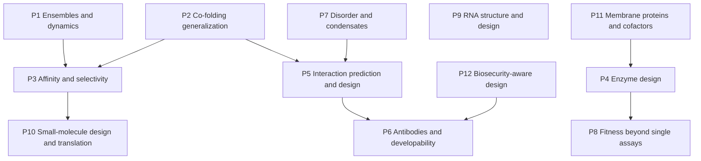

# Chapter 52. Open Problems III: Proteins and Molecules

!!! abstract "Chapter at a glance"
    **Motivation.** The third atlas covers proteins, nucleic acids, and small molecules: structure ensembles and dynamics, the physics (or memory) behind co-folding, binding affinity and selectivity, enzymes, interactions, antibodies, disorder, fitness prediction beyond a single assay, RNA, and small-molecule design and translation. Proteins are the domain where AI has produced its clearest breakthroughs and where the remaining problems are the sharpest, because experiments (structures, binding, activity) give quantitative ground truth and the generator–filter loop of design (Chapter 36) can be closed in days. Entries follow the format of Chapter 50.
    **Prerequisites.** Chapters 22–24, 34–37, 43, 45, 46, 48, 50, 51, 55–58.
    **You will be able to:** (1) state a protein or molecular problem as a measurable goal with a ceiling; (2) distinguish interpolation from extrapolation in each problem; (3) design the decisive experiment; (4) judge claims by denominators, controls, and novelty; (5) select a problem that matches your experimental access.

---

## 52.0 The shape of the field

!!! lens "Research lens: interpolation versus extrapolation"
    In every entry below, state whether the target is *inside* the region covered by training data (similar sequences, folds, ligands, interfaces) or outside it. Reported progress is overwhelmingly in the first case (Chapter 35, §35.5; Chapter 36). The open problems are mostly in the second.

---

## 52.1 P1. Structural ensembles, conformational change, and dynamics

**Goal.** Predict the equilibrium distribution of conformations (populations of states, free-energy differences, and transition kinetics) for a protein or complex from sequence and conditions, scored against NMR ensembles, hydrogen–deuterium exchange, FRET, single-molecule data, long molecular-dynamics simulations, and mutational stabilities.

**Status.** Single-structure predictors do not give populations; MSA subsampling and clustering yield alternative states without calibrated weights [[S]]; generative emulators trained on molecular-dynamics simulations and stability data (BioEmu, Lewis et al. 2025) sample equilibrium ensembles quickly and reproduce folding free energies to about 1 kcal/mol on their benchmarks [[S]] for those benchmarks; validation on proteins unlike the training simulations, and prediction of kinetics, is open [[H]].

**Why hard.** G-M (ensemble data are sparse), G-O (single-structure objectives), G-G (new folds).

**Diagnostics.** (i) Does an emulator's predicted population of two states agree with experiment for fold-switching and kinases outside the training set? (ii) Is the error dominated by free-energy offsets or by missing states? (iii) Do emulator ensembles satisfy detailed balance and reproduce *kinetics* (committors)?

**Minimal experiment.** Collect 50 proteins with experimentally measured populations of two or more states (NMR, HDX, smFRET) that are not in the training set (by sequence and fold); compare emulators, MSA-perturbation methods, and long MD, by absolute free-energy error and rank correlation of population changes under mutation.

**Attack.** A3 (objective: ensemble likelihood), A9 (biological constraint: thermodynamics), A4 (data: standardized ensemble benchmark).

**Success.** Mean absolute error of state free energy below 1 kcal/mol on held-out proteins, and prediction of mutation-induced population changes with rank correlation above 0.6.

**Proxy to avoid.** RMSD of the best sample to a single reference structure.

---

## 52.2 P2. Co-folding: memorization, physics, and generalization

**Goal.** Predict the pose of a ligand, nucleic acid, or partner protein in a complex for targets with no similar complexes in the training data, and respond correctly to physically meaningful perturbations (mutating binding-site residues; changing the ligand).

**Status.** Co-folding accuracy falls steeply with similarity to training complexes for AF3, Protenix, Chai-1, and Boltz-1 (Škrinjar et al. 2025) [[S]]; adversarial binding-site mutations often leave poses unchanged (Masters et al. 2025) [[S]]; developer reports of large gains on hard dissimilar cases (IsoDDE, 2026) await independent prospective tests [[P]] (Chapter 35).

**Why hard.** G-G (novelty), G-O (structure-only objectives), G-M (small crystallographic databases of true novelty).

**Diagnostics.** (i) Success rate as a function of pocket and ligand similarity to training; (ii) responses to adversarial and physically motivated perturbations; (iii) improvement with physics-informed training (energies and forces).

**Minimal experiment.** A prospective crystallographic fragment-screening benchmark: for 20 targets without close training analogs, soak libraries of fragments, solve structures, freeze model versions before release of structures, and score poses.

**Attack.** A3 (add energy and force terms), A5 (prospective benchmark), A4.

**Success.** Pose success above 60% (ligand RMSD under 2 Å and physical validity) on targets with no similar complexes in training, and correct responses to a standard panel of adversarial perturbations.

**Proxy to avoid.** Success on a benchmark with similar complexes in training.

---

## 52.3 P3. Binding affinity and selectivity

**Goal.** Predict binding free energies (absolute and relative) for protein–ligand and protein–protein complexes with an error below the noise of the assay, and predict *selectivity* across related targets.

**Status.** Physics-based free-energy perturbation (FEP) achieves about 1 kcal/mol accuracy for congeneric series with substantial cost and expertise; Boltz-2 (2025) reports an affinity module approaching FEP accuracy at about a thousand-fold lower cost [[P]] (developer-reported); machine-learning scoring functions generalize poorly to novel targets and chemotypes because of dataset biases [[S]] (Chapters 24, 37). Experimental measurement noise (a pIC$_{50}$ SD of about 0.5) caps correlations at about 0.9 (Chapter 24).

**Why hard.** G-M (noisy, heterogeneous labels from different assays), G-G (new chemotypes), G-I (affinity depends on conformational states and water).

**Diagnostics.** (i) Performance on *prospective* lead-optimization series versus retrospective benchmarks; (ii) the decomposition of error into target-specific and ligand-specific parts; (iii) agreement of method rankings across assay formats.

**Minimal experiment.** A blinded, prospective campaign: for 10 targets, a hidden series of 20 compounds each; predictions are submitted before the measurements are released; compare FEP, ML, and hybrid methods by correlation, error, and *decision value* (does the ranking identify the best 3 compounds?).

**Attack.** A5 (evaluation: prospective and decision-focused), A9 (physics hybrids).

**Success.** Mean absolute error below 1 kcal/mol and Spearman above 0.6 on blinded series for novel chemotypes at 1/100 the cost of FEP.

**Proxy to avoid.** Pearson correlation on random splits of PDBbind-style data sets.

---

## 52.4 P4. De novo enzyme design

**Goal.** Design enzymes that catalyze specified reactions (including new-to-nature ones) with rates, selectivity, and stability approaching natural enzymes, scored by experimentally measured $k_\mathrm{cat}/K_\mathrm{M}$ and by structures.

**Status.** Computationally designed enzymes have been reported for several reactions but typically with modest activity that required directed evolution to approach natural efficiencies [[S]]; new generators conditioned on catalytic motifs and all-atom design (RFdiffusion-family) increase the success rate of reaching folded, active starting points [[P]]; designs matching natural enzyme efficiency without evolution are not established [[H]]. Chapter 36 (Example 2) works the campaign.

**Why hard.** G-M (kinetic data are scarce and heterogeneous), G-O (stability and folding objectives, not transition-state stabilization), G-I (preorganization and dynamics).

**Diagnostics.** (i) What fraction of designs fold, bind substrate, and turn over, at each step of the cascade? (ii) Does activity require the designed catalytic residues (mutational controls)? (iii) Can a *transition-state scoring* model (quantum-mechanical features) rank designs better than structure-confidence filters?

**Minimal experiment.** For one well-characterized reaction, design 500 enzymes with three generators and filters, and measure expression, folding, binding, and turnover; report attrition and the relation of each filter to the next step.

**Attack.** A3 (objective: catalytic proficiency), A9 (biological constraint: electrostatic preorganization), A4 (data: a kinetics database).

**Success.** At least one design per reaction with $k_\mathrm{cat}/K_\mathrm{M}$ above $10^4\ \mathrm{M^{-1}s^{-1}}$ before evolution, activity dependent on designed residues, and a crystal structure within 1 Å of the design in the active site.

**Proxy to avoid.** Detection of any product above background.

---

## 52.5 P5. Protein–protein interactions: prediction and design

**Goal.** Predict whether two proteins interact, with what affinity and specificity, and design interactions with desired specificity, scored by proteome-scale interaction assays and prospective design tests.

**Status.** Structure-prediction-based screens recover many known complexes and propose new ones, with confidence scores separating true from false interactions only partially, and strong biases toward well-studied proteins [[S]]; binder design succeeds on favorable targets (Chapter 36); *specificity* design (binding one family member and not another) and design against flat, polar, or disordered surfaces remain hard [[P]].

**Why hard.** G-M (negative data are rare), G-G (new interfaces), G-O (affinity objectives ignore specificity).

**Diagnostics.** (i) What is the false-positive rate of structure-based interaction screens at a given score threshold in an unbiased test set? (ii) Does performance depend on the protein's literature count? (iii) For designed binders, what are off-target interactions in a proteome-scale panel?

**Minimal experiment.** Build a benchmark of experimentally validated negatives from systematic assays and measure interaction prediction by sequence-based, structure-based, and hybrid methods, stratified by literature count and similarity to training.

**Attack.** A5 (evaluation with real negatives), A3 (add negative design objectives).

**Success.** AUROC above 0.9 on a literature-count-balanced benchmark with validated negatives, and designed binders with no detectable off-target binding in a 100-protein panel.

**Proxy to avoid.** Recovery of known interactions from databases.

---

## 52.6 P6. Antibodies: design, developability, and immunogenicity

**Goal.** Design antibodies and nanobodies to specified epitopes with high affinity, specificity, stability, expression, and low immunogenicity, in a small number of rounds.

**Status.** Zero-shot design to many targets has reported hit rates of about 16% of tested designs and at least one binder for 50% of targets in one round (Chai-2, preprint) [[P]]; atomically accurate de novo VHH and scFv design with experimental structural validation exists with affinities that needed maturation (RFdiffusion antibodies) [[P]]; developability (aggregation, viscosity, polyreactivity) and immunogenicity prediction are weak, and clinical translation of AI-designed antibodies is early [[H]].

**Why hard.** G-M (developability data are proprietary and heterogeneous), G-I (immunogenicity depends on the patient), G-G (new epitopes).

**Diagnostics.** (i) Hit rates by epitope type; (ii) correlation of computational developability scores with experimental measurements across independent labs; (iii) affinity after one round of maturation.

**Minimal experiment.** A public benchmark of 20 antigens with sealed sets of experimental outcomes: hit rate, affinity, epitope (by competition or structure), polyreactivity, aggregation, and expression, for several design systems under one protocol.

**Attack.** A5 (public benchmark), A4 (developability data).

**Success.** A hit rate above 30% with $K_\mathrm{D}$ below 10 nM at the first round and developability within clinical-range thresholds for at least 50% of antigens.

**Proxy to avoid.** Binding in a single-concentration yeast display assay.

---

## 52.7 P7. Intrinsic disorder, condensates, and context-dependent function

**Goal.** Predict the function, interactions, and phase behavior of intrinsically disordered regions (IDRs), roughly a third of eukaryotic proteome residues, scored by binding and condensation assays.

**Status.** Structure predictors flag disorder by low confidence but do not describe ensembles (Chapter 35); sequence features (charge patterning, aromatic residues) predict some condensate behavior [[S]]; language-model embeddings predict some IDR functions [[P]]; context dependence (post-translational modifications, partners, concentrations) is largely unmodeled [[H]].

**Why hard.** G-M (few quantitative datasets), G-O (structure-centric training), G-I (multivalent weak interactions).

**Diagnostics.** (i) How well do sequence-based predictors of condensate formation agree with measured saturation concentrations? (ii) Are IDR-function predictions stable under shuffling that preserves composition? (iii) Do modifications change predictions in the right direction?

**Minimal experiment.** A saturation-concentration screen of 500 IDR sequences with composition-matched shuffles; compare predictors by correlation with measured $c_\mathrm{sat}$ and by their response to shuffling.

**Attack.** A9 (physics of polymers), A4 (high-throughput phase assays).

**Success.** Correlation above 0.7 with measured saturation concentrations for held-out sequences, with correct sensitivity to charge patterning.

**Proxy to avoid.** Disorder labels from databases of predicted disorder.

---

## 52.8 P8. Protein fitness prediction beyond a single assay

**Goal.** Predict the effects of multi-mutant and cross-condition changes on stability, activity, and expression, and design improved variants with few measurements.

**Status.** Zero-shot pLM and family-model scores reach average Spearman about 0.4–0.5 on ProteinGym; the best practice is hybrid with a small number of labels (Chapter 34); scale does not always help (ESM-2 fitness prediction peaked at 650M parameters in one analysis); global epistasis and stability thresholds create nonadditivity (Chapter 23) [[S]]. Predicting multi-mutants and new backgrounds is harder than single mutants [[S]].

**Why hard.** G-O (likelihood is not fitness), G-M (assay-specific selection), G-G (backgrounds).

**Diagnostics.** (i) How does accuracy decay with the number of mutations? (ii) What fraction of the unexplained variance is assay-specific selection (learning curves on labeled variants)? (iii) Does a stability-aware latent model recover apparent epistasis?

**Minimal experiment.** For 10 proteins with DMS and multi-mutant data, hold out multi-mutants and evaluate zero-shot, hybrid, and latent-space models.

**Attack.** A1 (assumptions: additivity on the latent scale), A3.

**Success.** Spearman above 0.6 for triple and higher mutants on held-out proteins with 100 labeled single mutants.

**Proxy to avoid.** Average Spearman across single mutants only.

---

## 52.9 P9. RNA structure, function, and design

**Goal.** Predict RNA secondary and tertiary structure, conformational ensembles, and function, and design functional RNAs (riboswitches, ribozymes, aptamers, therapeutic RNAs), scored by chemical probing, structures, and activity.

**Status.** Deep-learning RNA 3D structure prediction was substantially below protein structure prediction in CASP15 and the community assessments that followed, and thermodynamic folding remains a strong baseline for many tasks (Chapter 33) [[S]]; chemical-probing data (SHAPE, DMS) provide large training sets for secondary structure and reactivity [[S]]; RNA design with experimental validation is advancing but data-limited [[P]].

**Why hard.** G-M (few experimental 3D structures; families are redundant), G-G (new families), G-O (structure objectives ignore ensembles).

**Diagnostics.** (i) Performance on families absent from training, with sequence-identity-controlled splits; (ii) agreement of predictions with chemical probing in new conditions; (iii) improvement over thermodynamic baselines.

**Minimal experiment.** Hold out RNA families by clustering; compare thermodynamic, covariance-based, and deep models on structure and on probing reactivity.

**Attack.** A9 (physics: nearest-neighbor energy models as priors), A4 (data: probing at scale).

**Success.** 3D accuracy (lDDT or RMSD) on held-out families comparable to protein prediction on held-out folds, and functional validation of designs at above 20% success.

**Proxy to avoid.** Accuracy on families with homologs in training.

---

## 52.10 P10. Small-molecule design and translation

**Goal.** Generate molecules that are active, selective, synthesizable, and have acceptable ADMET properties, and show that AI-enabled design improves the *probability and speed* of clinical success.

**Status.** Chapter 37: on BACE-1, a graph network matched but did not exceed a random forest on fingerprints; under a cluster split performance fell for all methods; generative models propose molecules whose synthesizability and novelty are variable [[S]]. In the clinic, AI-discovered molecules have Phase I success of 80–90% (21 trials) and Phase II of about 40% (10 trials) in an analysis through 2023 (Jayatunga et al.); a Phase IIa randomized trial of an AI-discovered target-and-molecule pair reported a positive efficacy signal in 71 patients (Chapter 58, Case 4) [[S]] for the existence of clinical-stage molecules, [[P]] at Phase I, [[H]] beyond.

**Why hard.** G-M (assay noise, proprietary data), G-I (target biology), G-G (new chemotypes and targets).

**Diagnostics.** (i) Performance of generators under *prospective*, cluster-held-out evaluation with synthesis; (ii) the fraction of proposed molecules that are synthesizable in at most five steps; (iii) program-level success rates against matched controls (Chapter 58, Case 4).

**Minimal experiment.** A prospective campaign with a fixed target set: three generation strategies (AI generative; AI-prioritized library screening; medicinal-chemistry-led) with matched budgets; compare hit rate, potency, synthesis steps, and ADMET at 6 months.

**Attack.** A5 (prospective evaluation), A9 (synthesizability as a constraint), A4 (shared negative data).

**Success.** Pre-registered evidence that the AI route yields at least 2-fold more compounds meeting a full lead-quality profile per unit cost than the matched alternatives.

**Proxy to avoid.** Docking scores and retrospective benchmark metrics.

---

## 52.11 P11. Membrane proteins, cofactors, metals, and the cellular environment

**Goal.** Predict structures, ligand binding, and function for membrane proteins, metalloproteins, and cofactor-dependent proteins, in the lipid and ionic environment where they function.

**Status.** Structure prediction is strong for many membrane proteins in the conformation represented in the data, and weaker for multiple states, lipids, ions, and cofactor geometry [[P]]; transporter and channel mechanisms require ensembles (P1) [[H]]; datasets are small and biased toward soluble proteins [[S]].

**Why hard.** G-M (hard to crystallize), G-I (environment), G-O.

**Diagnostics.** (i) Accuracy of ion and cofactor positions; (ii) the ability to predict state-specific conformations; (iii) performance on proteins with no homologs in training.

**Minimal experiment.** Cryo-EM structures of membrane proteins released after a model's training cutoff, with lipid and ion annotations; score the position of ions, lipids, and cofactors.

**Attack.** A4 (data: cryo-EM), A9.

**Success.** Ion and cofactor placement within 1 Å for at least 70% of sites on held-out membrane proteins.

**Proxy to avoid.** Backbone RMSD alone.

---

## 52.12 P12. Biosecurity-aware protein and molecule design

**Goal.** Design pipelines and screening that preserve beneficial capability while preventing misuse, evaluated adversarially.

**Status.** Generative tools can reformulate known toxins into variants that evade homology-based screening, with patches deployed after disclosure (Wittmann et al. 2025) [[S]]; excluding hazardous sequences from training reduces capability on those sequences (Evo 2) [[S]]; function-aware screening, structured access, and red-team protocols are under development [[P]] (Chapters 32, 36, 59).

**Why hard.** Dual use: capability and risk come from the same model; adversaries adapt.

**Diagnostics.** (i) Detection rate of a screening system against an adversarial set generated by the best available design tools; (ii) the capability loss (on legitimate tasks) of data exclusion; (iii) how detection degrades as generators improve.

**Minimal experiment.** An adversarial evaluation framework with a held-out red team and a sealed set of hazard-relevant function assays (in silico proxies, with strict access control), run periodically against screening tools.

**Attack.** A5 (adversarial evaluation), A9.

**Success.** A screening system that detects at least 99% of adversarially reformulated sequences of regulated agents at a false-positive rate below 0.1% on benign designs, re-evaluated at each generator release.

**Proxy to avoid.** Detection of unmodified database sequences.

---

## 52.13 Worked research example

!!! example "Worked Research Example 52.1: Choosing a protein problem when the lab has a crystallography pipeline"
    **Situation.** A structural biology lab with a crystallography and cryo-EM pipeline and a modest GPU cluster asks which entry to pursue.

    **Reasoning.**

    1. **What the lab can measure that others cannot:** structures of *novel* complexes soon after release of a model, with fragment screens. This is the P2 experiment.
    2. **Decisiveness and novelty:** P2's prospective benchmark is decisive and absent; P11 (ions, lipids) is also within the lab's measurements.
    3. **Plan.** Select 20 targets from the lab's pipeline with no close homologs in the PDB; freeze three model versions (including an open co-folding model and an affinity head); soak 100 fragments each; solve structures; score poses; analyze the dependence on similarity to training complexes and the effect of adversarial mutations.
    4. **Deliverables.** A public prospective benchmark (the sealed structures), a dataset of fragment poses, and a quantitative statement of co-folding accuracy as a function of novelty.
    5. **Risk.** Structures may be solved for a biased set of targets (those that crystallize); document the denominator and the selection.

    **Expert analysis.** The lab's comparative advantage is measurement, not modeling; the best problem is the one for which a measurement is the bottleneck.

---

## 52.14 Researcher's Notebook

!!! notebook "Researcher's Notebook: using the protein atlas"
    1. **Separate interpolation from extrapolation** in your target problem; measure the similarity of your test set to training.
    2. **Prefer prospective, blinded designs** wherever the measurement is affordable.
    3. **Demand a baseline** that is physics-based or nearest-neighbor.
    4. **Use decision-focused metrics** (does the ranking pick the best compounds?) in addition to correlation.
    5. **Record the denominator** and the selection at every step of a design cascade.
    6. **Plan for biosecurity** at the design stage (Chapter 59).

    **What it teaches.** Proteins give the fastest feedback loop in AI for biology: the limiting factor is rarely models, usually the quality of the test.

    **An open question to carry forward.** A set of *standardized prospective benchmarks* (P1, P2, P3, P4, P6) with sealed outcomes and a rolling release schedule, in the spirit of CASP but covering ensembles, ligands, affinities, enzymes, and antibodies, would give the field measurements it lacks. What governance, funding, and incentives would sustain it (CASP's own NIH funding lapsed in 2025 and was bridged by a one-time industry gift), and how should industry participants be treated when their models are proprietary?

---

## 52.15 Connections

- **Backward:** proteins and molecules (Chapters 23, 24); protein LMs, structure prediction, design, and molecular ML (Chapters 34–37); mechanistic interpretability (Chapter 48); the first two atlases (Chapters 50, 51).
- **Forward:** brains (Chapter 53); AI scientists (Chapter 54); the method chapters (55–59).

!!! takeaways "Key takeaways"
    1. In proteins and molecules the measurement loop is fast, which makes *prospective, blinded* benchmarks feasible and their absence the field's main gap.
    2. Co-folding (P2) and affinity (P3) are interpolation problems at present; extrapolation to novel pockets and chemotypes is the open frontier, and physics-informed training and prospective evaluation are the leading ideas.
    3. Ensembles and dynamics (P1) are the main structural frontier; emulators are promising and unvalidated beyond their training distribution.
    4. De novo enzymes (P4) and antibodies (P6) have credible demonstrations; the denominators, the developability, and the rates without evolution or maturation remain to be established.
    5. Fitness prediction (P8) is a hybrid of evolutionary priors and a few labels; scale alone does not monotonically help.
    6. Small-molecule design (P10) needs prospective, matched-control evidence on the probability and speed of success, not only retrospective metrics.
    7. Biosecurity (P12) requires adversarial evaluation of screening, updated as generators improve.

---

## Further reading

- Lewis, S. et al. (2025). Scalable emulation of protein equilibrium ensembles with generative deep learning. *Science* 389. Škrinjar, P. et al. (2025). Have protein-ligand co-folding methods moved beyond memorisation? *bioRxiv.* Masters, M. R., Mahmoud, A. H. & Lill, M. A. (2025). *Nat. Commun.* Abramson, J. et al. (2024). *Nature* 630, 493–500. Passaro, S. et al. (2025). Boltz-2. *bioRxiv.*
- Wang, L. et al. (2015). Accurate and reliable prediction of relative ligand binding potency in prospective drug discovery by way of a modern free-energy calculation protocol and force field. *J. Am. Chem. Soc.* 137, 2695–2703. Watson, J. L. et al. (2023). *Nature* 620, 1089–1100. Pacesa, M. et al. (2025). *Nature* 646, 483–492. Bennett, N. R. et al. (2025). *Nature* (RFantibody).
- Jayatunga, M. K. P. et al. (2024). *Drug Discov. Today* 29, 104009. Wittmann, B. J. et al. (2025). *Science.* Brixi, G. et al. (2026). *Nature.* Kryshtafovych, A. et al. (2023). Critical assessment of methods of protein structure prediction (CASP)—Round XV. *Proteins* 91, 1539–1549.
