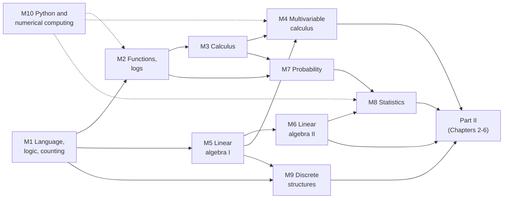

# Part 0 Guide: Mathematical Background from the Ground Up

!!! abstract "Who this part is for"
    **You** are a first-year undergraduate (or anyone with high-school algebra and curiosity) who wants to read this book. You may have seen some calculus and have never seen a matrix; you may know a little Python or none. Part 0 gives you, in ten chapters, every piece of mathematics and numerical computing the rest of the book assumes: logic and proof, functions and logarithms, calculus in one and several variables, linear algebra, probability, statistics, discrete mathematics and algorithms, and the Python and numerical habits that make the mathematics run.

    **What you need before starting:** high-school algebra (solving equations, exponents, fractions) and the idea of a graph of a function. Nothing else is assumed. No biology is assumed either; each chapter introduces the biology it uses.

    **What you will be able to do afterwards:** read the formulas in Parts II–X, follow every derivation, run and modify the code, and understand *why* the mathematics is shaped the way it is. You will not become a mathematician, and Part 0 does not try to prove everything; it tries to make you fluent enough that the rest of the book is readable.

---

## 0.1 The ten chapters

| Chapter | Title | What it gives you | Biology it uses |
|---|---|---|---|
| [M1](m01-language-of-mathematics.md) | The Language of Mathematics | reading formulas; sets, functions, logic, proof, induction, sums, counting, big-$O$ | genetic code as a function, barcode collisions |
| [M2](m02-functions-exponentials-logs.md) | Functions, Exponentials, Logarithms | growth and decay, logs, power laws, sigmoids, oscillations, log-sum-exp | PCR, mRNA half-lives, Kleiber's law, Hill functions, circadian rhythms |
| [M3](m03-single-variable-calculus.md) | Single-Variable Calculus | derivatives, optimization, Taylor series, integrals, ODEs, Euler's method, Jensen | gene-expression dynamics, maximum likelihood |
| [M4](m04-multivariable-calculus-optimization.md) | Multivariable Calculus and Optimization | gradients, Jacobians, Hessians, gradient descent, Lagrange multipliers | correlated features, Boltzmann distribution, read budgets |
| [M5](m05-linear-algebra-1.md) | Linear Algebra I | vectors, matrices, products, linear systems, determinants, conditioning | cosine similarity, stoichiometric matrices, normalization |
| [M6](m06-linear-algebra-2.md) | Linear Algebra II | subspaces, projection, eigenvalues, symmetric matrices, SVD and PCA | Jukes–Cantor, Markov chains of cell states, PCA of cells |
| [M7](m07-probability.md) | Probability from the Ground Up | Bayes' rule, distributions, expectation, LLN, CLT, Monte Carlo | screening tests, counts, linkage disequilibrium, coverage |
| [M8](m08-statistics.md) | Statistics from the Ground Up | estimators, MLE, intervals, p-values, multiple testing, regression, confounding | differential expression, winner's curse, Simpson's paradox |
| [M9](m09-discrete-structures.md) | Discrete Structures and Algorithms | graphs, trees, dynamic programming, complexity, assembly | networks, phylogenies, alignment, de Bruijn graphs |
| [M10](m10-python-numerical-computing.md) | Python and Numerical Computing | Python, NumPy, floating point, seeds, autograd, debugging habits | FASTA, counts matrices, stable likelihoods |

Every chapter has the same shape as the rest of the book: a motivation and prerequisites box, derivations, a **tested script** whose real output is printed in the chapter, **Biology for modeling** boxes, worked examples, a **Researcher's Notebook** that shows a common reasoning error, and key takeaways. The scripts are in `code/m01_…` to `code/m10_…` and run on a laptop in seconds.

**How the chapters depend on each other.**

Solid arrows are real prerequisites; dashed arrows say that the Python chapter supports the others, and you may meet it earlier if you are new to programming: **if you have never programmed, read M10 first or alongside M1**.

---

## 0.2 Placement check: where should I start?

The questions below are not exercises to be graded; they are a quick way to find chapters you can skim. Try each in about a minute without a computer. If you can answer, you can skim the chapter in the right column. Answers are below the table.

| # | Question | If you can answer it, skim… |
|---|---|---|
| 1 | Solve $2x+3=11$. | (assumed) |
| 2 | Is "if $P$ then $Q$" the same statement as "if $Q$ then $P$"? | M1.3 |
| 3 | How many DNA sequences of length 12 are there? | M1.7 |
| 4 | Simplify $\log_2 8+\log_2\tfrac12$. | M2.3 |
| 5 | A culture doubles every 3 hours. How many times larger is it after 12 hours? | M2.2 |
| 6 | Differentiate $x^{2}e^{3x}$. | M3.2 |
| 7 | Find $\partial f/\partial x$ and $\partial f/\partial y$ for $f(x,y)=x^{2}y$. | M4.1 |
| 8 | Compute $\begin{pmatrix}1&2\\3&4\end{pmatrix}\begin{pmatrix}0&1\\1&0\end{pmatrix}$. | M5.2 |
| 9 | What are the eigenvalues of $\begin{pmatrix}2&1\\1&2\end{pmatrix}$? | M6.4 |
| 10 | A test has 90% sensitivity and 90% specificity; prevalence is 1%. What is $P(\text{disease}\mid\text{positive})$? | M7.2 |
| 11 | What does a p-value of 0.03 mean, in one sentence? | M8.4 |
| 12 | How many edges does a tree with 10 nodes have? | M9.2 |
| 13 | In Python, what is `[10, 20, 30, 40][1:3]`? | M10.2 |
| 14 | What is the shape of the sum of an array of shape $(5,1)$ and one of shape $(1,4)$? | M10.3 |

??? note "Answers (open after trying)"
    1. $x=4$.
    2. No. The second is the *converse*; it is not equivalent. The contrapositive "if not $Q$ then not $P$" is equivalent to the original.
    3. $4^{12}=16{,}777{,}216$.
    4. $3+(-1)=2$.
    5. $2^{12/3}=2^{4}=16$.
    6. $2xe^{3x}+3x^{2}e^{3x}=xe^{3x}(2+3x)$ (product rule and chain rule).
    7. $\partial f/\partial x=2xy$, $\partial f/\partial y=x^{2}$.
    8. $\begin{pmatrix}2&1\\4&3\end{pmatrix}$ (multiplying on the right by this matrix swaps the columns).
    9. $1$ and $3$.
    10. $0.9\cdot0.01/(0.9\cdot0.01+0.1\cdot0.99)=0.009/0.108\approx0.083$, about 8%.
    11. If there were no real effect, data at least this extreme would occur in about 3% of experiments. (It is *not* the probability that the null hypothesis is true.)
    12. 9 (a tree on $n$ nodes has $n-1$ edges).
    13. `[20, 30]` (the slice starts at index 1 and stops before index 3).
    14. $(5,4)$ (broadcasting).

**Reading your results.** Miss none or one: take the **fast path** for the chapters you answered, and read the others fully. Miss several in one area (calculus, linear algebra, probability): read those chapters in full and run every script. Miss most: take the **full path**.

---

## 0.3 Three paths through Part 0

!!! tip "The full path (recommended for first-years)"
    Read M10 §M10.1–M10.3 (setup, Python, NumPy) first if you are new to programming. Then M1 → M2 → M3 → M4 → M5 → M6 → M7 → M8 → M9, finishing M10. Plan on roughly 6–8 hours per chapter including running and modifying the scripts, so Part 0 is about a semester at 5–8 hours a week. This is the path for someone who has had one calculus course or less.

!!! tip "The fast path (some background)"
    Skim each chapter you passed in the placement check, reading only the **Biology for modeling** boxes, the **worked examples**, the **Researcher's Notebook** and the takeaways, and run the scripts to see the outputs. Read in full the chapters where you missed questions. About two to three weeks.

!!! tip "The targeted path (you want to start Part II now)"
    Read only what the chapter you are about to start needs. The table below is the dependency map from the later parts of the book into Part 0; each Part II chapter also begins with a note naming the Part 0 chapters that prepare it.

| Book chapter | Part 0 chapters that prepare it |
|---|---|
| 1 (Anatomy of a research problem) | M1 (reading formulas, logic), M7 (conditional probability) |
| 2 (Linear algebra for representation) | M5, M6 |
| 3 (Calculus and optimization) | M3, M4 |
| 4 (Probability, statistics, Bayes) | M7, M8 |
| 5 (Information theory) | M2 (logs), M7 (distributions, expectation) |
| 6 (Computational thinking) | M9 (complexity), M10 |
| 7 (Statistical learning), 8 (Latent variables) | M6, M8; M7, M8 |
| 9 (Backpropagation), 10–12 (convolutions, sequence models, attention) | M3, M4, M5, M10; M2 (oscillations, softmax); M6 (eigenvalues) |
| 14–15 (generative models, diffusion) | M4 (Jacobians), M7 (distributions, Monte Carlo), M3 (ODEs) |
| 16 (geometric deep learning) | M9 (graphs, Laplacians), M6 |
| 19–26 (biology for modeling) | M2 (growth, Hill), M7 (Poisson, binomial), M8 (testing), M5 (stoichiometry) |
| 27–30 (computational biology) | M9 (dynamic programming, hashing), M10, M7 |
| 42 (evolutionary modeling) | M6 (rate matrices), M9 (trees) |

---

## 0.4 How to study this part

Mathematics is learned by doing, and this book has no problem sets, so *you* must supply the doing. Five habits, in order of importance:

1. **Run every script, then change it.** Each script prints the numbers quoted in its chapter. Change a parameter (the learning rate, the sample size, the seed) and *predict the new output before running it*. A wrong prediction is the most valuable event in your study: it marks exactly where your understanding and the mathematics disagree.
2. **Work the worked examples before reading the solution.** Cover the *Reasoning* paragraph, write your own, then compare. If you cannot start, reread the section above it.
3. **Use the reading procedure of §M1.1 on every formula** until it is automatic: objects and types, quantifiers, the verb, the smallest case, a sentence in words.
4. **Keep a one-page "formula notebook"** per chapter: the five or six facts you would need to reconstruct the rest (for M3: the chain rule, the derivative table, the Taylor series, the production–degradation ODE). Writing them by hand is slow in the useful way.
5. **Attack the Researcher's Notebooks.** Each ends with a tempting conclusion that is wrong or unsupported, and the point is the *reasoning move* that exposes it (a missing quantifier, a base rate, an unreplicated selection). These are what carry into research.

**Calibrating difficulty.** Some sections are marked as derivations in `!!! math` boxes; they are there to show that the formulas are not magic. On a first reading you may *skip a derivation* and return to it, but do not skip the worked example that applies it. If a whole chapter feels too hard, it is almost always because an earlier chapter was skimmed; the dependency diagram above tells you where to go back.

---

## 0.5 What Part 0 does not cover

Part 0 is a working toolkit, not a mathematics degree. Deliberately omitted or only sketched:

- **Rigorous analysis.** Limits are introduced by intuition; there is no $\epsilon$–$\delta$ development, no construction of the real numbers, and few existence proofs. Rudin's *Principles of Mathematical Analysis* or Abbott's *Understanding Analysis* is the next step if you want it.
- **Measure-theoretic probability.** Probability is developed with sums and densities. Measure theory is needed for the deepest results (conditioning on events of probability zero, convergence of random processes) and is not needed to *use* any model in this book.
- **Advanced linear algebra and numerical linear algebra.** Jordan forms, tensor products as abstract spaces, and detailed algorithms for large sparse eigenproblems are left to Chapter 2's references and to Trefethen & Bau.
- **Differential geometry and group theory.** Chapter 16 introduces symmetry and geometric deep learning in the language of the book; no prior knowledge is assumed beyond M5 and M6.
- **Biology.** Each chapter introduces what it needs, but Part 0 is not a biology course. Part V (Chapters 19–26) teaches biology for modeling.

When you finish the ten chapters, you should be able to say yes to each statement below. If not, return to the chapter in parentheses.

!!! takeaways "You are ready for Chapter 1 when you can…"
    1. Read a formula by identifying its objects, types, quantifiers and verb, and test it on a small case (M1).
    2. Tell a statement from its converse and contrapositive, and a necessary condition from a sufficient one (M1).
    3. Convert between growth rate, doubling time and half-life, and use logs to linearize power laws and exponentials (M2).
    4. Differentiate with the chain rule, find a maximum-likelihood estimate by calculus, and solve $dm/dt=\alpha-\delta m$ (M3).
    5. Compute a gradient and a Jacobian, explain how conditioning controls gradient descent, and derive the softmax by Lagrange multipliers (M4).
    6. Multiply matrices keeping track of shapes, solve a linear system, and find a null space (M5).
    7. Explain rank, projection, eigenvalues and the SVD, and say what PCA does and does not tell you (M6).
    8. Apply Bayes' rule with a base rate, name the distribution behind a count, and explain what the CLT does and what $n$ means (M7).
    9. Interpret a confidence interval and a p-value correctly, control the false discovery rate, and recognize confounding (M8).
    10. Represent a network as a matrix, explain why dynamic programming beats naive recursion, and describe assembly as a path problem (M9).
    11. Write short NumPy programs without silent shape bugs, explain floating-point failure modes, and report results across seeds (M10).

---

## Further reading (whole of Part 0)

- Stewart, J. *Calculus*; Strang, G. *Introduction to Linear Algebra*; Blitzstein, J. & Hwang, J. *Introduction to Probability*; Wasserman, L. *All of Statistics*. One standard book per area, each with free lectures online.
- Velleman, D. *How to Prove It*. Logic and proof.
- Downey, A. *Think Python* (free). Programming from scratch.
- Boyd, S. & Vandenberghe, L. *Introduction to Applied Linear Algebra* (free). Vectors and matrices with applications first.
- Milo, R. & Phillips, R. *Cell Biology by the Numbers* (free). Quantitative biology for the mathematically inclined.
