# Dependency Graph

How the major concepts build on one another. An arrow $A \to B$ means *B uses ideas from A in an essential way* (not merely that A is mentioned). Dashed arrows mark prerequisites that are taught **just in time**, inside the chapter that first needs them.

## 1. The big picture: parts

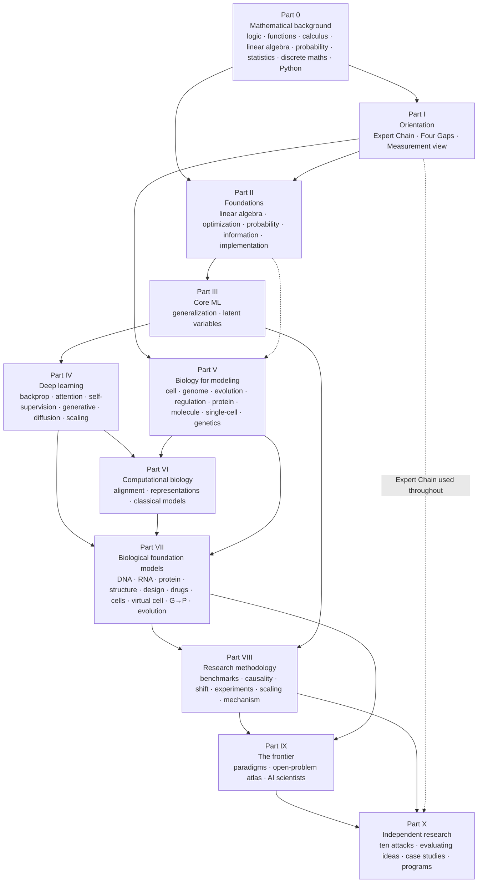

## 2. Chapter-level dependencies

The next four diagrams zoom in. Colors mark the Part: **teal** mathematical foundations and core ML, **indigo** deep learning, **green** biology and computational biology, **orange** biological foundation models, **purple** methodology, frontier, and independent research.

### 2a. From foundations to deep learning (Chapters 1–18)

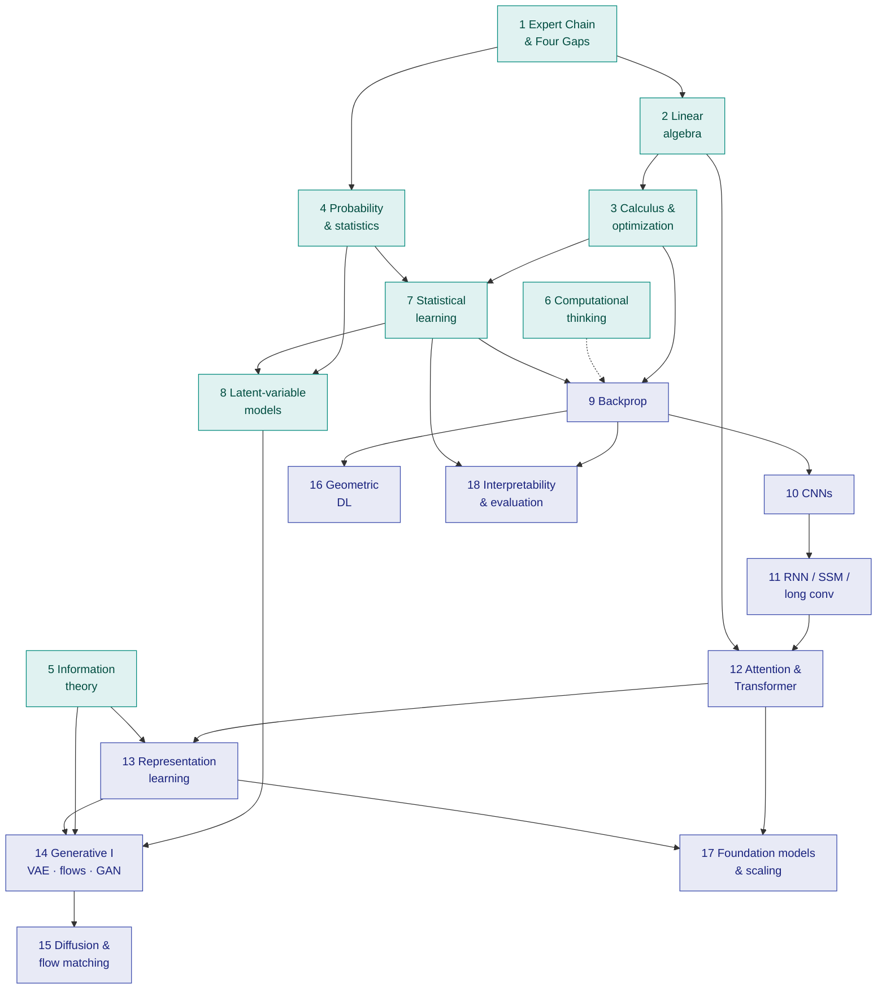

### 2b. Biology and computational biology (Chapters 19–30)

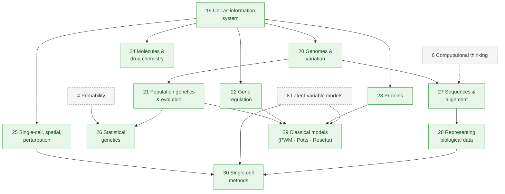

### 2c. Biological foundation models (Chapters 31–42) and what they draw on

*Genomes, RNA, and genotype → phenotype:*

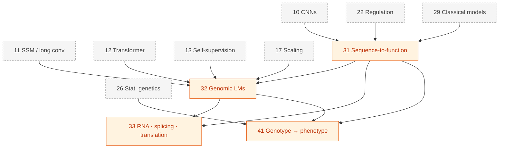

*Proteins, molecules, and evolution:*

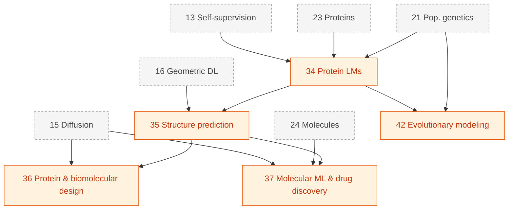

*Cells:*

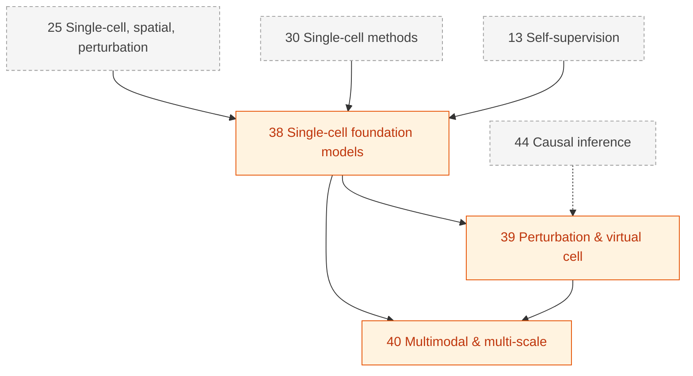

### 2d. Methodology, frontier, and independent research (Chapters 43–59)

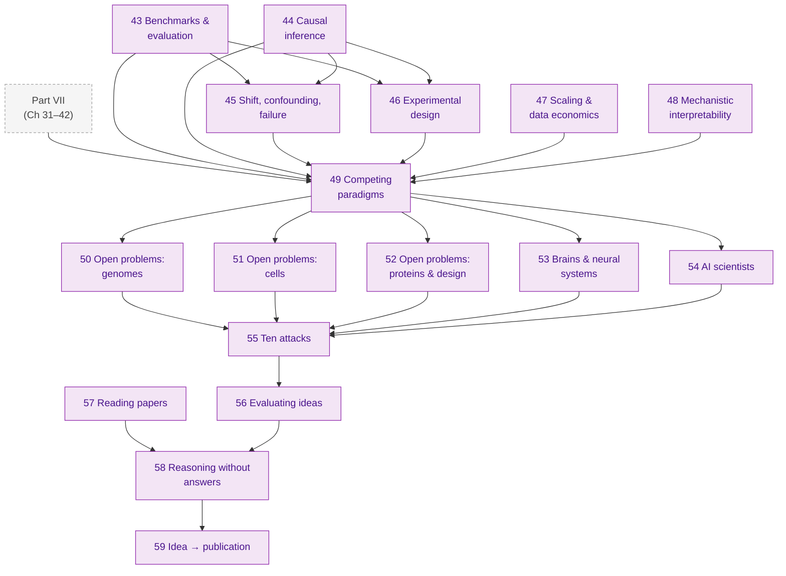

## 3. Concept dependencies (the "structural rhymes")

The same mathematical object recurs across chapters. Following these threads is the fastest way to see how the book's ideas are connected.

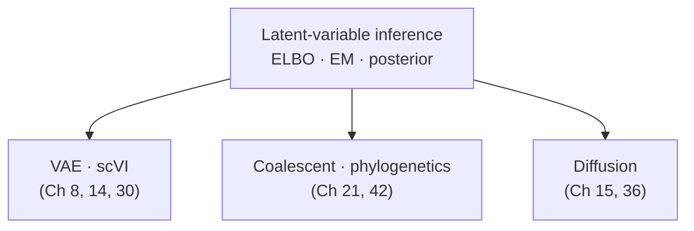

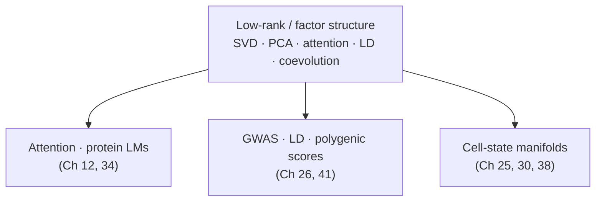

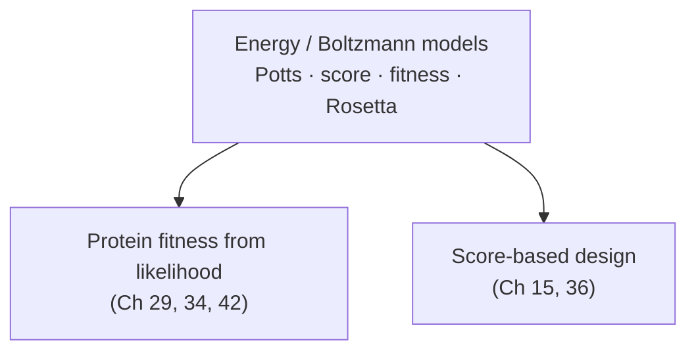

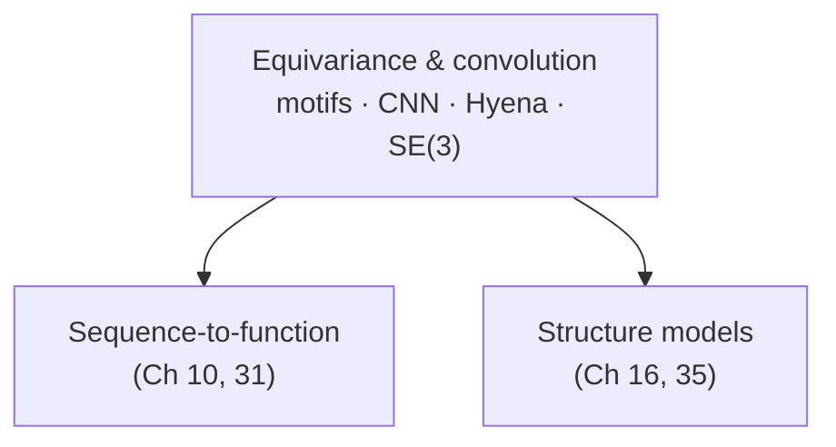

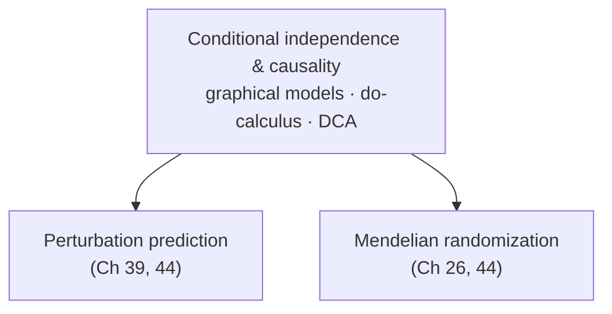

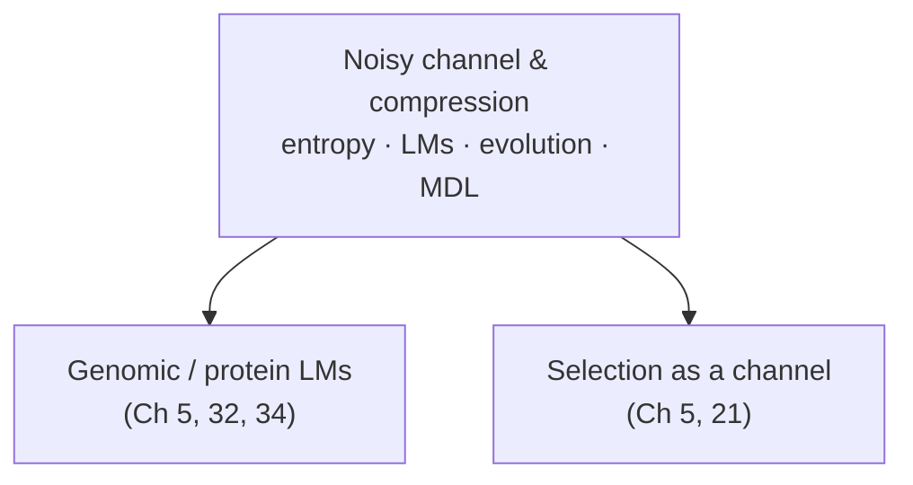

## 4. Three ways to use the graph

| If you want to... | Follow this path |
|---|---|
| Understand how AlphaFold-style models work | 2 → 3 → 9 → 12 → 16 → 23 → 34 → 35 |
| Understand why single-cell foundation models disappoint (and what might fix them) | 4 → 8 → 13 → 25 → 30 → 38 → 39 → 43 → 44 → 45 |
| Understand genomic language models and their evaluation | 5 → 11 → 12 → 13 → 20 → 21 → 22 → 31 → 32 → 43 |
| Be able to design a good benchmark for a new problem | 4 → 7 → 18 → 43 → 44 → 45 → 46 |
| Generate research ideas in a new subfield | 1 → [the subfield's Part VII chapter] → 49 → [matching Open Problems chapter] → 55 → 56 |
