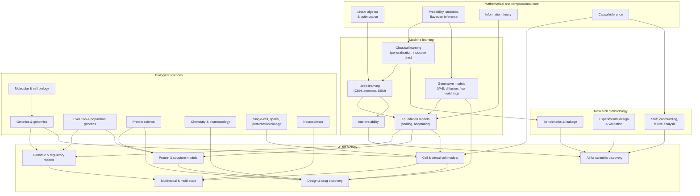

# Map of the Fields and How They Connect

AI for biology is not one field. It is a set of fields whose *problems* are often the same even when their vocabularies differ. This page maps the territory. Its main message: **the connections across fields are mostly mathematical, and the barriers are mostly measurement.**

## 1. The territory

## 2. How each pair of fields connects: the load-bearing analogies

These are the connections the book returns to. For each, the analogy has a precise mathematical form (see the "structural rhyme" call-outs).

| Connection | The shared structure | Where it appears |
|---|---|---|
| **Language modeling ↔ evolutionary sequence modeling** | Both estimate $p(x)$ over sequences from a corpus; in biology the corpus was generated by mutation and selection, so $\log p_\theta(x)$ may track fitness | Ch 5, 32, 34 |
| **Transformer representations ↔ biological sequence representations** | Attention computes soft pairwise couplings; Potts models of coevolution compute hard pairwise couplings | Ch 12, 29, 34 |
| **Generative modeling ↔ molecular design** | Sampling from $p(x \mid \text{property})$; diffusion and flow matching on coordinates and graphs | Ch 14–15, 36–37 |
| **Scaling laws ↔ biological foundation models** | Loss follows power laws in compute, data, parameters, but *biological data are not i.i.d. text*: number of independent lineages is the true sample size | Ch 17, 47 |
| **Causal inference ↔ perturbation biology** | CRISPR perturbation is an intervention, $p(y \mid \do(x))$; observational atlases are not | Ch 25, 39, 44 |
| **Representation learning ↔ biological measurement** | A measurement is a (lossy, noisy) encoder from latent biology to data; a learned representation is a second encoder | Ch 1, 13, 25 |
| **Evolution ↔ sequence prediction** | Phylogeny induces dependence between sequences; ignoring it inflates benchmark scores | Ch 21, 34, 43 |
| **Graph neural networks ↔ molecular structure** | Message passing on bonds; equivariance for 3D coordinates | Ch 16, 24, 35–37 |
| **Multimodal learning ↔ genotype–phenotype relationships** | Different assays are different views of the same latent state; alignment across views is a contrastive/latent-variable problem | Ch 13, 40, 41 |
| **Agents ↔ automated scientific discovery** | Closing the loop between hypothesis generation, experiment, and update; the evaluation problem moves to the loop itself | Ch 46, 54 |
| **Information theory ↔ biological representation** | Mutual information bounds what any representation can retain; selection acts as a noisy channel | Ch 5, 13, 21 |
| **Bayesian inference ↔ scientific hypothesis testing** | Posterior odds = prior odds × likelihood ratio; designing experiments is maximizing expected information gain | Ch 4, 46, 56 |

## 3. Example research programs, and the kinds of problems they illustrate

The book uses published work from several groups as *case material*. The list below is not a ranking and not an endorsement of any claim.

| Program (examples) | Problem class | What to learn from it | Chapters |
|---|---|---|---|
| **Google DeepMind** (AlphaFold lineage, AlphaMissense, AlphaGenome, AlphaProteo, co-scientist-type agents) | Structure, variant effect, regulatory prediction, AI for science | End-to-end learned geometry; carefully engineered supervised multi-task training; the role of evaluation | 31, 35, 36, 41, 54 |
| **Isomorphic Labs** (AlphaFold 3 lineage, drug design engine) | Biomolecular structure and affinity for drug discovery | Cofolding with diffusion; what generalization to novel ligands means; the gap between structure prediction and a drug | 35, 37, 52 |
| **Arc Institute, Stanford groups** (Evo, Evo 2, State, virtual cell initiative) | Genome-scale language models; generative genome design; virtual cells | Likelihood-as-fitness at scale; generation of functional phage genomes; metrics for perturbation prediction | 32, 36, 39, 51 |
| **Chan Zuckerberg Initiative and the cell-atlas community** (CELLxGENE, virtual cell platform, Human Cell Atlas) | Cell-type/state atlases; benchmarks; community data standards | Data infrastructure as scientific infrastructure; benchmark governance | 25, 38, 40 |
| **EvolutionaryScale** (ESM family) | Protein language models | Scaling and multimodal (sequence–structure–function) tokens | 34, 36 |
| **Baker lab / Institute for Protein Design and descendants** | De novo protein design | Generate–filter–test pipelines and the central role of experimental hit rates | 36 |
| **Academic labs** (Kundaje, Koo, Troyanskaya, Regev, Theis, Huber/Anders, Yosef, Marks, and many more) | Interpretation, rigorous benchmarking, methodology | Critical baselines and negative results, which are as informative as breakthroughs | 31, 38, 39, 43 |

## 4. Where problems live: three axes

Almost every problem in AI for biology can be located on three axes. Doing so tells you which literature is relevant and which failure modes to expect.

1. **Biological scale:** nucleotide → motif → gene → pathway → cell → tissue → organism → population → lineage.
2. **Task type:** *predict* ($x \to y$), *generate/design* ($y \to x$), *explain/intervene* (what happens under $\do(\cdot)$), *discover* (what mechanism is unknown).
3. **Information regime:** what is observed (sequence, structure, expression, imaging...), what is latent, and what generalization is demanded (new sequence, new species, new cell type, new perturbation, new chemistry).

!!! notebook "Researcher's Notebook: locate before you attack"
    Before reasoning about any new problem, fill in one line: *scale* / *task type* / *information regime*. Example: "Predicting the effect of a SNP on expression in a cell type not seen in training" is *nucleotide → cell*, *predict*, with *new-cell-type generalization* and an *observational* training distribution. That single line already tells you the likely traps: cell-type-specific confounding, limited training diversity, and no interventional data for the SNP itself.
