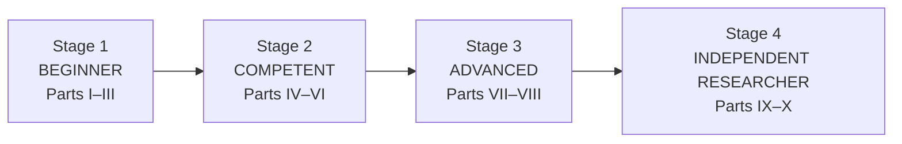

# Learning Trajectory

The book moves you through four stages. Each stage is defined by **what you can do**, not by what you have read. If you cannot do the things in a stage's "capability check," stay there.

## Stage 1: Beginner (Parts I–III, Chapters 1–8)

**You arrive able to:** write short Python programs; recall basic calculus and probability.

**You leave able to:**

- State any machine-learning problem as *data, hypothesis class, objective, optimization, evaluation*, and say which of these a given paper changed.
- Describe a biological dataset as a **measurement of a latent system** and list what the measurement loses.
- Compute and interpret likelihoods, KL divergences, p-values, FDRs, and posteriors; explain why a result that survives a split may still not generalize.
- Use the Expert Chain to take a vague claim ("this model understands the genome") and turn it into testable sub-claims.

**Capability check.** Given a performance number from a biology-ML paper, you can write down (a) the noise ceiling, (b) the appropriate trivial and strong baselines, (c) two ways the split could leak, and (d) what you would need to see to believe the claim.

**Mindset shift.** From *"what does the model achieve?"* to *"what would the number be if the model learned nothing biological?"*

## Stage 2: Competent (Parts IV–VI, Chapters 9–30)

**You leave able to:**

- Derive backpropagation, attention, the ELBO, the DDPM loss, and the InfoNCE bound; implement the core of each from scratch; state the tensor shapes and computational complexity.
- Read the methods section of a deep-learning paper in biology and reconstruct *the actual objective*, *the information available to the model*, and *the inductive biases*.
- Explain gene regulation, protein folding, evolution, single-cell measurement, and statistical genetics well enough to say, for a given dataset: how it was produced, what noise it carries, and what a model cannot see.
- Know what the pre-deep-learning methods (PWMs, Potts models, GWAS, scVI) were doing, so you can tell when a new method is genuinely new.

**Capability check.** Take a paper you have not seen (say, a model that predicts expression from sequence). Without reading the results, predict from the methods which kinds of generalization will succeed and which will fail, and say why.

**Mindset shift.** From *"what architecture was used?"* to *"what information does this representation preserve, and what does the objective reward?"*

## Stage 3: Advanced (Parts VII–VIII, Chapters 31–48)

**You leave able to:**

- Describe the intellectual history of each major paradigm (sequence-to-function, genomic LMs, protein LMs, structure prediction, design, molecular ML, single-cell foundation models, virtual cells) in terms of the *problem, the insight, the evidence, the limitations, and what was subsequently discovered*.
- Compare competing paradigms along representation, scale, objective, data, compute, generalization, validity, interpretability, and failure modes, and say when each is appropriate.
- Design a benchmark that distinguishes the hypotheses you care about, with leakage controls, baselines, noise ceilings, and power calculations.
- Reason about causality in perturbation data and use identification arguments to say what a dataset can and cannot establish.
- Plan an experiment that a wet-lab collaborator could run, with controls, replicates, and a pre-stated interpretation of every outcome.

**Capability check.** Given a published claim that a foundation model "learns regulatory grammar," propose three experiments, one computational, one using existing public data, and one wet-lab, that would respectively falsify it, support it, and distinguish between two alternative explanations.

**Mindset shift.** From *consumer of benchmarks* to *designer of the experiments that benchmarks are supposed to approximate*.

## Stage 4: Independent researcher (Parts IX–X, Chapters 49–59)

**You leave able to:**

- Enter an unfamiliar subfield and, within weeks, build a map: the key problems, the assumptions each approach rests on, the datasets, the evaluation pitfalls, and the live controversies.
- For an open problem, state *why* it is hard, *what has prevented progress*, *which assumptions are responsible*, *what information is missing*, and *what experiment would expose the bottleneck*.
- Generate research ideas systematically with the Ten Attacks, and differentiate real novelty from superficial modification.
- Pre-mortem and pre-register an idea: state the result that would change your mind before running it.
- Derive several distinct research directions from one underlying problem and decide among them by value, feasibility, and information gain.
- Write a research program: question, hypotheses, methods, evaluation, risks, timeline, ethics, and biosecurity considerations.

**Capability check.** Choose an open problem from Part IX that is *not* described in the book's text as solved. In two pages, produce: the decomposition, the hidden assumptions, three competing hypotheses, a discriminating experiment for each pair, predicted outcomes under each hypothesis, and the result that would make you abandon your favorite.

**Mindset shift.** From *finding the answer* to *finding the next informative question*.

## Pacing

Pacing is a function of background, not a promise. As a rough guide for a motivated reader studying alongside other commitments:

| Stage | Typical pace for full path | Notes |
|---|---|---|
| 1 | 4–8 weeks | Faster with prior ML/stats training; do not skip Chapter 4 on multiple testing |
| 2 | 10–16 weeks | The derivations in Part IV and the biology in Part V are the real work |
| 3 | 10–16 weeks | Reproduce at least one benchmark result per chapter you care about |
| 4 | Open-ended | The goal is a research program you could pursue for a year |

## The progression of worked examples

The worked research examples are the book's main practice mechanism. They are deliberately ordered:

1. **Reasoning about numbers** (Chapters 1–8): noise ceilings, baselines, leakage, multiple testing, what a likelihood does and doesn't mean.
2. **Reasoning about methods** (Chapters 9–30): why an objective yields a representation; why a method fails on a given data type; what a tensor shape implies.
3. **Reasoning about published claims** (Chapters 31–48): reconcile contradictory results; explain why a benchmark rewards the wrong thing; diagnose a failure of a foundation model.
4. **Reasoning about unsolved problems** (Chapters 49–59): there is no known answer; the example demonstrates a *process* for generating, ranking, and testing competing hypotheses.
